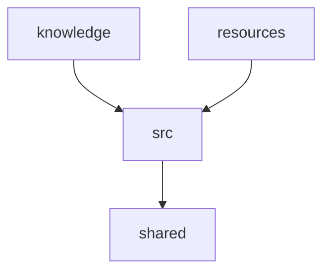
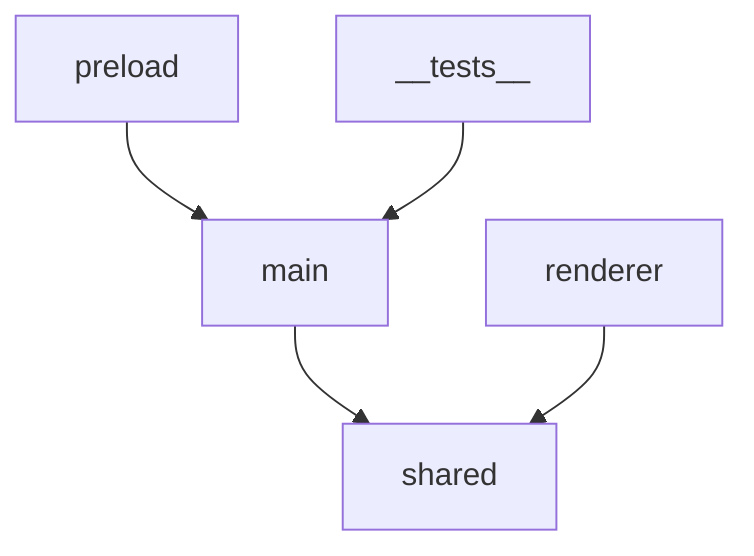

# Architecture Design 模板

## 核心定位

Architecture Design 回答「**系统应该如何组织？（System）**」，聚焦**系统架构**，不讨论接口细节和数据库细节（留到 TDD）。

在 block_sync 递归文档体系中，每级块文件的 `###` 标题会被 selective hideRule 处理：
- **导航类维度**（定位与职责、内部组成、依赖与联动）→ 标题 + 正文**保留**，随 sync 级联传递
- **细节类维度**（技术选型、非功能约束）→ 只留标题行在汇总中，正文需读原文

---

## 章节结构（每模块/文件夹一个 `##` 块，以下为各维度 `###`）

### 架构图（导航类 · 内容保留，会级联传递）

- 用 **mermaid** 描述该文件夹内部子模块的组织关系和依赖拓扑
- 顶层 `architecture.md`：整体架构图，展示代码库顶层文件夹之间的依赖关系
- 下级块文件：本级内部子模块的依赖拓扑图
- 图中节点 = 下一级文件夹/模块，边 = 依赖关系

示例（顶级 architecture.md）：

示例（下级 src.md，展示 src 内部子模块关系）：

### 定位与职责（导航类 · 内容保留，会级联传递）

- **职责**：这个模块/文件夹的职责是什么（一句话）
- **边界**：
  - 负责：[列出该模块负责的事情]
  - 不负责：[列出明确不属于该模块的事情]

### 内部组成（导航类 · 内容保留，会级联传递）

- 该模块/文件夹包含的子模块或子文件夹列表
- 每个子模块的简要说明（一句话）

### 依赖与联动（导航类 · 内容保留，会级联传递）

- **内部子模块间依赖**：子模块之间的依赖关系（谁依赖谁）
- **通信方式**：同步调用、异步消息、事件总线、IPC 等
- **数据流**：数据在子模块间如何流动、在哪发生格式/结构转换
- **关键交互场景**：最重要的 2-3 个交互场景描述

### 技术选型（细节类 · 只留标题，细节读原文）

有则写，无则省略。对每个关键技术选择：

- **技术**：选用的技术/框架/库
- **用途**：在项目中承担什么角色
- **选型理由**：为什么选它而非替代方案（考虑：成熟度、社区、性能、团队能力、跨平台支持等）
- **替代方案**：考虑过但未选的方案及原因

### 非功能约束（细节类 · 只留标题，细节读原文）

有则写，无则省略。

- **解耦性**
- **复用性**
- **可扩展（Scalability）**：系统如何应对增长
- **可观测性（Observability）**：日志、监控、追踪的整体策略
- **跨平台（Cross-platform）**：多平台适配差异（如适用）

---

## 约束

- **不讨论 API 细节**：不定义具体的 API 签名、参数列表、返回值（留到 TDD）
- **不讨论数据库细节**：不定义具体的表结构、字段类型、索引（留到 TDD）
- **不讨论产品价值**：不解释「为什么用户需要这个功能」（已在 MRD/PRD 中讨论）
- 聚焦系统层面的组织结构和模块关系
- **只描述下一级**，不越级
