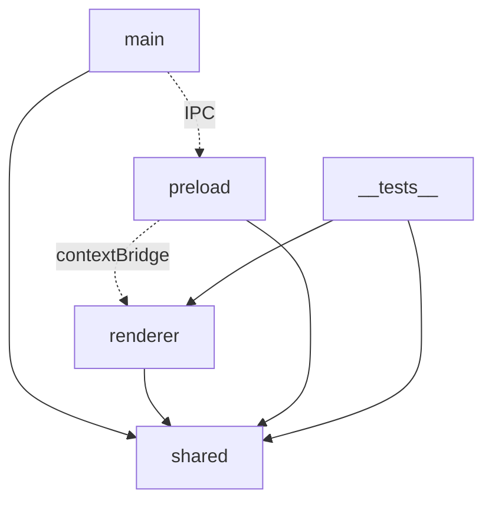
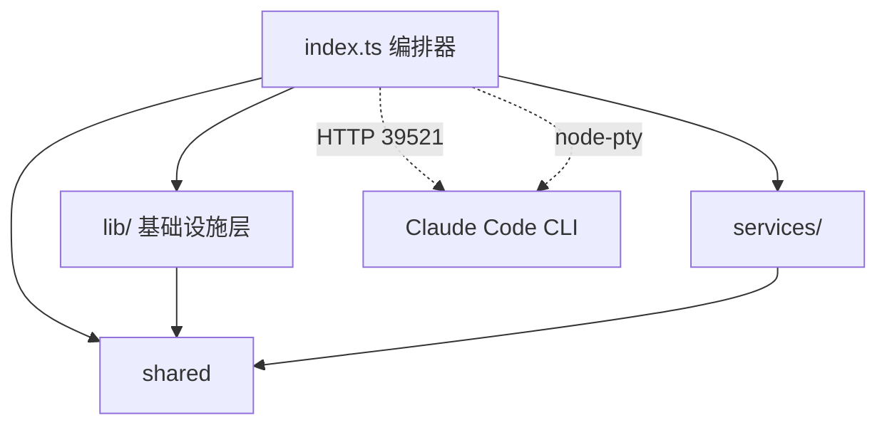
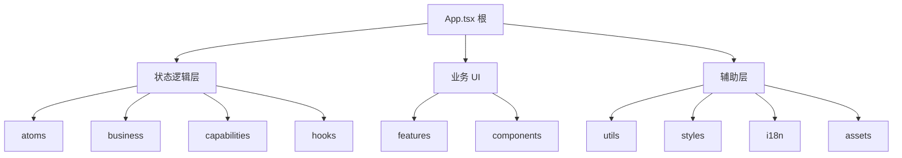
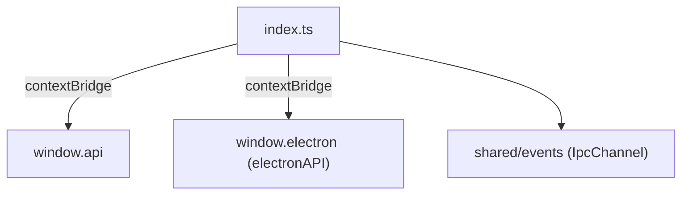
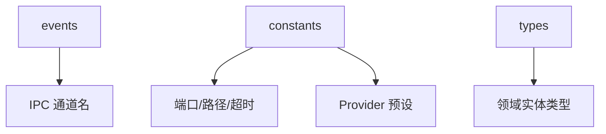
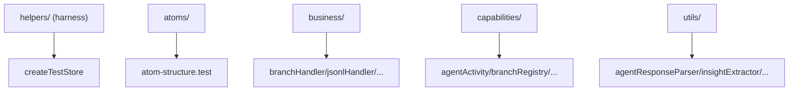

---
paths:
  - "claude-driver/src/**/*"
---

<!-- parent: architecture -->

### 架构图

### 定位与职责

- **职责**：Claude Steer 全部源码根，按 Electron 三进程 + 跨进程契约 + 测试五分。
- **边界**：负责组织 main/preload/renderer/shared/__tests__ 五大顶层模块及其依赖关系；不负责具体模块内部实现（见子级）。

### 内部组成

- **main**：Electron 主进程（Node.js）。编排器 `index.ts` + 基础设施层 `lib/`（11 机制模块）+ `services/`（远程桥接）。
- **renderer**：渲染进程（Chromium + React）。状态逻辑层（atoms/business/capabilities/hooks）+ 业务 UI（features/components）+ 根 `App.tsx`。
- **preload**：ContextBridge，暴露类型安全 `window.api`（invoke/on/removeAllListeners）。
- **shared**：跨进程类型、常量、IPC 通道名契约（events/constants/types）。
- **__tests__**：Vitest 测试套件，镜像渲染层结构（atoms/business/capabilities/utils + helpers）。

### 依赖与联动

- **内部依赖**：main 与 renderer 均依赖 shared（类型/常量/IPC 名）；preload 桥接 main↔renderer；__tests__ 依赖 renderer 与 shared。
- **通信方式**：main↔renderer 经 preload 的 `window.api`（ipcMain.handle / ipcRenderer.invoke 双向 + webContents.send 单向推送）。
- **关键交互场景**：①Hook 事件经 HookServer->HookEventBus->IPC.HOOK_EVENT 推送渲染层；②PTY 操作经 IPC.SESSION_* invoke 主进程 PtyManager；③JSONL 经 JsonlWatcher->IPC.JSONL_RECORD* 推送。

### 技术选型

electron-vite 三目标构建；TypeScript 全栈类型安全；main 用 node-pty/chokidar/http 原生模块，renderer 用 Jotai/@xyflow/react/React。

### 非功能约束

- **解耦性**：shared 为唯一跨进程耦合点，契约化（IPC 通道名常量化防漂移）。
- **可测试性**：renderer 状态逻辑层接受注入 store，可脱离 React/IPC 单测。
- **跨平台**：main 层抽象平台差异（claude bin 解析、Hook 脚本、任务栏角标）。

## main
<!-- parent: src -->
### 架构图

### 定位与职责

- **职责**：Electron 主进程入口与编排层。`index.ts` 统管窗口生命周期、HTTP Hook Server、80+ IPC handler 注册、PTY↔Claude 会话双向绑定、5 类衍生持久化文件写入、依赖检测与启动流程。
- **边界**：负责主进程级编排与基础设施模块组装；不负责渲染层 UI 与状态（见 renderer）。

### 内部组成

- **index.ts**：编排器。持有 `ptyToClaudeMap`/`claudeToPtyMap` 双向绑定表、`termWindows`、scheduler/insight/chat ptyId 集合；定义 `autoWatchTranscript`/`bindPtyToClaudeSession`/`replayInsertions`/`getSubagentInsertionsPath` 等核心函数。
- **lib/**：基础设施层，11 个按 SRP 拆分的机制模块（config/deps/git/hook-server/jsonl/notification/projects/pty/scheduler/statusline/updater）。
- **services/**：`RemoteBridgeService`，cc-connect 远程交互（飞书 bot）安装检测与 `config.toml` 字段级读写。

### 依赖与联动

- **内部依赖**：index.ts 依赖全部 lib/* 与 services/；lib 内部 config 被 pty（env 块）、hook-server（user hooks）、statusline（注入）复用。
- **通信方式**：经 preload 暴露的 IPC（ipcMain.handle 双向 + webContents.send 单向推送）与 renderer 通信；经 HTTP 39521 与 Claude Code Hook 通信；经 node-pty stdin/stdout 与 Claude CLI 进程通信。
- **关键交互场景**：①Session 启动->PTY spawn->autoWatchTranscript 检测 JSONL->bindPtyToClaudeSession->IPC.PTY_BIND；②Hook 事件->HookEventBus->IPC.HOOK_EVENT 推送；③衍生持久化（insertions/milestones/git-marks/meta/subagent-insertions）由对应 IPC handler appendFileSync。

### 技术选型
### 非功能约束

## renderer
<!-- parent: src -->
### 架构图

### 定位与职责

- **职责**：Electron 渲染进程（Chromium + React）。`App.tsx` hash 路由 + 3-tab shell + pop-out；状态逻辑层（atoms/business/capabilities/hooks）+ 业务 UI（features/components）+ 辅助层（utils/styles/i18n/assets）。
- **边界**：负责 UI 与状态；不直接接触 ipcRenderer（经 preload window.api）、不接触 Node 模块。

### 内部组成

- **App.tsx / main.tsx**：根。hash 路由（`#/terminal`、`#/chat` pop-out 各自 JotaiProvider）+ 3-tab（global/project/notifications）+ 全局 overlay（GlobalSettingsModal/InitSopModal）。
- **状态逻辑层**：atoms（状态）/ business（IPC 事件处理）/ capabilities（变更+持久化）/ hooks（React 胶水）。
- **业务 UI**：features（9 功能模块）+ components（6 通用组件）。
- **辅助**：utils（路径匹配）/ styles（token）/ i18n（国际化）/ assets（遗留 CSS）。

### 依赖与联动

- **内部依赖**：状态逻辑层四件套互依；features 依赖 atoms/hooks/capabilities + components；shared 类型/IPC 名。
- **通信方式**：经 preload `window.api`（invoke 双向 + on 单向）；IPC->Atom 桥接（useIpcBridge 根）。
- **关键交互场景**：①Hook 事件 -> business -> capabilities -> atom -> 组件 re-render；②用户操作 -> IPC.invoke -> main -> 推送回 -> atom 更新。

### 技术选型
### 非功能约束

## preload
<!-- parent: src -->
### 架构图

### 定位与职责

- **职责**：ContextBridge IPC 包装。将 ipcMain handler 映射为类型安全 `window.api`（invoke/on/removeAllListeners）。安全模型：`contextIsolation` 默认开启，渲染进程不直接接触 ipcRenderer，仅获 3 个收窄方法 + @electron-toolkit/preload 的 electronAPI。
- **边界**：桥接；不含业务逻辑。

### 内部组成

- **index.ts**：`window.api`（invoke(channel,...args)/on(channel,listener) 包裹去 IpcRendererEvent/返回退订/removeAllListeners）；`process.contextIsolated` 时用 contextBridge，否则直挂 window。
- **index.d.ts**：`window.electron`/`window.api` 环境类型声明（renderer 编译用）。

### 依赖与联动

- **内部依赖**：electron（contextBridge/ipcRenderer）；@electron-toolkit/preload（electronAPI）；shared/events（IpcChannel 类型）。
- **通信方式**：invoke=ipcRenderer.invoke（双向）；on=ipcRenderer.on（单向推送，包裹 listener 去 event）。
- **关键交互场景**：所有渲染层 IPC 经 window.api；通道名 IpcChannel 约束（仅注册常量可调）。

### 技术选型
### 非功能约束

## shared
<!-- parent: src -->
### 架构图

### 定位与职责

- **职责**：跨进程契约层。类型（types）+ 常量（constants）+ IPC 通道名（events）。被 main 与 renderer 共同引用（renderer 经 `@shared` 别名）。
- **边界**：纯契约；无运行时副作用、无 Electron/Node 依赖（renderer-safe）。

### 内部组成

- **events**：`ipc-channels.ts`（~90 IPC 通道常量 + IpcChannel 联合类型，单一真相源防漂移）。
- **constants**：`index.ts`（HOOK_PORT=39521/DRIVER_CONFIG_DIRNAME/超时/端点）+ `providers.ts`（6 provider 预设）。
- **types**：`index.ts`（核心领域实体）+ `jsonl.ts`（JSONL 解析类型 + extractToolDisplay）+ `lineInsertion.ts`（十类插入线统一模型）。

### 依赖与联动

- **内部依赖**：types 被 events/constants 引用（type-only）；无外部依赖。
- **通信方式**：被 main（相对路径）与 renderer（@shared 别名）import。
- **关键交互场景**：IPC 类型安全；跨进程实体共享；常量统一。

### 技术选型
### 非功能约束

## __tests__
<!-- parent: src -->
### 架构图

### 定位与职责

- **职责**：Vitest 测试套件，镜像渲染层结构。覆盖 atoms/business/capabilities/utils 纯逻辑单测。无 DOM 渲染（environment: node）。
- **边界**：仅渲染层逻辑单测；无主进程测试、无组件测试。

### 内部组成

- **helpers/**：`createTestStore`/`createStoreWith`/`collectAtomValues`（隔离 Jotai store 工厂）+ `setup.ts`（jest-dom matchers）+ `env.test.ts`（Phase 0 harness 验证）。
- **atoms/**：`atom-structure.test`（9 atom 初始值 + re-export shell）。
- **business/**：branchHandler（握手三态）/jsonlHandler/ptyBindHandler/sessionLifecycle。
- **capabilities/**：agentActivity/branchRegistry/contextTracker/permissionQueue/ptyBindings/realtimeVisibility/sessionRegistry/timelineStore。
- **utils/**：agentResponseParser/insightExtractor/jsonlToNode/lineInsertionBuilder/toolDisplay。

### 依赖与联动

- **内部依赖**：renderer atoms/business/capabilities/utils + shared。
- **通信方式**：无 IPC（隔离测试）；capability/business 接受注入 store。
- **关键交互场景**：每个 test `beforeEach` createTestStore 隔离；store.get/set 断言；createStoreWith seed；collectAtomValues 记录副作用顺序。

### 技术选型
### 非功能约束
