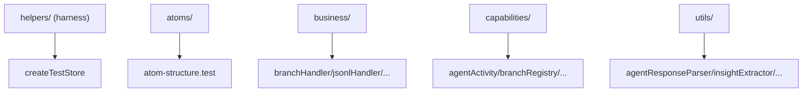

---
paths:
  - "claude-driver/src/__tests__/**/*"
---

<!-- parent: src -->

### 架构图

### 定位与职责

- **职责**：Vitest 测试套件，镜像渲染层结构。覆盖 atoms/business/capabilities/utils 纯逻辑单测。无 DOM 渲染（environment: node）。
- **边界**：仅渲染层逻辑单测；无主进程测试、无组件测试。

### 内部组成

- **helpers/**：`createTestStore`/`createStoreWith`/`collectAtomValues`（隔离 Jotai store 工厂）+ `setup.ts`（jest-dom matchers）+ `env.test.ts`（Phase 0 harness 验证）。
- **atoms/**：`atom-structure.test`（9 atom 初始值 + re-export shell）。
- **business/**：branchHandler（握手三态）/jsonlHandler/ptyBindHandler/sessionLifecycle。
- **capabilities/**：agentActivity/branchRegistry/contextTracker/permissionQueue/ptyBindings/realtimeVisibility/sessionRegistry/timelineStore。
- **utils/**：agentResponseParser/insightExtractor/jsonlToNode/lineInsertionBuilder/toolDisplay。

### 依赖与联动

- **内部依赖**：renderer atoms/business/capabilities/utils + shared。
- **通信方式**：无 IPC（隔离测试）；capability/business 接受注入 store。
- **关键交互场景**：每个 test `beforeEach` createTestStore 隔离；store.get/set 断言；createStoreWith seed；collectAtomValues 记录副作用顺序。

### 技术选型

Vitest（globals:true，environment:node）；@testing-library/jest-dom（devDep，实际未渲染 DOM）；别名 @shared/@renderer。

### 非功能约束

- **可测试性**：store 注入是可测接缝；createTestStore 防状态泄漏。
- **覆盖缺口 [待补]**：无主进程测试（GitManager/PtyManager/JsonlParser/HookServer 等）、无组件测试、无 preload/IPC 注册表测试。

> 详情请阅读对应 TDD 块文件：`docs/TDD.md` § __tests__（`.claude/rules/tdd/src/__tests__.md`）
