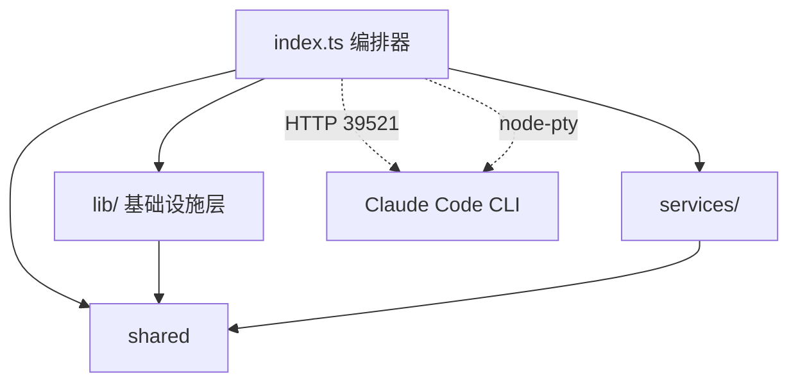
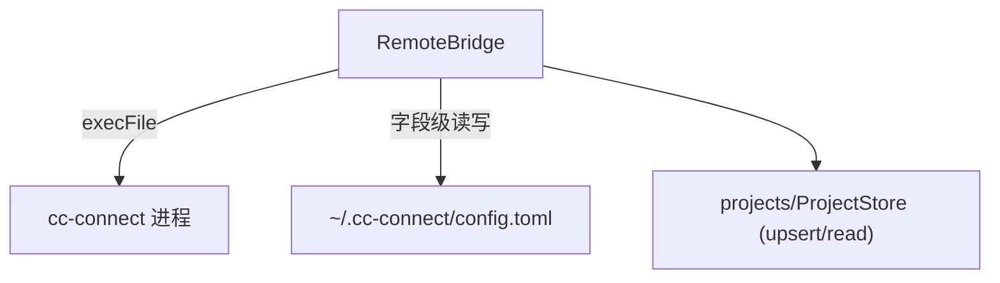

---
paths:
  - "claude-driver/src/main/**/*"
---


<!-- parent: src -->

### 架构图



### 定位与职责

- **职责**：Electron 主进程入口与编排层。`index.ts` 统管窗口生命周期、HTTP Hook Server、80+ IPC handler 注册、PTY↔Claude 会话双向绑定、5 类衍生持久化文件写入、依赖检测与启动流程。
- **边界**：负责主进程级编排与基础设施模块组装；不负责渲染层 UI 与状态（见 renderer）。

### 内部组成

- **index.ts**：编排器。持有 `ptyToClaudeMap`/`claudeToPtyMap` 双向绑定表、`termWindows`、scheduler/insight/chat ptyId 集合；定义 `autoWatchTranscript`/`bindPtyToClaudeSession`/`replayInsertions`/`getSubagentInsertionsPath` 等核心函数。
- **lib/**：基础设施层，11 个按 SRP 拆分的机制模块（config/deps/git/hook-server/jsonl/notification/projects/pty/scheduler/statusline/updater）。
- **services/**：`RemoteBridgeService`，cc-connect 远程交互（飞书 bot）安装检测与 `config.toml` 字段级读写。

### 依赖与联动

- **内部依赖**：index.ts 依赖全部 lib/* 与 services/；lib 内部 config 被 pty（env 块）、hook-server（user hooks）、statusline（注入）复用。
- **通信方式**：经 preload 暴露的 IPC（ipcMain.handle 双向 + webContents.send 单向推送）与 renderer 通信；经 HTTP 39521 与 Claude Code Hook 通信；经 node-pty stdin/stdout 与 Claude CLI 进程通信。
- **关键交互场景**：①Session 启动->PTY spawn->autoWatchTranscript 检测 JSONL->bindPtyToClaudeSession->IPC.PTY_BIND；②Hook 事件->HookEventBus->IPC.HOOK_EVENT 推送；③衍生持久化（insertions/milestones/git-marks/meta/subagent-insertions）由对应 IPC handler appendFileSync。

### 技术选型

node-pty（跨平台 PTY）、chokidar（JSONL tail）、Node 原生 http（Hook Server，零依赖）、electron（窗口/通知/autoUpdater）。

### 非功能约束

- **解耦性**：lib/* 按机制独立，index.ts 仅编排不实现业务逻辑。
- **健壮性**：Hook 端口冲突回调不崩；PTY 心跳 10s 检测 + 30min 无交互超时；JSONL tail 增量去重。
- **跨平台**：claude bin 解析覆盖 where/which/nvm/npm-global/Homebrew/nvm-windows。

## lib
<!-- parent: main -->
### 架构图

```mermaid
graph LR
    hook-server --> config
    pty --> config
    statusline --> config
    jsonl --> shared["shared/types"]
    git --> shared
    notification --> shared
    projects --> shared
    scheduler --> shared
    deps --> pty
    hook-server -.IPC.HOOK_EVENT.-> renderer["renderer"]
    jsonl -.IPC.JSONL_*.-> renderer
```

### 定位与职责

- **职责**：主进程基础设施层，按单一职责拆分为 11 个机制模块，各自封装一类与 Claude Code / 文件系统 / 系统集成的能力。
- **边界**：提供原子能力；编排与 IPC 注册由 `index.ts` 完成。

### 内部组成

- **config**：`~/.claude/settings.json`、`~/.claude.json`、`~/.claude-driver/config.json` 原子读写 + Hook/statusLine 注入 + 5 类配置组读取。映射「增量原子写入配置」「深度搜集机制」。
- **deps**：Node/npm/Git/Claude CLI 依赖检测 + Claude CLI 自动安装。
- **git**：无状态 Git CLI 包装（commit/reset/push/ensureRepo/deleteCommit/getStatus）。映射「Git 开发工作流」。
- **hook-server**：零依赖 HTTP Server（39521）接收 Hook + statusLine，EventBus 推送渲染层。映射三通道主通道、Token 捕获、上下文更新、Subagent/Branch/通知。
- **jsonl**：`chokidar`+tail 增量解析 JSONL 转录（含 subagent depth:3）。映射「Token 捕获」「信息分类系统」。
- **notification**：桌面通知 + 跨平台任务栏角标。映射「系统通知推送」。
- **projects**：`projects.json` 原子存储 + 目录扫描（找 CLAUDE.md）。
- **pty**：多会话 node-pty 管理 + 消息队列 + ANSI 剥离。映射「多 Agent 点对点管理」「深度搜集机制」。
- **scheduler**：`scheduler-sessions.json` 持久化 `/loop` 定时任务。
- **statusline**：生成 statusLine 桥接脚本（.sh/.ps1）并注入 settings.json。
- **updater**：electron-updater 包装（仅 packaged 时激活，手动下载）。

### 依赖与联动

- **内部依赖**：hook-server/pty/statusline 均依赖 config；deps 依赖 pty（resolveClaudeBin）。
- **通信方式**：经 IPC 与 renderer 通信；hook-server/jsonl 经 webContents.send 推送。
- **关键交互场景**：①Hook POST->hook-server->HookEventBus->IPC.HOOK_EVENT；②JSONL tail->jsonl->IPC.JSONL_RECORD*；③PTY stdin 注入（消息队列 Stop 触发 + 权限审批 y/n）。

### 技术选型
### 非功能约束

## services
<!-- parent: main -->
### 架构图



### 定位与职责

- **职责**：cc-connect 远程交互（飞书 bot）安装检测 + `~/.cc-connect/config.toml` 字段级读写。支撑 PRD「功能入口·远程交互·cc-connect·飞书」。
- **边界**：负责 cc-connect 进程与配置；不负责飞书 bot UI（renderer features/remote）、不负责 PTY（pty）。

### 内部组成

- **RemoteBridgeService.ts**：checkInstall（which/where）、saveProjectBot、readProjectConfig、ensureConfig；私有 readToml/writeToml（只 patch 匹配的 `[[projects]]` 段，保留其他）。

### 依赖与联动

- **内部依赖**：shared/types（FeishuBotConfig）；projects/ProjectStore（upsertProject/readProjects）。
- **通信方式**：经 IPC.CC_CONNECT_CHECK/START/STOP/STATUS/CONFIG_SAVE/CONFIG_READ/INSTALL/LOG 与渲染层交互。
- **关键交互场景**：①检测安装 -> 未装引导（CHAT_START+CHAT_WINDOW_OPEN 预填安装命令）；②保存 bot -> 重生成 toml；③start/stop cc-connect 服务。

### 技术选型
### 非功能约束
