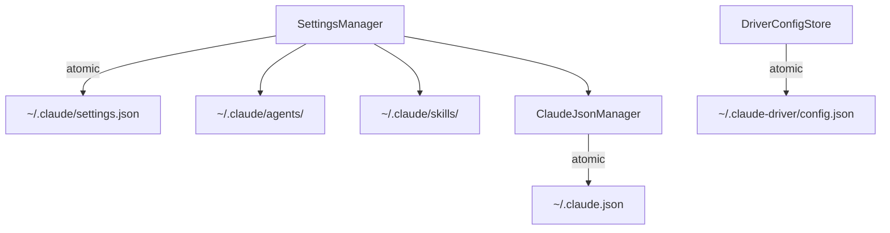
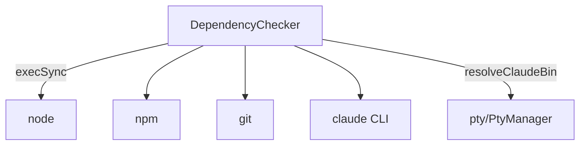
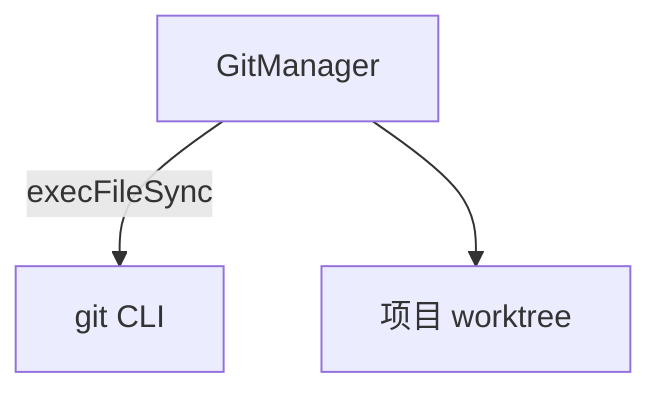
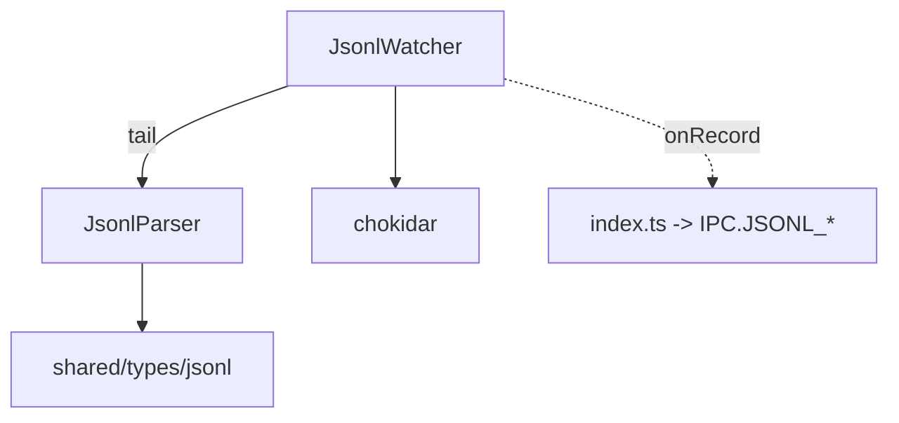
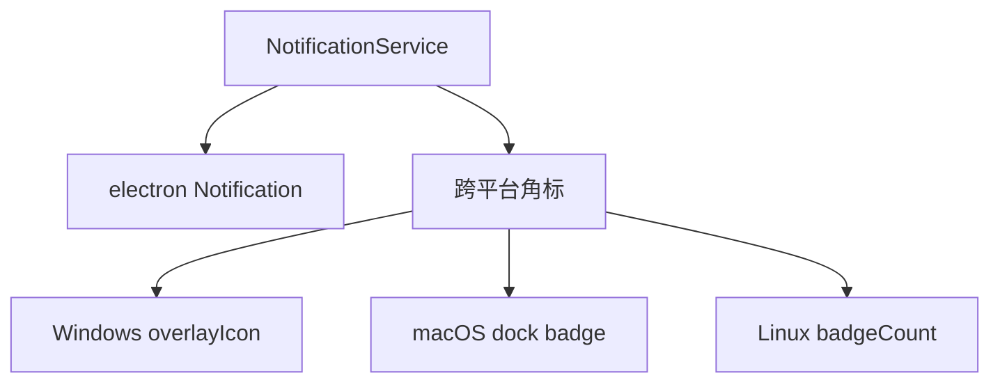
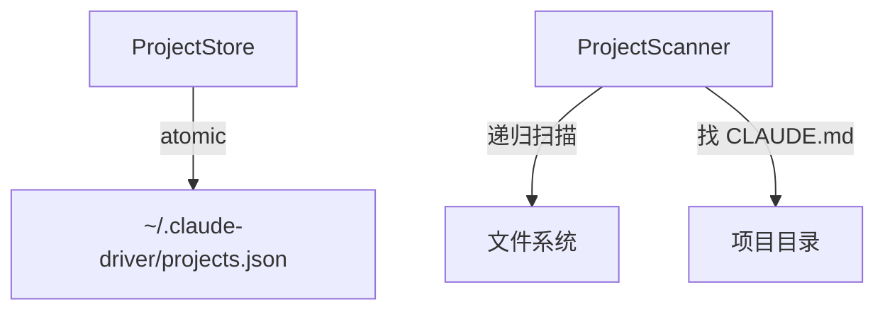
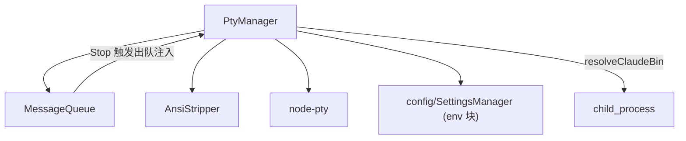
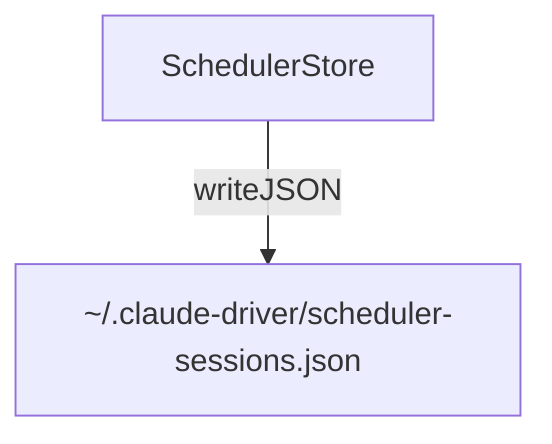
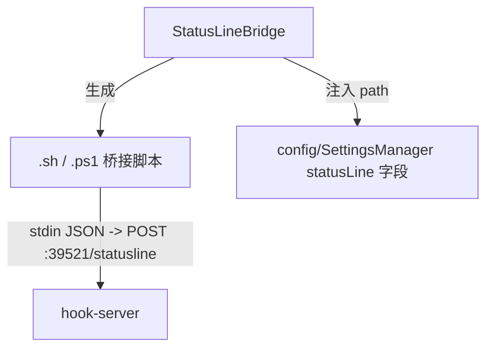

---
paths:
  - "claude-driver/src/main/lib/**/*"
---


<!-- parent: main -->

### 架构图

```mermaid
graph LR
    hook-server --> config
    pty --> config
    statusline --> config
    jsonl --> shared["shared/types"]
    git --> shared
    notification --> shared
    projects --> shared
    scheduler --> shared
    deps --> pty
    hook-server -.IPC.HOOK_EVENT.-> renderer["renderer"]
    jsonl -.IPC.JSONL_*.-> renderer
```

### 定位与职责

- **职责**：主进程基础设施层，按单一职责拆分为 11 个机制模块，各自封装一类与 Claude Code / 文件系统 / 系统集成的能力。
- **边界**：提供原子能力；编排与 IPC 注册由 `index.ts` 完成。

### 内部组成

- **config**：`~/.claude/settings.json`、`~/.claude.json`、`~/.claude-driver/config.json` 原子读写 + Hook/statusLine 注入 + 5 类配置组读取。映射「增量原子写入配置」「深度搜集机制」。
- **deps**：Node/npm/Git/Claude CLI 依赖检测 + Claude CLI 自动安装。
- **git**：无状态 Git CLI 包装（commit/reset/push/ensureRepo/deleteCommit/getStatus）。映射「Git 开发工作流」。
- **hook-server**：零依赖 HTTP Server（39521）接收 Hook + statusLine，EventBus 推送渲染层。映射三通道主通道、Token 捕获、上下文更新、Subagent/Branch/通知。
- **jsonl**：`chokidar`+tail 增量解析 JSONL 转录（含 subagent depth:3）。映射「Token 捕获」「信息分类系统」。
- **notification**：桌面通知 + 跨平台任务栏角标。映射「系统通知推送」。
- **projects**：`projects.json` 原子存储 + 目录扫描（找 CLAUDE.md）。
- **pty**：多会话 node-pty 管理 + 消息队列 + ANSI 剥离。映射「多 Agent 点对点管理」「深度搜集机制」。
- **scheduler**：`scheduler-sessions.json` 持久化 `/loop` 定时任务。
- **statusline**：生成 statusLine 桥接脚本（.sh/.ps1）并注入 settings.json。
- **updater**：electron-updater 包装（仅 packaged 时激活，手动下载）。

### 依赖与联动

- **内部依赖**：hook-server/pty/statusline 均依赖 config；deps 依赖 pty（resolveClaudeBin）。
- **通信方式**：经 IPC 与 renderer 通信；hook-server/jsonl 经 webContents.send 推送。
- **关键交互场景**：①Hook POST->hook-server->HookEventBus->IPC.HOOK_EVENT；②JSONL tail->jsonl->IPC.JSONL_RECORD*；③PTY stdin 注入（消息队列 Stop 触发 + 权限审批 TUI 按键序列：rawWrite 方向键/回车/Tab，非 y/n 字母）。

### 技术选型

node-pty、chokidar、Node 原生 http、smol-toml、electron-updater、child_process（execFileSync/execSync）。

### 非功能约束

- **复用性**：config 的原子写入模式（write-tmp+rename+field-merge）被 projects/scheduler/services 复用。
- **健壮性**：Hook 端口冲突回调；PTY 心跳+超时；JSONL tail offset 去重。
- **跨平台**：Hook 脚本与任务栏角标按平台分支。

## config
<!-- parent: lib -->
### 架构图



### 定位与职责

- **职责**：全部配置文件原子读写 + Hook/statusLine 配置注入 + 5 类配置组读取。映射 PRD「机制·增量原子写入配置」（write-tmp+rename+field-merge）与「机制·深度搜集机制」（readAllConfigGroups）。
- **边界**：负责配置 IO 与注入；不负责 PTY（pty）、不负责远程 toml（services）。

### 内部组成

- **SettingsManager.ts**：`~/.claude/settings.json` 原子读写；Hook 配置注入（13 事件类型，Unix curl + Windows .ps1 bridge 生成）；statusLine 注入；env 块（provider）读写；agents/skills/hooks/tools/mcp 5 类配置组读取（readAllConfigGroups）。
- **ClaudeJsonManager.ts**：`~/.claude.json` 原子读写；全局 MCP servers、项目 `.mcp.json`、MCP enable/disable 状态；onboarding/trust 旁路。
- **DriverConfigStore.ts**：`~/.claude-driver/config.json` 原子读写（仪表盘自身配置：token 单价、预算、通知开关、主题、语言）。

### 依赖与联动

- **内部依赖**：shared/types（HookEventName/DriverConfig）；shared/constants（DRIVER_CONFIG_DIRNAME）；SettingsManager 依赖 ClaudeJsonManager（readGlobalMcpServers）。
- **通信方式**：经 IPC.CONFIG_READ/WRITE、DRIVER_CONFIG_READ、PROVIDER_CONFIG_READ/WRITE、CLAUDE_SETTINGS_READ、PROJECT_SETTINGS_READ/WRITE、MCP_SET_ENABLED、SKILL_SET_ENABLED、CONFIG_EXPORT/IMPORT 与渲染层交互。
- **关键交互场景**：①启动 injectHookConfig + setupStatusLineBridge；②readAllConfigGroups 一次性返回 5 类；③字段级 patch（patchDriverConfig/patchProjectMcpState）。

### 技术选型
### 非功能约束

## deps
<!-- parent: lib -->
### 架构图



### 定位与职责

- **职责**：启动期依赖检测（Node ≥18 / npm / Git / Claude Code CLI）+ 生成平台安装提示 + Claude CLI 自动安装。
- **边界**：负责检测与安装引导；不负责运行期 PTY（pty）。

### 内部组成

- **DependencyChecker.ts**：checkNode/checkNpm/checkGit/checkClaude + checkAllDependencies + autoInstallClaude（`npm install -g @anthropic-ai/claude-code`）；生成平台安装提示（winget/brew/apt/dnf/pacman）。

### 依赖与联动

- **内部依赖**：pty/PtyManager（resolveClaudeBin/refreshClaudeBin）。
- **通信方式**：启动期 `runDependencyCheck` 同步调用，非 IPC。
- **关键交互场景**：缺依赖 -> 弹窗提示 + 引导安装；Claude CLI 可自动安装。

### 技术选型
### 非功能约束

## git
<!-- parent: lib -->
### 架构图



### 定位与职责

- **职责**：无状态 Git CLI 操作包装。映射 PRD「机制·Git 开发工作流」（节点级快照/回退/删除、项目级同步 GitHub）。
- **边界**：负责执行 git 命令；不负责 worktree-per-session 编排（规划中）、不负责 UI（renderer gitCapability）。

### 内部组成

- **GitManager.ts**：对象式 API：commit（add -A + commit）、reset（--hard）、ensureRepo（init + checkout -b main）、push、getStatus（remote + branch）、deleteCommit（rebase --onto，非交互）。

### 依赖与联动

- **内部依赖**：无 in-repo 依赖。
- **通信方式**：经 IPC.GIT_COMMIT/RESET/ENSURE_REPO/DELETE_COMMIT/PUSH/GET_STATUS/GIT_MARKS_LOAD/MARK_SAVE/MARK_DELETE 与渲染层交互。
- **关键交互场景**：①节点快照 commit；②回退 reset --hard；③删除节点 deleteCommit（非交互 rebase，禁交互式）；④远程未配置/权限不足弹子窗口说明。

### 技术选型
### 非功能约束

## hook-server
<!-- parent: lib -->
### 架构图

```mermaid
graph TD
    HookServer -->|POST /hooks /statusline| Http["Node http :39521"]
    HookServer --> HookEventBus
    HookEventBus -->|enrich| SettingsManager["config/SettingsManager getUserHooksForEvent"]
    HookEventBus -.webContents.send.-> Renderer["IPC.HOOK_EVENT / STATUS_LINE"]
```

### 定位与职责

- **职责**：三通道主通道。零依赖 HTTP Server 接收 Claude Code Hook 事件 + statusLine 数据，EventBus 解析为 `HookEvent` 推送渲染层。映射 PRD「机制·Token 捕获」（statusLine 入口）、「机制·上下文更新机制」（PostToolUse/PostCompact）、「机制·Subagent/Branch 显示逻辑」、「机制·系统通知推送」（PermissionRequest）。
- **边界**：负责接收与分发；不负责业务处理（renderer business/）、不负责 PTY（pty）。

### 内部组成

- **HookServer.ts**：Node 原生 `http` 模块，监听 127.0.0.1，接收 POST `/hooks` 与 `/statusline`；端口冲突触发 `onPortConflict` 回调而非崩溃。
- **HookEventBus.ts**：解析 Hook payload -> `HookEvent`（enrich user_hooks via getUserHooksForEvent）；闭包 `getWindow()` 避免 window 时序问题；页面加载中时 500ms 后重试 send。

### 依赖与联动

- **内部依赖**：shared/types（HookPayload/StatusLineData/HookEvent）；shared/events（IPC）；config/SettingsManager（getUserHooksForEvent）。
- **通信方式**：HTTP 接收 Claude Code POST；webContents.send 推送 IPC.HOOK_EVENT/STATUS_LINE。
- **关键交互场景**：①Claude Code 发 Hook -> HookServer -> HookEventBus.dispatchHook -> IPC.HOOK_EVENT；②statusLine 每 ~300ms -> dispatchStatusLine -> IPC.STATUS_LINE；③端口占用 -> onPortConflict 回调。

### 技术选型
### 非功能约束

## jsonl
<!-- parent: lib -->
### 架构图



### 定位与职责

- **职责**：JSONL 转录文件增量解析与监听。映射 PRD「机制·Token 捕获」（唯一计费源 message.usage 提取）与「机制·信息分类系统」转录回看数据源；支撑 Subagent/Branch 显示逻辑（subagent JSONL 独立路径）。
- **边界**：负责解析与监听；不负责 token 聚合（renderer stats.atom）、不负责时间线渲染。

### 内部组成

- **JsonlParser.ts**：单行 JSONL -> `JsonlRecord`（仅 user/assistant），提取 text/tool_use/tool_result/usage/model/isSidechain/agentId/timestamp；提供路径->sessionUuid 与 subagent info 提取。
- **JsonlWatcher.ts**：`chokidar` tail 增量监听主 session 与 subagent JSONL（depth:3 覆盖 `<uuid>/subagents/agent-*.jsonl`）；per-file read offset；自动发现新 subagent 文件；追踪 `file-history-snapshot` 标记 branch 起点。

### 依赖与联动

- **内部依赖**：shared/types/jsonl（JsonlRecord 等类型）；无其他 in-repo 依赖。
- **通信方式**：经 index.ts 推送 IPC.JSONL_RECORD/RECORDS/SUBAGENT_RECORD/SUBAGENT_INSERTIONS/BRANCH_SNAPSHOT。
- **关键交互场景**：①实时 tail 新行->parseJsonlLine->onRecord；②历史回看 readFromStart 全量；③subagent 文件出现自动 watch。

### 技术选型
### 非功能约束

## notification
<!-- parent: lib -->
### 架构图



### 定位与职责

- **职责**：桌面通知 + 跨平台任务栏角标管理。映射 PRD「机制·系统通知推送」。
- **边界**：负责通知与角标；不负责应用内通知队列（renderer notification.atom）。

### 内部组成

- **NotificationService.ts**：init/notify/setBadge/incrementBadge/decrementBadge/resetBadge；主进程持有 `pendingCount`。

### 依赖与联动

- **内部依赖**：electron（app/nativeImage）；shared/events（IPC）。
- **通信方式**：由 index.ts 在 PermissionRequest Hook 触发 notify+increment、审批后 decrement；IPC.NOTIFICATION/NOTIFICATION_FOCUS_TAB 推送。
- **关键交互场景**：权限请求 -> 桌面通知 + 角标 +1；审批 -> 角标 -1；点击通知 -> 切换通知 tab。

### 技术选型
### 非功能约束

## projects
<!-- parent: lib -->
### 架构图



### 定位与职责

- **职责**：项目记录单持久化 + 目录扫描发现项目。支撑 PRD「全局监控界面·项目画板」数据源与初始化 SOP。
- **边界**：负责项目 CRUD 与扫描；不负责会话（sessions）、不负责渲染（renderer projects.atom）。

### 内部组成

- **ProjectStore.ts**：`~/.claude-driver/projects.json` 原子读写；CRUD（keyed by 绝对路径 id）；initCompleted/lastRootDir；updateProjectClaims 批量。
- **ProjectScanner.ts**：递归扫描（max depth 6）找含 CLAUDE.md 的目录；排除 node_modules 等；按路径前缀去重（保留最浅）；检测 Git repo。

### 依赖与联动

- **内部依赖**：shared/types（Project/ClaimStatus）。
- **通信方式**：经 IPC.PROJECT_LIST/CREATE/SCAN/UPDATE/UPDATED/HISTORY_SCAN 与渲染层交互。
- **关键交互场景**：①初始化 SOP 扫描根目录 -> 认领清单；②新建项目 upsertProject；③后续打开加载 claimStatus=1。

### 技术选型
### 非功能约束

## pty
<!-- parent: lib -->
### 架构图



### 定位与职责

- **职责**：多 Claude 会话 PTY 生命周期管理 + 消息队列 + ANSI 清洗。映射 PRD「机制·多 Agent 点对点管理」的进程层（识别/创建/写入/读取/生命控制）与「机制·深度搜集机制」（env 块构建）。
- **边界**：负责 PTY 进程 IO；不负责 Hook 接收（hook-server）、JSONL 解析（jsonl）、IPC 注册（index.ts）。

### 内部组成

- **PtyManager.ts**：多会话 node-pty 管理（start/startBare/startCommand/resume/write/stop/resize）、claude bin 跨平台解析、心跳检测（10s）、30min 无交互超时、env 块构建（剥离宿主 Anthropic 变量 + 合并 settings.json env）。
- **MessageQueue.ts**：每会话 FIFO 队列，Stop Hook 触发出队自动注入 stdin（PRD Q1/Q2/Q3）。
- **AnsiStripper.ts**：剥离 ANSI 转义 + 可打印内容启发式。

### 依赖与联动

- **内部依赖**：config/SettingsManager（readClaudeEnvBlock）；shared/constants（HEARTBEAT_INTERVAL_MS/PTY_TIMEOUT_MS）；shared/types（SessionStatus/PermissionMode）。
- **通信方式**：node-pty stdin/stdout；经 IPC.SESSION_START/INPUT/STOP/RESUME、TERM_WINDOW_OPEN/CLOSE、TERM_DATA/RESIZE、PERMISSION_RESPOND 与渲染层交互。
- **关键交互场景**：①startSession spawn claude（stream-json）-> onData 回推；②resumeSession 用 `claude -r <claudeId>`；③MessageQueue.onStop() 取队首 -> writeToSession。

### 技术选型
### 非功能约束

## scheduler
<!-- parent: lib -->
### 架构图



### 定位与职责

- **职责**：定时任务持久化存储（按 projectPath 分组，含 claudeId + 任务列表）。支撑 PRD「功能入口·定时触发」（基于 `/loop`）。
- **边界**：负责持久化；不负责 PTY 调度注入（index.ts）、不负责 UI（renderer SchedulerModal）。

### 内部组成

- **SchedulerStore.ts**：read/writeSchedulerSessions、appendTaskToSession、deleteTask、updateClaudeId；非原子直接 writeJSON。

### 依赖与联动

- **内部依赖**：无 in-repo 依赖。
- **通信方式**：经 IPC.SCHEDULER_LIST/CREATE/TOGGLE/DELETE 与渲染层交互；调度通过 index.ts 向 PTY 注入 `/loop` 命令。
- **关键交互场景**：创建任务 appendTaskToSession；暂停/恢复 toggle（控制 loop PTY）；删除 deleteTask。

### 技术选型
### 非功能约束

## statusline
<!-- parent: lib -->
### 架构图



### 定位与职责

- **职责**：生成 statusLine 桥接脚本（Unix .sh / Windows .ps1）并注入 `~/.claude/settings.json` 的 statusLine 字段。映射 PRD 三通道副通道（statusLine stdin 桥接）。
- **边界**：负责脚本生成与注入；不负责接收（hook-server `/statusline`）、不负责统计（renderer stats.atom）。

### 内部组成

- **StatusLineBridge.ts**：setupStatusLineBridge（生成脚本 + 注入）、removeStatusLineBridge；脚本读 stdin JSON 并 POST 给主进程。

### 依赖与联动

- **内部依赖**：config/SettingsManager（injectStatusLineConfig/read/writeClaudeSettings）；shared/constants（DRIVER_CONFIG_DIRNAME/STATUS_LINE_SCRIPT_NAME/STATUS_LINE_ENDPOINT）。
- **通信方式**：脚本经 HTTP POST `/statusline` -> HookEventBus.dispatchStatusLine -> IPC.STATUS_LINE。
- **关键交互场景**：启动 setupStatusLineBridge 注入；Claude Code 每 ~300ms 唤起脚本 -> POST。

### 技术选型
### 非功能约束

## updater
<!-- parent: lib -->
### 架构图

```mermaid
graph TD
    Updater -->|autoUpdater| EU["electron-updater"]
    Updater -.IPC.UPDATER_*.-> Renderer["renderer"]
```

### 定位与职责

- **职责**：应用自动更新包装。支撑 PRD「全局设置·更新」。
- **边界**：仅 packaged 应用激活；不负责 dev 模式。

### 内部组成

- **index.ts**：initUpdater（绑定 autoUpdater 事件）、checkForUpdates、downloadUpdate、quitAndInstall；autoDownload=false（手动下载）。

### 依赖与联动

- **内部依赖**：electron-updater；electron（app/BrowserWindow）；shared/events（IPC）。
- **通信方式**：经 IPC.UPDATER_CHECK/DOWNLOAD/QUIT_AND_INSTALL/STATE_CHANGED 与渲染层交互。
- **关键交互场景**：检查 -> 下载（progress 推送）-> 下载完成 -> 用户确认 quitAndInstall。

### 技术选型
### 非功能约束
