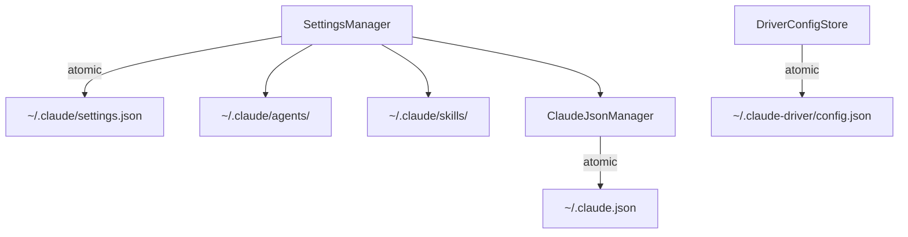

---
paths:
  - "claude-driver/src/main/lib/config/**/*"
---

<!-- parent: lib -->

### 架构图

### 定位与职责

- **职责**：全部配置文件原子读写 + Hook/statusLine 配置注入 + 5 类配置组读取。映射 PRD「机制·增量原子写入配置」（write-tmp+rename+field-merge）与「机制·深度搜集机制」（readAllConfigGroups）。
- **边界**：负责配置 IO 与注入；不负责 PTY（pty）、不负责远程 toml（services）。

### 内部组成

- **SettingsManager.ts**：`~/.claude/settings.json` 原子读写；Hook 配置注入（13 事件类型，Unix curl + Windows .ps1 bridge 生成）；statusLine 注入；env 块（provider）读写；agents/skills/hooks/tools/mcp 5 类配置组读取（readAllConfigGroups）。
- **ClaudeJsonManager.ts**：`~/.claude.json` 原子读写；全局 MCP servers、项目 `.mcp.json`、MCP enable/disable 状态；onboarding/trust 旁路。
- **DriverConfigStore.ts**：`~/.claude-driver/config.json` 原子读写（仪表盘自身配置：token 单价、预算、通知开关、通知窗口始终置顶 `notifWindowAlwaysOnTop`、通知窗口自动打开 `notifWindowAutoOpen`、主题、语言）。

### 依赖与联动

- **内部依赖**：shared/types（HookEventName/DriverConfig）；shared/constants（DRIVER_CONFIG_DIRNAME）；SettingsManager 依赖 ClaudeJsonManager（readGlobalMcpServers）。
- **通信方式**：经 IPC.CONFIG_READ/WRITE、DRIVER_CONFIG_READ、PROVIDER_CONFIG_READ/WRITE、CLAUDE_SETTINGS_READ、PROJECT_SETTINGS_READ/WRITE、MCP_SET_ENABLED、SKILL_SET_ENABLED、CONFIG_EXPORT/IMPORT 与渲染层交互。
- **关键交互场景**：①启动 injectHookConfig + setupStatusLineBridge；②readAllConfigGroups 一次性返回 5 类；③字段级 patch（patchDriverConfig/patchProjectMcpState）。

### 技术选型

自实现 write-tmp + os.replace（原子 rename）；无第三方配置库（字段级合并自实现）；smol-toml 仅在 services 用。

### 非功能约束

- **健壮性**：原子 rename 保证「要么完整成功要么不变」；字段级合并不覆盖用户其他字段。
- **复用性**：原子写入模式被 projects/scheduler/services 复用。
- **跨平台**：Hook bridge 脚本 Unix .sh + Windows .ps1 双生成。

> 详情请阅读对应 TDD 块文件：`docs/TDD.md` § main § lib § config（`.claude/rules/tdd/src/main/lib/config.md`）
