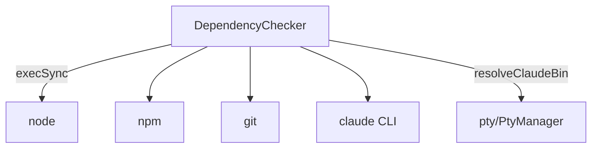

---
paths:
  - "claude-driver/src/main/lib/deps/**/*"
---

<!-- parent: lib -->

### 架构图

### 定位与职责

- **职责**：启动期依赖检测（Node ≥18 / npm / Git / Claude Code CLI）+ 生成平台安装提示 + Claude CLI 自动安装。
- **边界**：负责检测与安装引导；不负责运行期 PTY（pty）。

### 内部组成

- **DependencyChecker.ts**：checkNode/checkNpm/checkGit/checkClaude + checkAllDependencies + autoInstallClaude（`npm install -g @anthropic-ai/claude-code`）；生成平台安装提示（winget/brew/apt/dnf/pacman）。

### 依赖与联动

- **内部依赖**：pty/PtyManager（resolveClaudeBin/refreshClaudeBin）。
- **通信方式**：启动期 `runDependencyCheck` 同步调用，非 IPC。
- **关键交互场景**：缺依赖 -> 弹窗提示 + 引导安装；Claude CLI 可自动安装。

### 技术选型

child_process execSync（同步检测，启动期一次性）；平台分支安装提示。

### 非功能约束

- **跨平台**：覆盖 winget/brew/apt/dnf/pacman 五包管理器提示。
- **健壮性**：canAutoFix 标记，缺失项分类处理。

> 详情请阅读对应 TDD 块文件：`docs/TDD.md` § main § lib § deps（`.claude/rules/tdd/src/main/lib/deps.md`）
