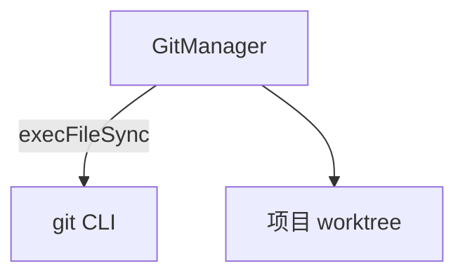

---
paths:
  - "claude-driver/src/main/lib/git/**/*"
---

<!-- parent: lib -->

### 架构图

### 定位与职责

- **职责**：无状态 Git CLI 操作包装。映射 PRD「机制·Git 开发工作流」（节点级快照/回退/删除、项目级同步 GitHub）。
- **边界**：负责执行 git 命令；不负责 worktree-per-session 编排（规划中）、不负责 UI（renderer gitCapability）。

### 内部组成

- **GitManager.ts**：对象式 API：commit（add -A + commit）、reset（--hard）、ensureRepo（init + checkout -b main）、push、getStatus（remote + branch）、deleteCommit（rebase --onto，非交互）。

### 依赖与联动

- **内部依赖**：无 in-repo 依赖。
- **通信方式**：经 IPC.GIT_COMMIT/RESET/ENSURE_REPO/DELETE_COMMIT/PUSH/GET_STATUS/GIT_MARKS_LOAD/MARK_SAVE/MARK_DELETE 与渲染层交互。
- **关键交互场景**：①节点快照 commit；②回退 reset --hard；③删除节点 deleteCommit（非交互 rebase，禁交互式）；④远程未配置/权限不足弹子窗口说明。

### 技术选型

child_process execFileSync（同步执行 git，无 shell 注入风险）；无状态设计便于并发。

### 非功能约束

- **健壮性**：禁用交互式 rebase（`-i`），全程非交互静默；返回 {ok, error} 结构化结果。
- **安全**：execFileSync 避免 shell 注入。

> 详情请阅读对应 TDD 块文件：`docs/TDD.md` § main § lib § git（`.claude/rules/tdd/src/main/lib/git.md`）
