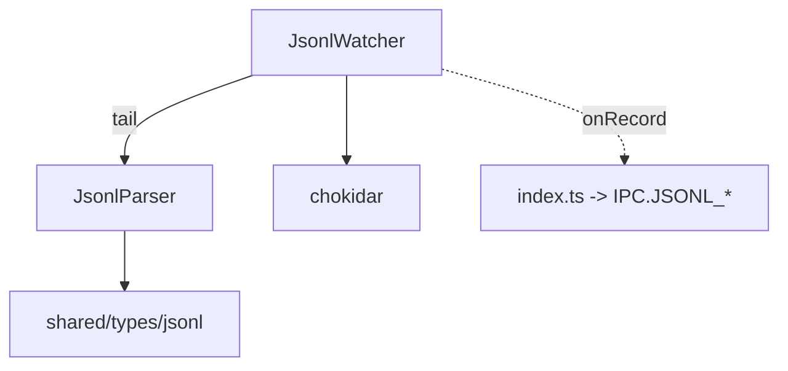

---
paths:
  - "claude-driver/src/main/lib/jsonl/**/*"
---

<!-- parent: lib -->

### 架构图

### 定位与职责

- **职责**：JSONL 转录文件增量解析与监听。映射 PRD「机制·Token 捕获」（唯一计费源 message.usage 提取）与「机制·信息分类系统」转录回看数据源；支撑 Subagent/Branch 显示逻辑（subagent JSONL 独立路径）。
- **边界**：负责解析与监听；不负责 token 聚合（renderer stats.atom）、不负责时间线渲染。

### 内部组成

- **JsonlParser.ts**：单行 JSONL -> `JsonlRecord`（仅 user/assistant），提取 text/tool_use/tool_result/usage/model/isSidechain/agentId/timestamp；提供路径->sessionUuid 与 subagent info 提取。
- **JsonlWatcher.ts**：`chokidar` tail 增量监听主 session 与 subagent JSONL（depth:3 覆盖 `<uuid>/subagents/agent-*.jsonl`）；per-file read offset；自动发现新 subagent 文件；追踪 `file-history-snapshot` 标记 branch 起点。

### 依赖与联动

- **内部依赖**：shared/types/jsonl（JsonlRecord 等类型）；无其他 in-repo 依赖。
- **通信方式**：经 index.ts 推送 IPC.JSONL_RECORD/RECORDS/SUBAGENT_RECORD/SUBAGENT_INSERTIONS/BRANCH_SNAPSHOT。
- **关键交互场景**：①实时 tail 新行->parseJsonlLine->onRecord；②历史回看 readFromStart 全量；③subagent 文件出现自动 watch。

### 技术选型

chokidar（跨平台文件监听，比 fs.watch 稳定）；自实现 tail offset（避免重复处理已读内容）。

### 非功能约束

- **健壮性**：tail 模式 + offset 去重防重复；文件监听静默停止时由上层轮询兜底。
- **可扩展**：subagent depth:3 自动发现，支持多并发 subagent。

> 详情请阅读对应 TDD 块文件：`docs/TDD.md` § main § lib § jsonl（`.claude/rules/tdd/src/main/lib/jsonl.md`）
