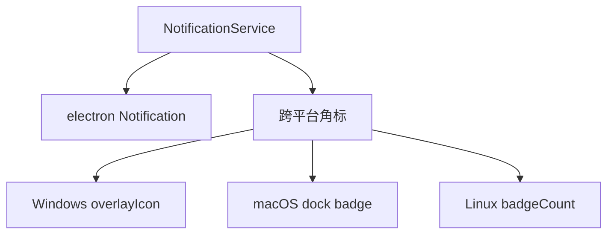

---
paths:
  - "claude-driver/src/main/lib/notification/**/*"
---

<!-- parent: lib -->

### 架构图

### 定位与职责

- **职责**：桌面通知 + 跨平台任务栏角标管理。映射 PRD「机制·系统通知推送」。
- **边界**：负责通知与角标；不负责应用内通知队列（renderer notification.atom）。

### 内部组成

- **NotificationService.ts**：init/notify/setBadge/incrementBadge/decrementBadge/resetBadge；主进程持有 `pendingCount`。

### 依赖与联动

- **内部依赖**：electron（app/nativeImage）；shared/events（IPC）。
- **通信方式**：由 index.ts 在 PermissionRequest Hook 触发 notify+increment、审批后 decrement、关闭后 decrement；IPC.NOTIFICATION/NOTIFICATION_FOCUS_TAB 推送。
- **关键交互场景**：权限请求 -> 桌面通知 + 角标 +1；审批 -> 角标 -1；关闭 -> 角标 -1；点击通知 -> 切换通知 tab。

### 技术选型

Electron 原生 Notification + 三平台角标 API（setOverlayIcon/dock.setBadge/setBadgeCount）。

### 非功能约束

- **当前限制 [待确认]**：`desktopNotificationsEnabled` 为死开关（notify 不读此开关，PRD §8.1 已记录，待绑定全局设置开关）。
- **硬编码绑定**：当前角标计数语义硬编码为「待处理权限请求数」，非通用通知。

> 详情请阅读对应 TDD 块文件：`docs/TDD.md` § main § lib § notification（`.claude/rules/tdd/src/main/lib/notification.md`）
