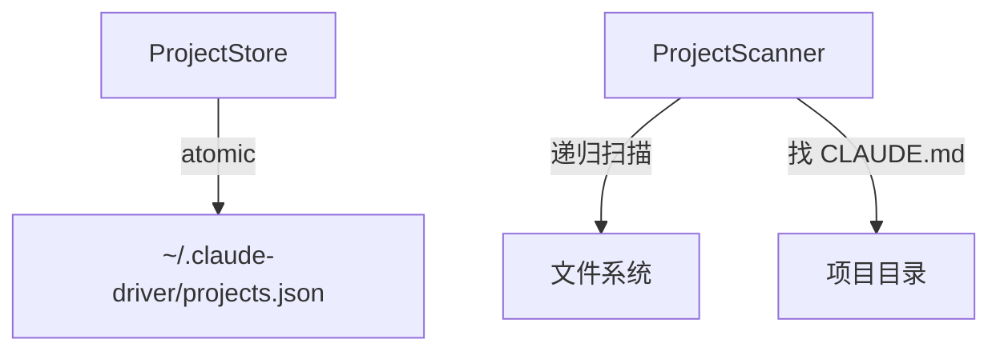

---
paths:
  - "claude-driver/src/main/lib/projects/**/*"
---

<!-- parent: lib -->

### 架构图

### 定位与职责

- **职责**：项目记录单持久化 + 目录扫描发现项目。支撑 PRD「全局监控界面·项目画板」数据源与初始化 SOP。
- **边界**：负责项目 CRUD 与扫描；不负责会话（sessions）、不负责渲染（renderer projects.atom）。

### 内部组成

- **ProjectStore.ts**：`~/.claude-driver/projects.json` 原子读写；CRUD（keyed by 绝对路径 id）；initCompleted/lastRootDir；updateProjectClaims 批量。
- **ProjectScanner.ts**：递归扫描（max depth 6）找含 CLAUDE.md 的目录；排除 node_modules 等；按路径前缀去重（保留最浅）；检测 Git repo。

### 依赖与联动

- **内部依赖**：shared/types（Project/ClaimStatus）。
- **通信方式**：经 IPC.PROJECT_LIST/CREATE/SCAN/UPDATE/UPDATED/HISTORY_SCAN 与渲染层交互。
- **关键交互场景**：①初始化 SOP 扫描根目录 -> 认领清单；②新建项目 upsertProject；③后续打开加载 claimStatus=1。

### 技术选型

自实现原子写入（write-tmp+rename）；fs 递归扫描 + 前缀去重。

### 非功能约束

- **健壮性**：projectsFileExists 探测；扫描深度限制 + 排除规则防性能问题。
- **可扩展**：claimStatus 三态（1/0/-1）支持「稍后决定」。

> 详情请阅读对应 TDD 块文件：`docs/TDD.md` § main § lib § projects（`.claude/rules/tdd/src/main/lib/projects.md`）
