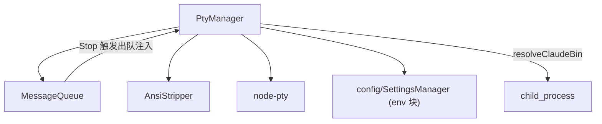

---
paths:
  - "claude-driver/src/main/lib/pty/**/*"
---

<!-- parent: lib -->

### 架构图

### 定位与职责

- **职责**：多 Claude 会话 PTY 生命周期管理 + 消息队列 + ANSI 清洗。映射 PRD「机制·多 Agent 点对点管理」的进程层（识别/创建/写入/读取/生命控制）与「机制·深度搜集机制」（env 块构建）。
- **边界**：负责 PTY 进程 IO；不负责 Hook 接收（hook-server）、JSONL 解析（jsonl）、IPC 注册（index.ts）。

### 内部组成

- **PtyManager.ts**：多会话 node-pty 管理（start/startBare/startCommand/resume/write/stop/resize）、claude bin 跨平台解析、心跳检测（10s）、30min 无交互超时、env 块构建（剥离宿主 Anthropic 变量 + 合并 settings.json env）。
- **MessageQueue.ts**：每会话 FIFO 队列，Stop Hook 触发出队自动注入 stdin（PRD Q1/Q2/Q3）。
- **AnsiStripper.ts**：剥离 ANSI 转义 + 可打印内容启发式。

### 依赖与联动

- **内部依赖**：config/SettingsManager（readClaudeEnvBlock）；shared/constants（HEARTBEAT_INTERVAL_MS/PTY_TIMEOUT_MS）；shared/types（SessionStatus/PermissionMode）。
- **通信方式**：node-pty stdin/stdout；经 IPC.SESSION_START/INPUT/STOP/RESUME、TERM_WINDOW_OPEN/CLOSE、TERM_DATA/RESIZE、PERMISSION_RESPOND 与渲染层交互。
- **关键交互场景**：①startSession spawn claude（stream-json）-> onData 回推；②resumeSession 用 `claude -r <claudeId>`；③MessageQueue.onStop() 取队首 -> writeToSession。

### 技术选型

node-pty（跨平台伪终端，唯一选择）；child_process execSync（claude bin 解析）；无第三方队列库（自实现 FIFO）。

### 非功能约束

- **可扩展**：atomFamily 化的 per-session 状态；消息队列按会话隔离互不影响。
- **健壮性**：心跳 + 超时双保险；stopSession 写 Ctrl+C×2 + 500ms 等待 + pty.kill。
- **跨平台**：claude bin 解析覆盖 where/which/nvm/npm-global/Homebrew/nvm-windows。

> 详情请阅读对应 TDD 块文件：`docs/TDD.md` § main § lib § pty（`.claude/rules/tdd/src/main/lib/pty.md`）
