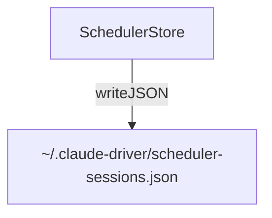

---
paths:
  - "claude-driver/src/main/lib/scheduler/**/*"
---

<!-- parent: lib -->

### 架构图

### 定位与职责

- **职责**：定时任务持久化存储（按 projectPath 分组，含 claudeId + 任务列表）。支撑 PRD「功能入口·定时触发」（基于 `/loop`）。
- **边界**：负责持久化；不负责 PTY 调度注入（index.ts）、不负责 UI（renderer SchedulerModal）。

### 内部组成

- **SchedulerStore.ts**：read/writeSchedulerSessions、appendTaskToSession、deleteTask、updateClaudeId；非原子直接 writeJSON。

### 依赖与联动

- **内部依赖**：无 in-repo 依赖。
- **通信方式**：经 IPC.SCHEDULER_LIST/CREATE/TOGGLE/DELETE 与渲染层交互；调度通过 index.ts 向 PTY 注入 `/loop` 命令。
- **关键交互场景**：创建任务 appendTaskToSession；暂停/恢复 toggle（控制 loop PTY）；删除 deleteTask。

### 技术选型

直接 fs writeJSON（任务量小，未用原子写入）。

### 非功能约束

- **健壮性**：7 天过期（renderer 侧 formatExpiry 强制）；每会话最多 50 任务。
- **待优化**：当前为 `/loop` 间隔触发，cron 式定时为规划方向。

> 详情请阅读对应 TDD 块文件：`docs/TDD.md` § main § lib § scheduler（`.claude/rules/tdd/src/main/lib/scheduler.md`）
