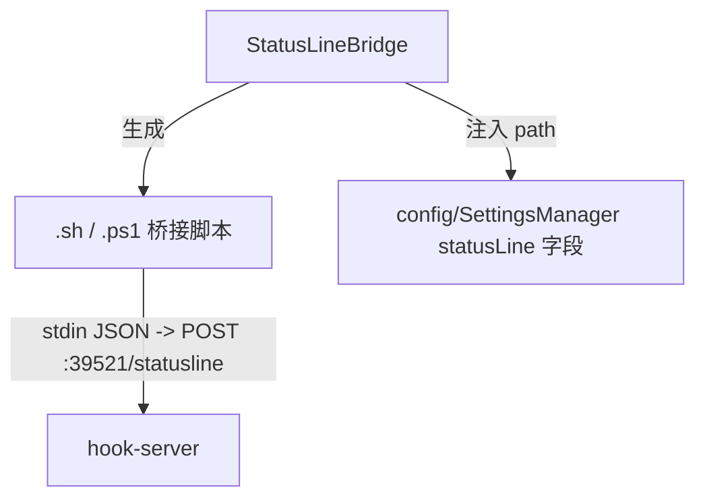

---
paths:
  - "claude-driver/src/main/lib/statusline/**/*"
---

<!-- parent: lib -->

### 架构图

### 定位与职责

- **职责**：生成 statusLine 桥接脚本（Unix .sh / Windows .ps1）并注入 `~/.claude/settings.json` 的 statusLine 字段。映射 PRD 三通道副通道（statusLine stdin 桥接）。
- **边界**：负责脚本生成与注入；不负责接收（hook-server `/statusline`）、不负责统计（renderer stats.atom）。

### 内部组成

- **StatusLineBridge.ts**：setupStatusLineBridge（生成脚本 + 注入）、removeStatusLineBridge；脚本读 stdin JSON 并 POST 给主进程。

### 依赖与联动

- **内部依赖**：config/SettingsManager（injectStatusLineConfig/read/writeClaudeSettings）；shared/constants（DRIVER_CONFIG_DIRNAME/STATUS_LINE_SCRIPT_NAME/STATUS_LINE_ENDPOINT）。
- **通信方式**：脚本经 HTTP POST `/statusline` -> HookEventBus.dispatchStatusLine -> IPC.STATUS_LINE。
- **关键交互场景**：启动 setupStatusLineBridge 注入；Claude Code 每 ~300ms 唤起脚本 -> POST。

### 技术选型

Unix sh + curl / Windows ps1 + Invoke-WebRequest 双脚本；脚本路径写入 settings.json。

### 非功能约束

- **跨平台**：Unix .sh + Windows .ps1 双生成，平台自动选择。
- **解耦性**：脚本为独立文件，主进程崩溃不影响 Claude Code 调用脚本（仅 POST 失败）。

> 详情请阅读对应 TDD 块文件：`docs/TDD.md` § main § lib § statusline（`.claude/rules/tdd/src/main/lib/statusline.md`）
