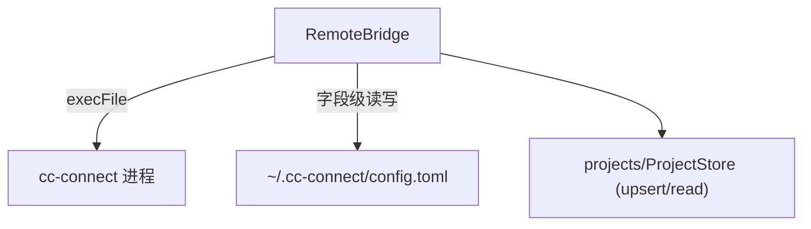

---
paths:
  - "claude-driver/src/main/services/**/*"
---

<!-- parent: main -->

### 架构图

### 定位与职责

- **职责**：cc-connect 远程交互（飞书 bot）安装检测 + `~/.cc-connect/config.toml` 字段级读写。支撑 PRD「功能入口·远程交互·cc-connect·飞书」。
- **边界**：负责 cc-connect 进程与配置；不负责飞书 bot UI（renderer features/remote）、不负责 PTY（pty）。

### 内部组成

- **RemoteBridgeService.ts**：checkInstall（which/where）、saveProjectBot、readProjectConfig、ensureConfig；私有 readToml/writeToml（只 patch 匹配的 `[[projects]]` 段，保留其他）。

### 依赖与联动

- **内部依赖**：shared/types（FeishuBotConfig）；projects/ProjectStore（upsertProject/readProjects）。
- **通信方式**：经 IPC.CC_CONNECT_CHECK/START/STOP/STATUS/CONFIG_SAVE/CONFIG_READ/INSTALL/LOG 与渲染层交互。
- **关键交互场景**：①检测安装 -> 未装引导（CHAT_START+CHAT_WINDOW_OPEN 预填安装命令）；②保存 bot -> 重生成 toml；③start/stop cc-connect 服务。

### 技术选型

smol-toml（TOML 解析/生成，支持字段级 patch）；child_process execFile（安装检测，不开 PTY）。

### 非功能约束

- **健壮性**：config.toml 字段级合并（只改匹配 `[[projects]]` 段，保留其他项目）；TOML 嵌套结构严格控制缩进顺序。
- **解耦性**：cc-connect 为外部独立进程（github.com/chenhg5/cc-connect），本模块仅管理，不实现飞书协议。

> 详情请阅读对应 TDD 块文件：`docs/TDD.md` § main § services（`.claude/rules/tdd/src/main/services.md`）
