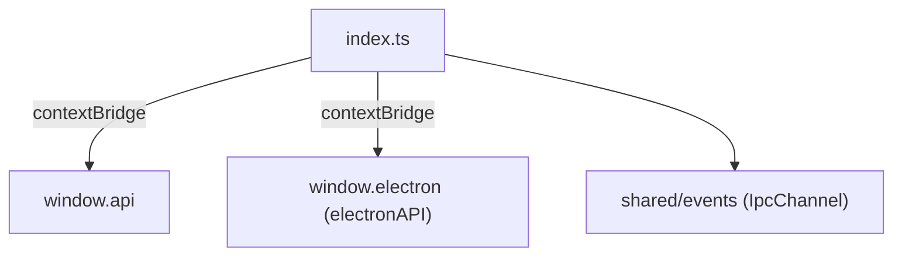

---
paths:
  - "claude-driver/src/preload/**/*"
---

<!-- parent: src -->

### 架构图

### 定位与职责

- **职责**：ContextBridge IPC 包装。将 ipcMain handler 映射为类型安全 `window.api`（invoke/on/removeAllListeners）。安全模型：`contextIsolation` 默认开启，渲染进程不直接接触 ipcRenderer，仅获 3 个收窄方法 + @electron-toolkit/preload 的 electronAPI。
- **边界**：桥接；不含业务逻辑。

### 内部组成

- **index.ts**：`window.api`（invoke(channel,...args)/on(channel,listener) 包裹去 IpcRendererEvent/返回退订/removeAllListeners）；`process.contextIsolated` 时用 contextBridge，否则直挂 window。
- **index.d.ts**：`window.electron`/`window.api` 环境类型声明（renderer 编译用）。

### 依赖与联动

- **内部依赖**：electron（contextBridge/ipcRenderer）；@electron-toolkit/preload（electronAPI）；shared/events（IpcChannel 类型）。
- **通信方式**：invoke=ipcRenderer.invoke（双向）；on=ipcRenderer.on（单向推送，包裹 listener 去 event）。
- **关键交互场景**：所有渲染层 IPC 经 window.api；通道名 IpcChannel 约束（仅注册常量可调）。

### 技术选型

contextBridge（Electron 官方安全桥接）；通道名类型化收窄 API 面。

### 非功能约束

- **安全**：contextIsolation 默认开启；渲染进程无 ipcRenderer 直接访问；API 面仅 3 方法 + electronAPI。
- **类型安全**：IpcChannel 联合约束 channel 参数。

> 详情请阅读对应 TDD 块文件：`docs/TDD.md` § preload（`.claude/rules/tdd/src/preload.md`）
