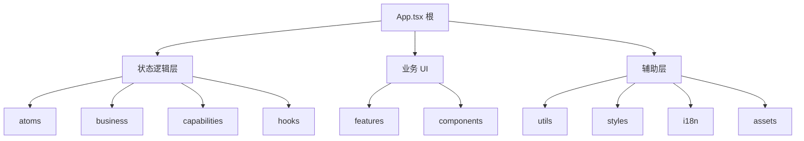
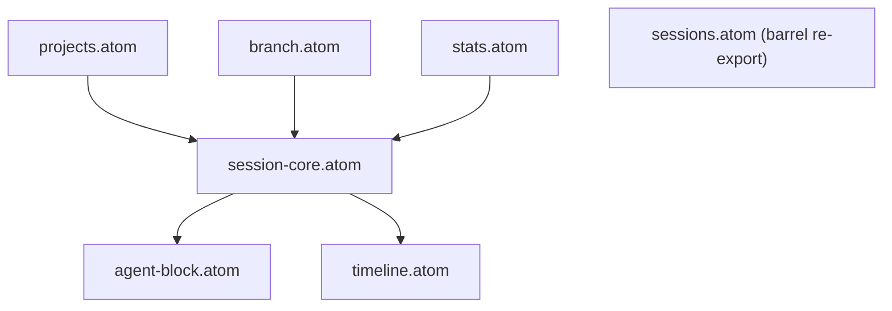
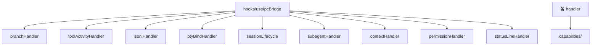
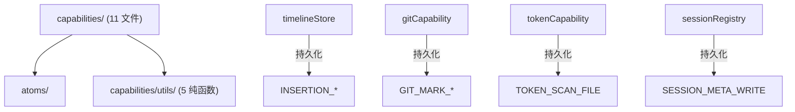
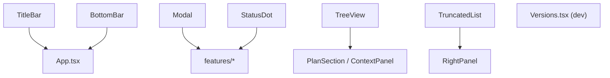
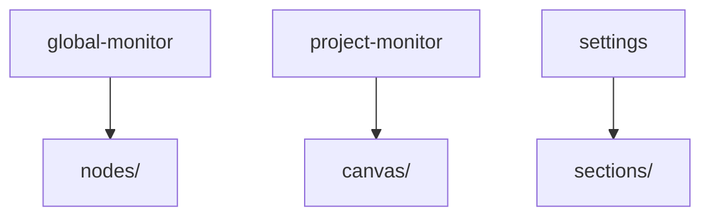
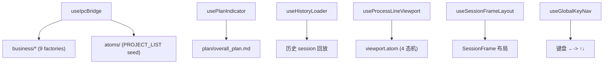
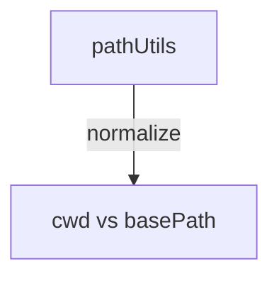
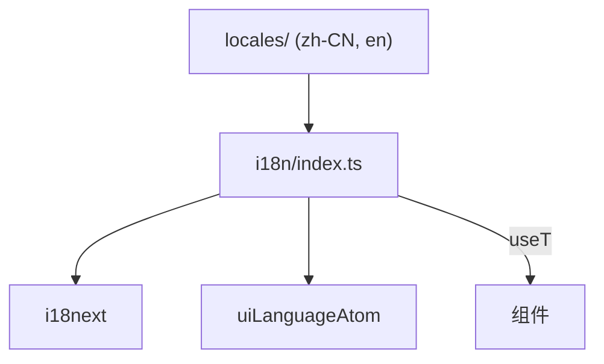
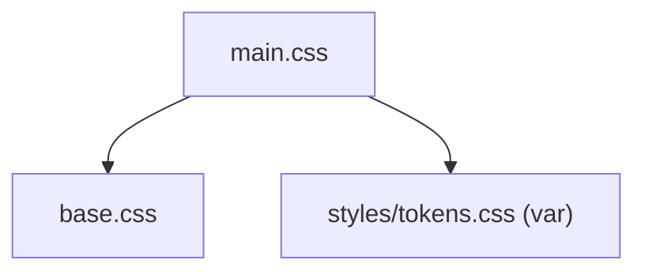

---
paths:
  - "claude-driver/src/renderer/**/*"
---


<!-- parent: src -->

### 架构图



### 定位与职责

- **职责**：Electron 渲染进程（Chromium + React）。`App.tsx` hash 路由 + 3-tab shell + pop-out；状态逻辑层（atoms/business/capabilities/hooks）+ 业务 UI（features/components）+ 辅助层（utils/styles/i18n/assets）。
- **边界**：负责 UI 与状态；不直接接触 ipcRenderer（经 preload window.api）、不接触 Node 模块。

### 内部组成

- **App.tsx / main.tsx**：根。hash 路由（`#/terminal`、`#/chat` pop-out 各自 JotaiProvider）+ 3-tab（global/project/notifications）+ 全局 overlay（GlobalSettingsModal/InitSopModal）。
- **状态逻辑层**：atoms（状态）/ business（IPC 事件处理）/ capabilities（变更+持久化）/ hooks（React 胶水）。
- **业务 UI**：features（9 功能模块）+ components（6 通用组件）。
- **辅助**：utils（路径匹配）/ styles（token）/ i18n（国际化）/ assets（遗留 CSS）。

### 依赖与联动

- **内部依赖**：状态逻辑层四件套互依；features 依赖 atoms/hooks/capabilities + components；shared 类型/IPC 名。
- **通信方式**：经 preload `window.api`（invoke 双向 + on 单向）；IPC->Atom 桥接（useIpcBridge 根）。
- **关键交互场景**：①Hook 事件 -> business -> capabilities -> atom -> 组件 re-render；②用户操作 -> IPC.invoke -> main -> 推送回 -> atom 更新。

### 技术选型

React + Jotai（原子化精准 re-render）+ @xyflow/react（两处无限画布）+ xterm.js（终端 pop-out）+ i18next。

### 非功能约束

- **解耦性**：状态逻辑层接受注入 store，可单测；IPC->Atom 桥接模式隔离副作用。
- **性能**：atomFamily 按 session/project keyed；fitView 节流 500ms。
- **可观测性**：ProcessLineCanvas `[DIAG]` 计数器（render/insertion/layout/effect）暴露在 DOM。

## atoms
<!-- parent: renderer -->
### 架构图



### 定位与职责

- **职责**：Jotai 原子状态容器（16 文件）。原始 atom（可变状态）+ 派生 atom（计算选择器）。无逻辑、无 IPC、无 React。
- **边界**：仅持有状态；不监听 IPC（business）、不持久化（capabilities）、不渲染（features）。

### 内部组成

- **session-core.atom**：`activeSessionsAtom`(claudeId->Session) + `ptySessionIdsAtom`(实时可见集，由 `addToRealtime`/`removeFromRealtime` 配对写入) + 派生 `runningSessionCountAtom`。
- **pty-binding.atom**：PTY↔Claude 双向绑定表 `ptyBindingsAtom`。
- **branch.atom**：`sessionRelationsAtom`(child->parent) + `branchCountAtom`。
- **agent-block.atom**：Agent Block 实时状态（工具/经验/subagent/insight）+ frame 高度图 + subagent 槽位。
- **timeline.atom**：`timelineBySessionAtom` + `lineInsertionsBySessionAtom` + `subagentTimelineAtom` + 导游标 `scrubber/cursorNodeIndexAtom`。
- **context-panel.atom**：每会话上下文组件列表 + `selectedContextAgentAtom`。
- **projects.atom**：项目 Map + 派生 claimed/pending + per-project PlanNode/PlanIndicator/Milestone/ProjectSettings（atomFamily）+ `runningProjectsAtom`（派生：依赖 `activeSessionsAtom` + `ptySessionIdsAtom` + `projectsAtom`，ptySessionIds.has + Running/Paused + pathMatches → {projectId, name, sessionCount}[]）。`ptySessionIdsAtom` 的清理（`removeFromRealtime`）是项目分组消失的前提。
- **permission.atom** / **notification.atom** / **pending-starts.atom** / **insight.atom** / **scheduler.atom** / **viewport.atom** / **stats.atom**（token 统计派生）/ **agentLabels.atom**（派生标签）。
- **sessions.atom**：barrel re-export（向后兼容）。

### 依赖与联动

- **内部依赖**：派生 atom 读原始 atom（如 stats 读 session-core；agentLabels 读 sessions/pty-bindings/branch）。
- **通信方式**：被 business 经 capabilities 写（store.set）；被 hooks/features 经 useAtomValue 读。
- **关键交互场景**：IPC 事件 -> business -> capabilities -> store.set(atom) -> 订阅组件 re-render。

### 技术选型
### 非功能约束

## business
<!-- parent: renderer -->
### 架构图



### 定位与职责

- **职责**：IPC 事件处理器（9 文件，工厂模式 `createXxxHandler(store)`）。监听 IPC，转译 payload 为 capability 调用变更 atom。含状态机（branchHandler 握手三态）与插入线构建（toolActivityHandler）。
- **边界**：监听 IPC + 调用 capabilities；不直接写 atom（经 capabilities）、不持久化（capabilities）、不渲染。

### 内部组成

- **branchHandler**：/branch 全生命周期状态机 IDLE->PENDING_CONFIRM->PENDING_BIND->IDLE。
- **toolActivityHandler**：PreToolUse/PostToolUse/Failure + workflow hooks；按类别构建插入线；subagent 槽位分配/释放。
- **jsonlHandler**：JSONL_RECORD* 入侵 -> TimelineNode + 插入线 + token 累计（实时路径）+ Insight 提取。
- **ptyBindHandler**：PTY_BIND/UNBIND，3 路径（B 已有条目/C 缺失查 pending/外部启动）。
- **sessionLifecycle**：SessionStart/End/Stop。
- **subagentHandler**：SubagentStart/Stop（+ /btw 回答回填）。
- **contextHandler**：PostToolUse(Read/Glob/Grep/WebFetch) 添加上下文 + PostCompact 清空动态。
- **permissionHandler**：PermissionRequest 入队（dedup）/Denied 出队。
- **statusLineHandler**：~300ms statusLine -> tokenUsage patch + claudeId 解析。

### 依赖与联动

- **内部依赖**：全部依赖 capabilities/ + atoms/；branchHandler 依赖 useSessionFrameLayout（computeFrozenOffset）。
- **通信方式**：`window.api.on(channel, cb)` 注册监听；handler -> capability -> store.set。
- **关键交互场景**：IPC->Atom 桥接的变更侧；注册顺序 branch 优先（PTY_BIND/HOOK_EVENT 先到 branch 状态机）。

### 技术选型
### 非功能约束

## capabilities
<!-- parent: renderer -->
### 架构图



### 定位与职责

- **职责**：store 变更 + 持久化助手（11 文件，接受注入 `store`）。对特定 atom 的原子读写操作，按域分组（M/L/N/O/P/I/J/H/K + token）。部分调用 IPC 持久化到 JSONL sidecar。
- **边界**：变更 atom + 持久化；不监听 IPC（business）、不渲染（features）。

### 内部组成

- **agentActivity**(M)：agentBlocksAtom 读写（toolStart/Done/Failed、show/hideSubagent、槽位分配/释放、setInsight、clearWorkStatus）。
- **branchRegistry**(L)：sessionRelationsAtom 读写（registerBranch 自动算 side/lineLength/branchIndex，快照竞态缓存）。
- **contextTracker**(N)：contextPanelAtom（add/clearDynamic/get）。
- **permissionQueue**(O)：permissionRequestsAtom（enqueue dedup/dequeue/getPending）。
- **gitCapability**(P)：timeline isGitted 标记 + 持久化 `.git-marks.jsonl`。
- **ptyBindings**(I)：双向绑定表读写（bind/unbind/resolve）。
- **realtimeVisibility**(J)：ptySessionIdsAtom（add/remove/is/get）。
- **sessionRegistry**(H)：activeSessionsAtom 写（create/patch/complete/find）+ 持久化 `.meta.json`。
- **timelineStore**(K)：timeline/insertions 读写 + 持久化 `.insertions.jsonl`（含 subagent 变体）。
- **tokenCapability**(M7)：sessionTokensAtom 唯一写入入口（3 路径）+ setDriverConfig。
- **jumpableNodes**：构建键盘 ↑↓ 跳转列表（纯函数）。
- **utils/**：纯转换（jsonlToNode/insightExtractor/agentResponseParser/lineInsertionBuilder/toolDisplay）。

### 依赖与联动

- **内部依赖**：atoms/；部分依赖 @shared/events（持久化 IPC）。
- **通信方式**：被 business/hooks 调用；store.set(atom) + 可选 window.api.invoke(持久化)。
- **关键交互场景**：business -> capability -> store.set + 持久化 sidecar；hooks 也直接调用。

### 技术选型
### 非功能约束

## components
<!-- parent: renderer -->
### 架构图



### 定位与职责

- **职责**：通用、feature-agnostic 的展示型 React 组件，跨页复用。无 barrel，各自 default export。
- **边界**：通用 UI；不含业务逻辑（业务在 features）。

### 内部组成

- **TitleBar**：38px 顶栏（macOS 红黄绿控件装饰 + logo + 标题 + 右侧 today tokens/cost/running count），`-webkit-app-region: drag`。
- **BottomBar**：38px 底栏（3 tab + 右侧统计 + 设置按钮）。
- **Modal**：全局 overlay（blur 背景 + Portal 到 body + ESC/click-outside 关闭）。
- **StatusDot**：6 状态指示点（running/paused/done/todo/idle/error）。
- **TreeView**：递归展开树（Plan M/S/T + 上下文文件树）。
- **TruncatedList**：截断列表（≤3 全显；>3 显 2+`···N`，点击展开 overlay）。
- **Versions.tsx**：dev 组件（列 Electron/Chromium/Node 版本）。

### 依赖与联动

- **内部依赖**：i18n（useT）；App（TabId 类型）。
- **通信方式**：纯 props；Modal 经 Portal。
- **关键交互场景**：BottomBar 切 tab；Modal 容器；StatusDot 状态点贯穿所有可视化元素。

### 技术选型
### 非功能约束

## features
<!-- parent: renderer -->
### 架构图



### 定位与职责

- **职责**：业务 UI 模块（9 子目录）。每个对应 PRD 一类界面概念（全局监控/项目监控/消息通知/设置/功能入口等）。
- **边界**：业务 UI；通用组件在 components/。

### 内部组成

- **global-monitor**：全局监控页（项目画板 + 右半面板 + 创建向导 + 初始化 SOP）。含 `nodes/`。
- **project-monitor**：项目监控页（实时工作区 + 历史工作区 + Plan + Git）。含 `canvas/`。
- **notifications**：独立通知窗口（`#/notifications`，独立 BrowserWindow pop-out）。按运行中项目分割 + 2 行通知项 + 可展开详情（复用历史面板触发线可视化）。
- **settings**：全局设置 Modal（10 section）。含 `sections/`。
- **chat**：闲聊气泡 pop-out（`#/chat`）。
- **terminal**：独立终端 pop-out（`#/terminal`，xterm.js）。
- **remote**：cc-connect 远程/飞书配置。
- **scheduler**：定时任务 Modal。
- **author-recommend**：作者推荐 Modal。

### 依赖与联动

- **内部依赖**：atoms/hooks/capabilities/business + components + shared。
- **通信方式**：经 window.api IPC；订阅 atom。
- **关键交互场景**：①GlobalMonitorPage 双击项目卡 -> 切 project tab；②ProcessLineCanvas 节点 Git 操作；③SettingsModal 统一保存。

### 技术选型
### 非功能约束

## hooks
<!-- parent: renderer -->
### 架构图



### 定位与职责

- **职责**：React 胶水（6 文件）。挂载/卸载 IPC 编排（useIpcBridge）、生命周期状态机（usePlanIndicator/useHistoryLoader）、画布 UI 控制器（useGlobalKeyNav/useProcessLineViewport/useSessionFrameLayout）。
- **边界**：将 business 接到 live Jotai store；不持有业务状态、不定义 atom。

### 内部组成

- **useIpcBridge**：IPC 编排入口。组装 9 business handlers（注册顺序 branch 优先），PROJECT_LIST seed，后台扫描 token（PROJECT_HISTORY_SCAN）。
- **usePlanIndicator**：Plan 数据管理 + 倒三角指示器状态机（active/possibly-paused/completed）。导出 `parsePlanNodes`（M/S/T markdown 解析）。
- **useHistoryLoader**：历史 session 加载（GIT_ENSURE_REPO/PROJECT_HISTORY_SCAN max 20/replay insertions/milestones/git-marks/branch relations/token-scan）。
- **useProcessLineViewport**：4 态视口机（overview/focus/follow/locked）+ 节流 fitView 500ms。
- **useSessionFrameLayout**：SessionFrame 位置计算（cluster-aware X + 时间堆叠 Y）。导出 FRAME_WIDTH/GAP 等常量。
- **useGlobalKeyNav**：←-> 框间跳转 + ↑↓ 框内节点跳转（buildJumpableNodes）。

### 依赖与联动

- **内部依赖**：business/* + capabilities/* + atoms/* + @xyflow/react。
- **通信方式**：useEffect -> createXxxHandler(store) + window.api.on；handlers 变更 atom -> 组件 re-render。
- **关键交互场景**：useIpcBridge 是 IPC->Atom 桥接根；usePlanIndicator 检测 PostToolUse plan 写入生成里程碑。

### 技术选型
### 非功能约束

## utils
<!-- parent: renderer -->
### 架构图



### 定位与职责

- **职责**：渲染层通用工具。当前仅跨平台路径前缀匹配。
- **边界**：纯函数；无 IPC、无状态。

### 内部组成

- **pathUtils.ts**：`pathMatches(cwd, basePath)` - 规范化 `\`->`/`、大小写不敏感、`cwd===base || cwd.startsWith(base+'/')`。

### 依赖与联动

- **内部依赖**：无。
- **通信方式**：被 business/capabilities/hooks 调用做 session cwd 归属判定。
- **关键交互场景**：session 按项目路径归属（LeftPanel 过滤、statusLine claudeId 解析回退）。

### 技术选型
### 非功能约束

## styles
<!-- parent: renderer -->
### 架构图

```mermaid
graph TD
    Tokens["tokens.css :root"] -->|var(--..)| Components["各组件 CSS"]
```

### 定位与职责

- **职责**：全局 CSS Design Token 系统（权威）。Anthropic 暖色暗主题 + 响应式排版/间距 + 动画。
- **边界**：仅 token 定义 + 全局 reset；组件级样式在各组件 .css。

### 内部组成

- **tokens.css**：`:root` 自定义属性（color bg0-bg4/orange --or/green/purple/red/blue status；响应式 typography `clamp()` 800-2560px；spacing；layout sizes/radii；shadows；pulse/blink keyframes；reset；scrollbar）。

### 依赖与联动

- **内部依赖**：被所有组件 CSS 经 `var(--...)` 引用。
- **通信方式**：CSS 自定义属性；主题切换经 `document.documentElement.dataset.theme`。
- **关键交互场景**：全局主题；响应式适配。

### 技术选型
### 非功能约束

## i18n
<!-- parent: renderer -->
### 架构图



### 定位与职责

- **职责**：i18next 翻译引擎 + Jotai atom 集成。atom 为单一真相源，i18next 为引擎。
- **边界**：翻译；不持有业务状态。

### 内部组成

- **index.ts**：i18next init（zh-CN 默认 + en）、`uiLanguageAtom`、`useT()` hook（订阅 atom + setLanguage 持久化经 CONFIG_WRITE + 同步 i18next.language）、`tStatic`（非组件上下文）。
- **types.ts**：`UILanguage` 联合 + `SUPPORTED_LANGUAGES` + `FALLBACK_LANGUAGE`。

### 依赖与联动

- **内部依赖**：locales/{zh-CN,en}。
- **通信方式**：setLanguage 写 atom + 持久化 IPC.CONFIG_WRITE(scope:driver,key:uiLanguage)。
- **关键交互场景**：atom 变更 -> 订阅组件 re-render；语言即时切换。

### 技术选型
### 非功能约束

## assets
<!-- parent: renderer -->
### 架构图



### 定位与职责

- **职责**：electron-vite 脚手架遗留 CSS（base reset + scaffold 样式）。
- **边界**：遗留样式；权威 token 系统在 styles/tokens.css。

### 内部组成

- **base.css**：electron-vite 默认 color tokens（`--ev-c-*`）+ reset（遗留，与 tokens.css 的 `--bg*`/`--or` 独立）。
- **main.css**：import base.css + body/#root flex 布局 + code/versions 脚手架（引用 tokens.css 的 `--space-*`/`--text-*`）。

### 依赖与联动

- **内部依赖**：引用 styles/tokens.css 变量。
- **通信方式**：静态 CSS。
- **关键交互场景**：main.tsx import tokens.css；assets 为脚手架层。

### 技术选型
### 非功能约束
