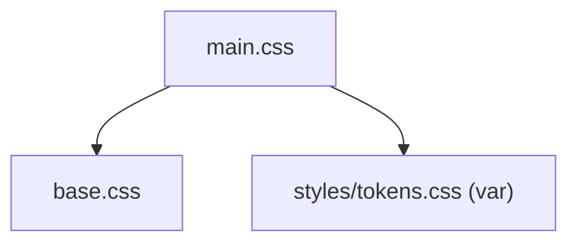

---
paths:
  - "claude-driver/src/renderer/src/assets/**/*"
---

<!-- parent: renderer -->

### 架构图

### 定位与职责

- **职责**：electron-vite 脚手架遗留 CSS（base reset + scaffold 样式）。
- **边界**：遗留样式；权威 token 系统在 styles/tokens.css。

### 内部组成

- **base.css**：electron-vite 默认 color tokens（`--ev-c-*`）+ reset（遗留，与 tokens.css 的 `--bg*`/`--or` 独立）。
- **main.css**：import base.css + body/#root flex 布局 + code/versions 脚手架（引用 tokens.css 的 `--space-*`/`--text-*`）。

### 依赖与联动

- **内部依赖**：引用 styles/tokens.css 变量。
- **通信方式**：静态 CSS。
- **关键交互场景**：main.tsx import tokens.css；assets 为脚手架层。

### 技术选型

electron-vite 默认 scaffold。

### 非功能约束

- **遗留 [待清理]**：`--ev-c-*` token 多为遗留，tokens.css 为权威；scaffold CSS 部分可能已死。

> 详情请阅读对应 TDD 块文件：`docs/TDD.md` § renderer § assets（`.claude/rules/tdd/src/renderer/assets.md`）
