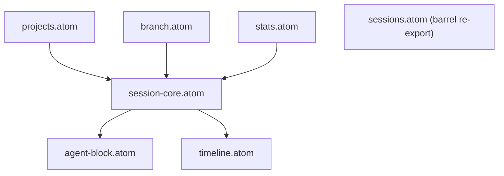

---
paths:
  - "claude-driver/src/renderer/src/atoms/**/*"
---

<!-- parent: renderer -->

### 架构图

### 定位与职责

- **职责**：Jotai 原子状态容器（16 文件）。原始 atom（可变状态）+ 派生 atom（计算选择器）。无逻辑、无 IPC、无 React。
- **边界**：仅持有状态；不监听 IPC（business）、不持久化（capabilities）、不渲染（features）。

### 内部组成

- **session-core.atom**：`activeSessionsAtom`(claudeId->Session) + `ptySessionIdsAtom`(实时可见集，由 `addToRealtime`/`removeFromRealtime` 配对写入) + 派生 `runningSessionCountAtom`。
- **pty-binding.atom**：PTY↔Claude 双向绑定表 `ptyBindingsAtom`。
- **branch.atom**：`sessionRelationsAtom`(child->parent) + `branchCountAtom`。
- **agent-block.atom**：Agent Block 实时状态（工具/经验/subagent/insight）+ frame 高度图 + subagent 槽位。
- **timeline.atom**：`timelineBySessionAtom` + `lineInsertionsBySessionAtom` + `subagentTimelineAtom` + 导游标 `scrubber/cursorNodeIndexAtom`。
- **context-panel.atom**：每会话上下文组件列表 + `selectedContextAgentAtom`。
- **projects.atom**：项目 Map + 派生 claimed/pending + per-project PlanNode/PlanIndicator/Milestone/ProjectSettings（atomFamily）+ `runningProjectsAtom`（派生：依赖 `activeSessionsAtom` + `ptySessionIdsAtom` + `projectsAtom`，ptySessionIds.has + Running/Paused + pathMatches → {projectId, name, sessionCount}[]）。`ptySessionIdsAtom` 的清理（`removeFromRealtime`）是项目分组消失的前提。
- **permission.atom** / **notification.atom** / **pending-starts.atom** / **insight.atom** / **scheduler.atom** / **viewport.atom** / **stats.atom**（token 统计派生）/ **agentLabels.atom**（派生标签）。
- **sessions.atom**：barrel re-export（向后兼容）。

### 依赖与联动

- **内部依赖**：派生 atom 读原始 atom（如 stats 读 session-core；agentLabels 读 sessions/pty-bindings/branch）。
- **通信方式**：被 business 经 capabilities 写（store.set）；被 hooks/features 经 useAtomValue 读。
- **关键交互场景**：IPC 事件 -> business -> capabilities -> store.set(atom) -> 订阅组件 re-render。

### 技术选型

Jotai（atomFamily 支持按会话/项目 keyed 状态）；`atom(get=>…)` 派生避免组件内重复聚合。

### 非功能约束

- **解耦性**：纯状态层，无副作用，单一职责。
- **可测试性**：atom 初始值可脱离 React 单测（见 __tests__/atoms）。

> 详情请阅读对应 TDD 块文件：`docs/TDD.md` § renderer § atoms（`.claude/rules/tdd/src/renderer/atoms.md`）
