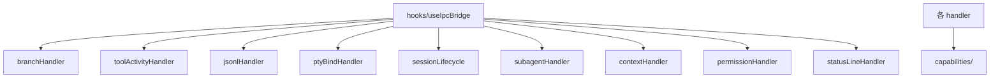

---
paths:
  - "claude-driver/src/renderer/src/business/**/*"
---

<!-- parent: renderer -->

### 架构图

### 定位与职责

- **职责**：IPC 事件处理器（9 文件，工厂模式 `createXxxHandler(store)`）。监听 IPC，转译 payload 为 capability 调用变更 atom。含状态机（branchHandler 握手三态）与插入线构建（toolActivityHandler）。
- **边界**：监听 IPC + 调用 capabilities；不直接写 atom（经 capabilities）、不持久化（capabilities）、不渲染。

### 内部组成

- **branchHandler**：/branch 全生命周期状态机 IDLE->PENDING_CONFIRM->PENDING_BIND->IDLE。
- **toolActivityHandler**：PreToolUse/PostToolUse/Failure + workflow hooks；按类别构建插入线；subagent 槽位分配/释放。
- **jsonlHandler**：JSONL_RECORD* 入侵 -> TimelineNode + 插入线 + token 累计（实时路径）+ Insight 提取。
- **ptyBindHandler**：PTY_BIND/UNBIND，3 路径（B 已有条目/C 缺失查 pending/外部启动）。
- **sessionLifecycle**：SessionStart/End/Stop。
- **subagentHandler**：SubagentStart/Stop（+ /btw 回答回填）。
- **contextHandler**：PostToolUse(Read/Glob/Grep/WebFetch) 添加上下文 + PostCompact 清空动态。
- **permissionHandler**：PermissionRequest 入队（dedup）/Denied 出队。
- **statusLineHandler**：~300ms statusLine -> tokenUsage patch + claudeId 解析。

### 依赖与联动

- **内部依赖**：全部依赖 capabilities/ + atoms/；branchHandler 依赖 useSessionFrameLayout（computeFrozenOffset）。
- **通信方式**：`window.api.on(channel, cb)` 注册监听；handler -> capability -> store.set。
- **关键交互场景**：IPC->Atom 桥接的变更侧；注册顺序 branch 优先（PTY_BIND/HOOK_EVENT 先到 branch 状态机）。

### 技术选型

工厂模式 `createXxxHandler(store)` 返回 `register()`（IPC 退订列表）+ handler 方法；store 注入实现可测。

### 非功能约束

- **可测试性**：接受注入 store，可脱离 React/IPC 单测（除持久化 IPC 需 mock window.api）。
- **健壮性**：branchHandler 握手三态处理 IPC 时序竞态；jsonlHandler 实时路径才累计 token（批重放跳过防重复）。

> 详情请阅读对应 TDD 块文件：`docs/TDD.md` § renderer § business（`.claude/rules/tdd/src/renderer/business.md`）
