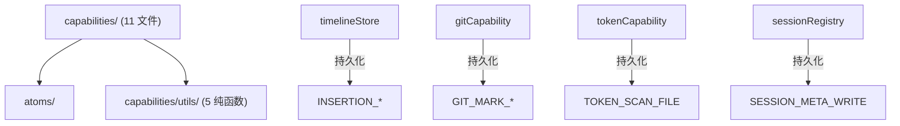
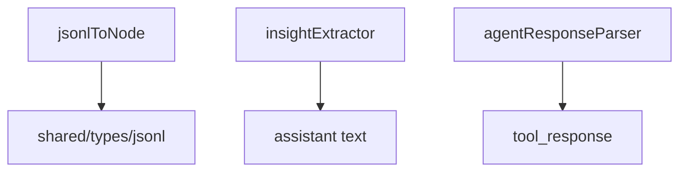

---
paths:
  - "claude-driver/src/renderer/src/capabilities/**/*"
---

<!-- parent: renderer -->

### 架构图

### 定位与职责

- **职责**：store 变更 + 持久化助手（11 文件，接受注入 `store`）。对特定 atom 的原子读写操作，按域分组（M/L/N/O/P/I/J/H/K + token）。部分调用 IPC 持久化到 JSONL sidecar。
- **边界**：变更 atom + 持久化；不监听 IPC（business）、不渲染（features）。

### 内部组成

- **agentActivity**(M)：agentBlocksAtom 读写（toolStart/Done/Failed、show/hideSubagent、槽位分配/释放、setInsight、clearWorkStatus）。
- **branchRegistry**(L)：sessionRelationsAtom 读写（registerBranch 自动算 side/lineLength/branchIndex，快照竞态缓存）。
- **contextTracker**(N)：contextPanelAtom（add/clearDynamic/get）。
- **permissionQueue**(O)：permissionRequestsAtom（enqueue dedup/dequeue/getPending）。
- **gitCapability**(P)：timeline isGitted 标记 + 持久化 `.git-marks.jsonl`。
- **ptyBindings**(I)：双向绑定表读写（bind/unbind/resolve）。
- **realtimeVisibility**(J)：ptySessionIdsAtom（add/remove/is/get）。
- **sessionRegistry**(H)：activeSessionsAtom 写（create/patch/complete/find）+ 持久化 `.meta.json`。
- **timelineStore**(K)：timeline/insertions 读写 + 持久化 `.insertions.jsonl`（含 subagent 变体）。
- **tokenCapability**(M7)：sessionTokensAtom 唯一写入入口（3 路径）+ setDriverConfig。
- **jumpableNodes**：构建键盘 ↑↓ 跳转列表（纯函数）。
- **utils/**：纯转换（jsonlToNode/insightExtractor/agentResponseParser/lineInsertionBuilder/toolDisplay）。

### 依赖与联动

- **内部依赖**：atoms/；部分依赖 @shared/events（持久化 IPC）。
- **通信方式**：被 business/hooks 调用；store.set(atom) + 可选 window.api.invoke(持久化)。
- **关键交互场景**：business -> capability -> store.set + 持久化 sidecar；hooks 也直接调用。

### 技术选型

函数式 + store 注入（`Store = Pick<TestStore,'get'|'set'>`）；持久化与变更解耦（变更同步，持久化 fire-and-forget）。

### 非功能约束

- **可测试性**：纯 store 操作可单测（持久化 IPC 需 mock window.api）。
- **复用性**：timelineStore/gitCapability/tokenCapability 统一 sidecar 持久化模式。

## utils
<!-- parent: capabilities -->
### 架构图

### 定位与职责

- **职责**：纯转换/解析函数（3 文件）。无 store、无 IPC、无 React。
- **边界**：纯函数；不持有状态、不监听。

### 内部组成

- **jsonlToNode.ts**：`jsonlRecordToNode`（JsonlRecord -> TimelineNode，各 type 分支 + null 过滤 + uuid 回退）。
- **insightExtractor.ts**：`extractInsightText`（匹配 `★ Insight ─...─` 格式块）。
- **agentResponseParser.ts**：`extractAgentResponse`（string/array-text-blocks/object.content/object.result）。

### 依赖与联动

- **内部依赖**：shared/types/jsonl、atoms/timeline.atom（类型）。
- **通信方式**：被 capabilities/business 内联调用。
- **关键交互场景**：jsonlHandler 用 jsonlToNode + insightExtractor。

### 技术选型
### 非功能约束
