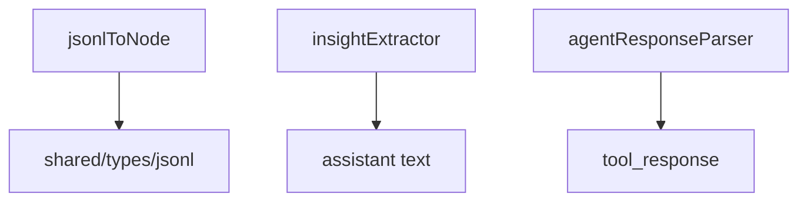

---
paths:
  - "claude-driver/src/renderer/src/capabilities/utils/**/*"
---

<!-- parent: capabilities -->

### 架构图

### 定位与职责

- **职责**：纯转换/解析函数（3 文件）。无 store、无 IPC、无 React。
- **边界**：纯函数；不持有状态、不监听。

### 内部组成

- **jsonlToNode.ts**：`jsonlRecordToNode`（JsonlRecord -> TimelineNode，各 type 分支 + null 过滤 + uuid 回退）。
- **insightExtractor.ts**：`extractInsightText`（匹配 `★ Insight ─...─` 格式块）。
- **agentResponseParser.ts**：`extractAgentResponse`（string/array-text-blocks/object.content/object.result）。

### 依赖与联动

- **内部依赖**：shared/types/jsonl、atoms/timeline.atom（类型）。
- **通信方式**：被 capabilities/business 内联调用。
- **关键交互场景**：jsonlHandler 用 jsonlToNode + insightExtractor。

### 技术选型

纯函数，零依赖，易测试。

### 非功能约束

无（历史遗留的 `lineInsertionBuilder.ts` 与 `toolDisplay.ts` 因与 `toolActivityHandler.ts` 内联实现重复且语义冲突，已清理）。

> 详情请阅读对应 TDD 块文件：`docs/TDD.md` § renderer § capabilities § utils（`.claude/rules/tdd/src/renderer/capabilities/utils.md`）
