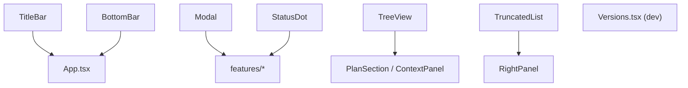
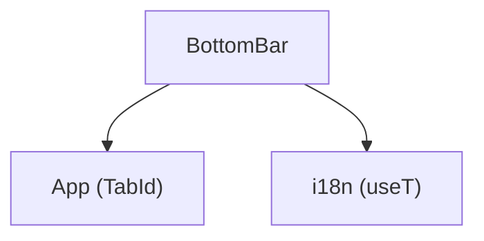
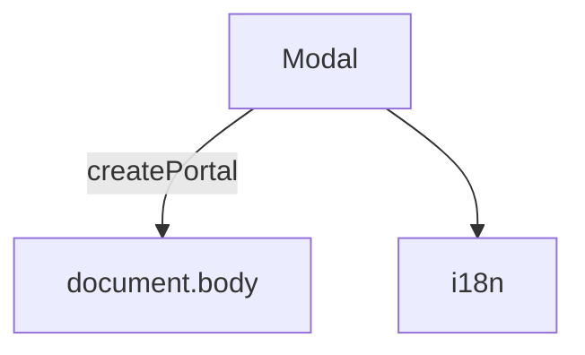
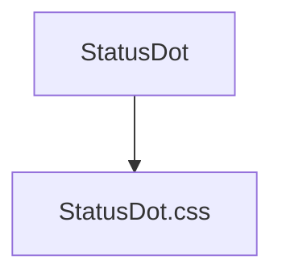
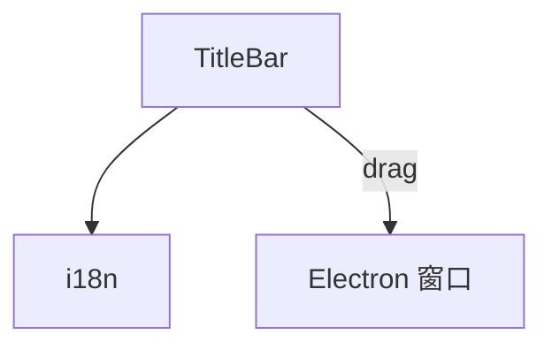
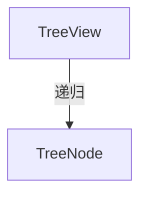
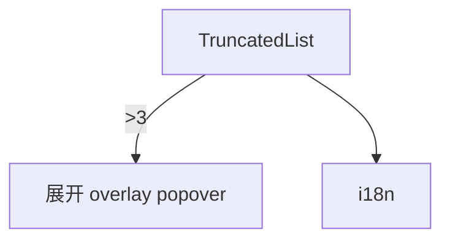

---
paths:
  - "claude-driver/src/renderer/src/components/**/*"
---

<!-- parent: renderer -->

### 架构图

### 定位与职责

- **职责**：通用、feature-agnostic 的展示型 React 组件，跨页复用。无 barrel，各自 default export。
- **边界**：通用 UI；不含业务逻辑（业务在 features）。

### 内部组成

- **TitleBar**：38px 顶栏（macOS 红黄绿控件装饰 + logo + 标题 + 右侧 today tokens/cost/running count），`-webkit-app-region: drag`。
- **BottomBar**：38px 底栏（3 tab + 右侧统计 + 设置按钮）。
- **Modal**：全局 overlay（blur 背景 + Portal 到 body + ESC/click-outside 关闭）。
- **StatusDot**：6 状态指示点（running/paused/done/todo/idle/error）。
- **TreeView**：递归展开树（Plan M/S/T + 上下文文件树）。
- **TruncatedList**：截断列表（≤3 全显；>3 显 2+`···N`，点击展开 overlay）。
- **Versions.tsx**：dev 组件（列 Electron/Chromium/Node 版本）。

### 依赖与联动

- **内部依赖**：i18n（useT）；App（TabId 类型）。
- **通信方式**：纯 props；Modal 经 Portal。
- **关键交互场景**：BottomBar 切 tab；Modal 容器；StatusDot 状态点贯穿所有可视化元素。

### 技术选型

React FC + CSS（无 UI 库，pixel-faithful 复刻设计稿）；createPortal 避 z-index 堆叠。

### 非功能约束

- **复用性**：feature-agnostic，跨页复用；TruncatedList 实现 PRD §3.2.1 截断规则。
- **可访问性**：Modal ESC 关闭 + click-outside。

## BottomBar
<!-- parent: components -->
### 架构图

### 定位与职责

- **职责**：38px 底部导航栏。2 tab（global/project）+ 右侧统计（tokens/项目数/agents/pending）+ 设置按钮。通知入口已迁移至 TitleBar 的独立通知窗口按钮，不属于 BottomBar 边界。pixel-faithful 复刻 `.btabs`。
- **边界**：导航 + 统计展示；不含业务逻辑。

### 内部组成

- **BottomBar.tsx**：props（activeTab/onTabChange/monthlyTokens/activeProjectTokens/projectCount/agentCount/pendingRequests/onOpenSettings）。

### 依赖与联动

- **内部依赖**：App（TabId 类型）；i18n。
- **通信方式**：纯 props 回调。
- **关键交互场景**：onTabChange 在 global/project 间切换；onOpenSettings 开 GlobalSettingsModal；通知窗口由 TitleBar 独立打开。

### 技术选型
### 非功能约束

## Modal
<!-- parent: components -->
### 架构图

### 定位与职责

- **职责**：全局 overlay Modal。blur 背景 + 居中内容 + ESC 关闭 + click-outside 关闭。经 React Portal 渲染到 body 避免 z-index 堆叠问题。
- **边界**：容器；内容由 children 注入。

### 内部组成

- **Modal.tsx**：props（open/onClose/title?/width?/children/showClose?）。

### 依赖与联动

- **内部依赖**：i18n。
- **通信方式**：纯 props。
- **关键交互场景**：SchedulerModal/RemoteModal/GlobalSettingsModal 等共用此容器。

### 技术选型
### 非功能约束

## StatusDot
<!-- parent: components -->
### 架构图

### 定位与职责

- **职责**：状态指示点。6 状态（running 绿色脉冲/paused 橙色脉冲/done 绿静态/todo 空心/idle 灰/error 红）。贯穿项目卡片、Agent Block、Plan 节点等所有可视化元素。
- **边界**：纯展示；不含逻辑。

### 内部组成

- **StatusDot.tsx**：props（status: DotStatus/size?: sm|md|lg/className?）；导出 DotStatus/DotSize 类型。

### 依赖与联动

- **内部依赖**：无。
- **通信方式**：纯 props。
- **关键交互场景**：项目卡片/Agent Block/Plan 节点状态可视化（对应 PRD §5 状态标识规范）。

### 技术选型
### 非功能约束

## TitleBar
<!-- parent: components -->
### 架构图

### 定位与职责

- **职责**：38px 顶栏。macOS 红黄绿窗口控件（装饰，Electron 用原生）+ logo + "Claude Steer" 标题 + 右侧 meta（today tokens/today cost USD/running count 绿脉冲点）。`-webkit-app-region: drag` 可拖动窗口。
- **边界**：标题栏；不含业务逻辑。

### 内部组成

- **TitleBar.tsx**：props（runningCount/todayTokens/todayCostUsd）。

### 依赖与联动

- **内部依赖**：i18n。
- **通信方式**：纯 props（读 stats atom 派生）。
- **关键交互场景**：窗口拖动；实时显示 today 统计。

### 技术选型
### 非功能约束

## TreeView
<!-- parent: components -->
### 架构图

### 定位与职责

- **职责**：递归可展开树视图。用于 Plan 树（M/S/T 层级）与上下文面板文件树。节点点击切换开合，箭头展开旋转 90deg。
- **边界**：通用树；数据由调用方提供。

### 内部组成

- **TreeView.tsx**：props（nodes: TreeNode[]/renderLabel?/defaultExpanded?/indentPx?/className?）；导出 `TreeNode` 接口（id/label: ReactNode/children?/defaultExpanded?）。

### 依赖与联动

- **内部依赖**：无。
- **通信方式**：纯 props + renderLabel 自定义渲染。
- **关键交互场景**：PlanSection 渲染 M->S->T；ContextPanel 渲染文件树。

### 技术选型
### 非功能约束

## TruncatedList
<!-- parent: components -->
### 架构图

### 定位与职责

- **职责**：截断列表。≤3 全显；>3 显前 2 + `···N more`，点击展开 overlay popover 列全部。click-outside 关闭。实现 PRD §3.2.1 截断规则（Agent 工具和经验等列表）。
- **边界**：通用列表；数据由调用方提供。

### 内部组成

- **TruncatedList.tsx**：泛型 props（items/renderItem/maxVisible? 默认 3/overlayTitle?/className?）。

### 依赖与联动

- **内部依赖**：i18n。
- **通信方式**：纯 props + renderItem。
- **关键交互场景**：RightPanel Agent/经验/工具列表截断；ExperiencesPanel/ToolsPanel 列展示。

### 技术选型
### 非功能约束
