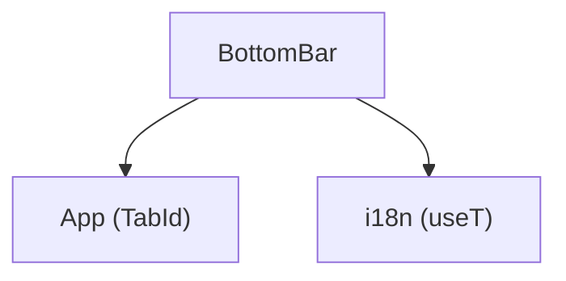

---
paths:
  - "claude-driver/src/renderer/src/components/BottomBar/**/*"
---

<!-- parent: components -->

### 架构图

### 定位与职责

- **职责**：38px 底部导航栏。2 tab（global/project）+ 右侧统计（tokens/项目数/agents/pending）+ 设置按钮。通知入口已迁移至 TitleBar 的独立通知窗口按钮，不属于 BottomBar 边界。pixel-faithful 复刻 `.btabs`。
- **边界**：导航 + 统计展示；不含业务逻辑。

### 内部组成

- **BottomBar.tsx**：props（activeTab/onTabChange/monthlyTokens/activeProjectTokens/projectCount/agentCount/pendingRequests/onOpenSettings）。

### 依赖与联动

- **内部依赖**：App（TabId 类型）；i18n。
- **通信方式**：纯 props 回调。
- **关键交互场景**：onTabChange 在 global/project 间切换；onOpenSettings 开 GlobalSettingsModal；通知窗口由 TitleBar 独立打开。

### 技术选型

React FC + CSS。

### 非功能约束

- **可访问性**：tab 切换键盘可达。

> 详情请阅读对应 TDD 块文件：`docs/TDD.md` § renderer § components § BottomBar（`.claude/rules/tdd/src/renderer/components/BottomBar.md`）
