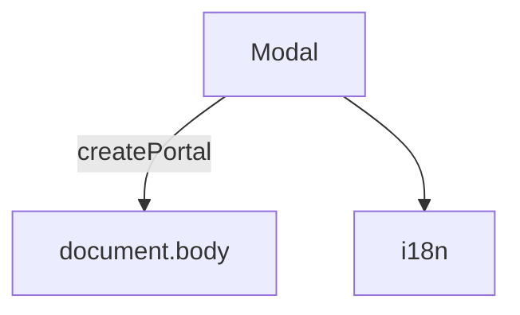

---
paths:
  - "claude-driver/src/renderer/src/components/Modal/**/*"
---

<!-- parent: components -->

### 架构图

### 定位与职责

- **职责**：全局 overlay Modal。blur 背景 + 居中内容 + ESC 关闭 + click-outside 关闭。经 React Portal 渲染到 body 避免 z-index 堆叠问题。
- **边界**：容器；内容由 children 注入。

### 内部组成

- **Modal.tsx**：props（open/onClose/title?/width?/children/showClose?）。

### 依赖与联动

- **内部依赖**：i18n。
- **通信方式**：纯 props。
- **关键交互场景**：SchedulerModal/RemoteModal/GlobalSettingsModal 等共用此容器。

### 技术选型

React createPortal（避免 z-index 战争）。

### 非功能约束

- **可访问性**：ESC + click-outside 关闭。

> 详情请阅读对应 TDD 块文件：`docs/TDD.md` § renderer § components § Modal（`.claude/rules/tdd/src/renderer/components/Modal.md`）
