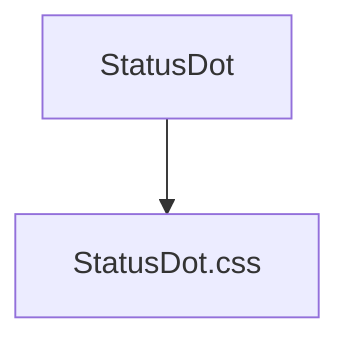

---
paths:
  - "claude-driver/src/renderer/src/components/StatusDot/**/*"
---

<!-- parent: components -->

### 架构图

### 定位与职责

- **职责**：状态指示点。6 状态（running 绿色脉冲/paused 橙色脉冲/done 绿静态/todo 空心/idle 灰/error 红）。贯穿项目卡片、Agent Block、Plan 节点等所有可视化元素。
- **边界**：纯展示；不含逻辑。

### 内部组成

- **StatusDot.tsx**：props（status: DotStatus/size?: sm|md|lg/className?）；导出 DotStatus/DotSize 类型。

### 依赖与联动

- **内部依赖**：无。
- **通信方式**：纯 props。
- **关键交互场景**：项目卡片/Agent Block/Plan 节点状态可视化（对应 PRD §5 状态标识规范）。

### 技术选型

React FC + CSS keyframes（pulse 动画）。

### 非功能约束

- **复用性**：全应用统一状态视觉语言（PRD 6 种状态标识）。

> 详情请阅读对应 TDD 块文件：`docs/TDD.md` § renderer § components § StatusDot（`.claude/rules/tdd/src/renderer/components/StatusDot.md`）
