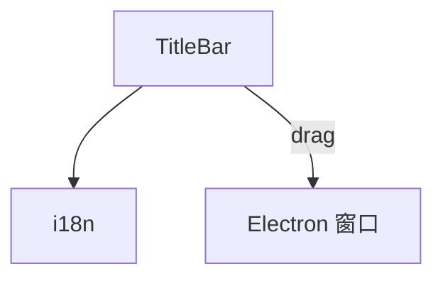

---
paths:
  - "claude-driver/src/renderer/src/components/TitleBar/**/*"
---

<!-- parent: components -->

### 架构图

### 定位与职责

- **职责**：38px 顶栏。macOS 红黄绿窗口控件（装饰，Electron 用原生）+ logo + "Claude Steer" 标题 + 右侧 meta（today tokens/today cost USD/running count 绿脉冲点）。`-webkit-app-region: drag` 可拖动窗口。
- **边界**：标题栏；不含业务逻辑。

### 内部组成

- **TitleBar.tsx**：props（runningCount/todayTokens/todayCostUsd）。

### 依赖与联动

- **内部依赖**：i18n。
- **通信方式**：纯 props（读 stats atom 派生）。
- **关键交互场景**：窗口拖动；实时显示 today 统计。

### 技术选型

React FC + CSS `-webkit-app-region: drag`。

### 非功能约束

- **跨平台**：macOS 风格控件装饰；Electron 原生窗口控制实际生效。

> 详情请阅读对应 TDD 块文件：`docs/TDD.md` § renderer § components § TitleBar（`.claude/rules/tdd/src/renderer/components/TitleBar.md`）
