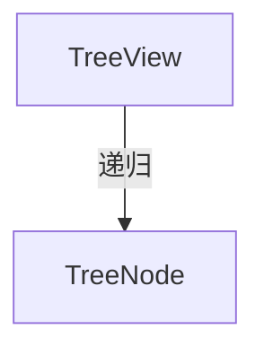

---
paths:
  - "claude-driver/src/renderer/src/components/TreeView/**/*"
---

<!-- parent: components -->

### 架构图

### 定位与职责

- **职责**：递归可展开树视图。用于 Plan 树（M/S/T 层级）与上下文面板文件树。节点点击切换开合，箭头展开旋转 90deg。
- **边界**：通用树；数据由调用方提供。

### 内部组成

- **TreeView.tsx**：props（nodes: TreeNode[]/renderLabel?/defaultExpanded?/indentPx?/className?）；导出 `TreeNode` 接口（id/label: ReactNode/children?/defaultExpanded?）。

### 依赖与联动

- **内部依赖**：无。
- **通信方式**：纯 props + renderLabel 自定义渲染。
- **关键交互场景**：PlanSection 渲染 M->S->T；ContextPanel 渲染文件树。

### 技术选型

React useState 递归；无第三方树库。

### 非功能约束

- **可扩展**：renderLabel 支持自定义节点渲染（状态图标等）。

> 详情请阅读对应 TDD 块文件：`docs/TDD.md` § renderer § components § TreeView（`.claude/rules/tdd/src/renderer/components/TreeView.md`）
