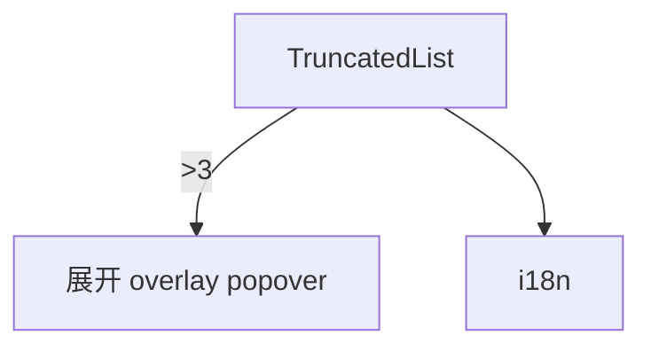

---
paths:
  - "claude-driver/src/renderer/src/components/TruncatedList/**/*"
---

<!-- parent: components -->

### 架构图

### 定位与职责

- **职责**：截断列表。≤3 全显；>3 显前 2 + `···N more`，点击展开 overlay popover 列全部。click-outside 关闭。实现 PRD §3.2.1 截断规则（Agent 工具和经验等列表）。
- **边界**：通用列表；数据由调用方提供。

### 内部组成

- **TruncatedList.tsx**：泛型 props（items/renderItem/maxVisible? 默认 3/overlayTitle?/className?）。

### 依赖与联动

- **内部依赖**：i18n。
- **通信方式**：纯 props + renderItem。
- **关键交互场景**：RightPanel Agent/经验/工具列表截断；ExperiencesPanel/ToolsPanel 列展示。

### 技术选型

React useState/useRef/useEffect + overlay popover。

### 非功能约束

- **复用性**：泛型 `<T>`，全应用列表截断统一规则。
- **可访问性**：click-outside 关闭。

> 详情请阅读对应 TDD 块文件：`docs/TDD.md` § renderer § components § TruncatedList（`.claude/rules/tdd/src/renderer/components/TruncatedList.md`）
