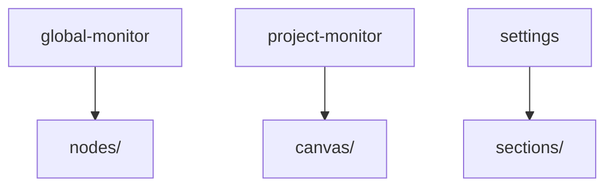
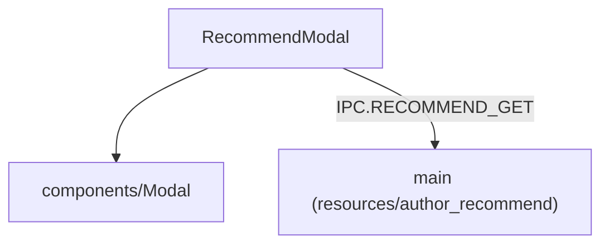
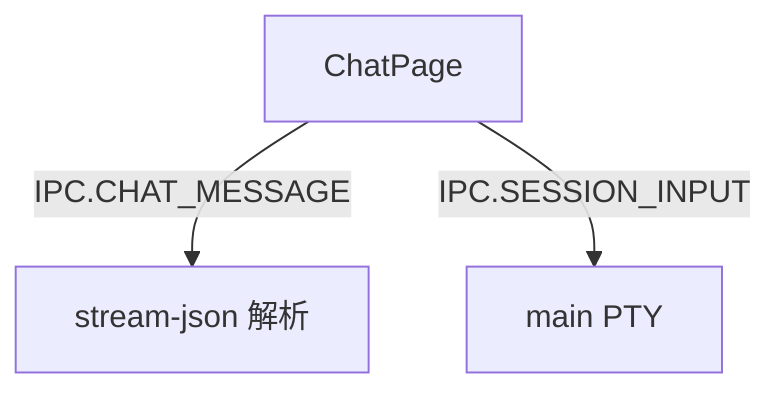
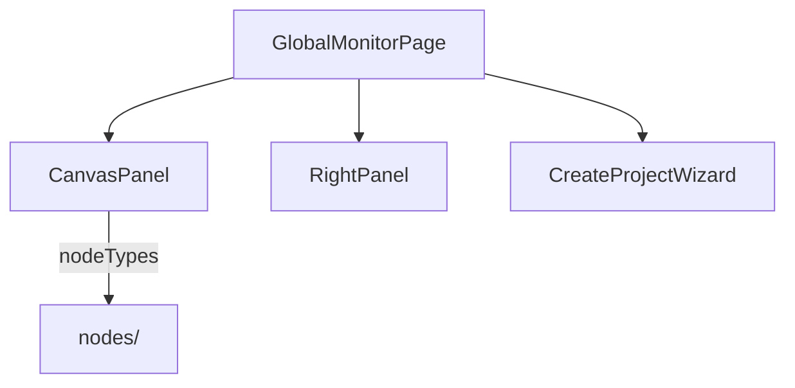
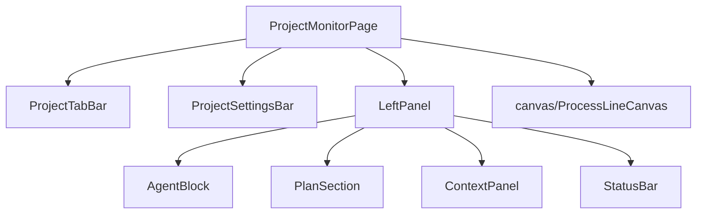
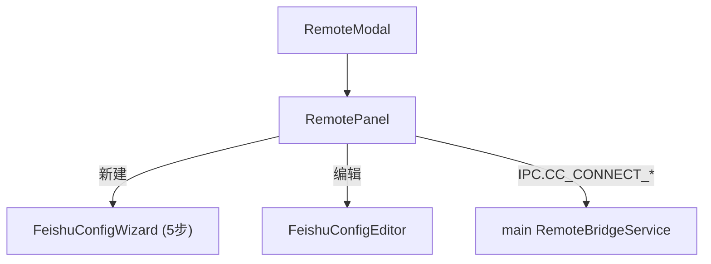
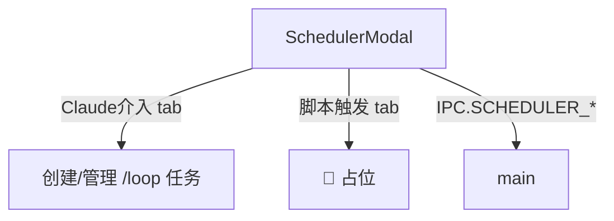
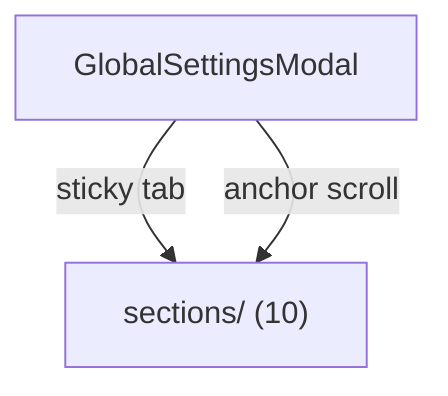
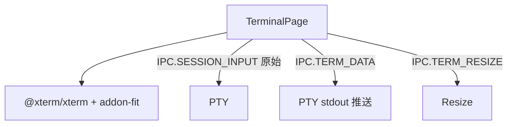

---
paths:
  - "claude-driver/src/renderer/src/features/**/*"
---


<!-- parent: renderer -->

### 架构图



### 定位与职责

- **职责**：业务 UI 模块（9 子目录）。每个对应 PRD 一类界面概念（全局监控/项目监控/消息通知/设置/功能入口等）。
- **边界**：业务 UI；通用组件在 components/。

### 内部组成

- **global-monitor**：全局监控页（项目画板 + 右半面板 + 创建向导 + 初始化 SOP）。含 `nodes/`。
- **project-monitor**：项目监控页（实时工作区 + 历史工作区 + Plan + Git）。含 `canvas/`。
- **notifications**：独立通知窗口（`#/notifications`，独立 BrowserWindow pop-out）。按运行中项目分割 + 2 行通知项 + 可展开详情（复用历史面板触发线可视化）。
- **settings**：全局设置 Modal（10 section）。含 `sections/`。
- **chat**：闲聊气泡 pop-out（`#/chat`）。
- **terminal**：独立终端 pop-out（`#/terminal`，xterm.js）。
- **remote**：cc-connect 远程/飞书配置。
- **scheduler**：定时任务 Modal。
- **author-recommend**：作者推荐 Modal。

### 依赖与联动

- **内部依赖**：atoms/hooks/capabilities/business + components + shared。
- **通信方式**：经 window.api IPC；订阅 atom。
- **关键交互场景**：①GlobalMonitorPage 双击项目卡 -> 切 project tab；②ProcessLineCanvas 节点 Git 操作；③SettingsModal 统一保存。

### 技术选型

@xyflow/react（画布）；xterm.js（终端）；React 组件式。

### 非功能约束

- **解耦性**：feature 隔离，各自页/Modal。
- **路由**：hash 路由（#/terminal、#/chat pop-out 各自 JotaiProvider）。

## author-recommend
<!-- parent: features -->
### 架构图



### 定位与职责

- **职责**：作者推荐 Modal。加载某分类精选推荐列表，三视图模式（list/detail/install-commands）。映射 PRD「Agent 工具和经验·添加按钮·下载精选·作者推荐」。
- **边界**：展示推荐；当前仅显示命令供复制（不实际安装 `[部分实现]`）。

### 内部组成

- **RecommendModal.tsx**：props（category/onClose）；state（items/loading/view/selected/copiedIdx）；CATEGORY_I18N 映射 agents/skills/mcps/workflows/clis。

### 依赖与联动

- **内部依赖**：components/Modal。
- **通信方式**：IPC.RECOMMEND_GET（读打包资源 resources/author_recommend/）。
- **关键交互场景**：选分类 -> 加载列表 -> 查看详情 -> 复制安装命令。

### 技术选型
### 非功能约束

## chat
<!-- parent: features -->
### 架构图



### 定位与职责

- **职责**：独立闲聊气泡 pop-out 窗口（`#/chat?sessionId=`）。监听 IPC.CHAT_MESSAGE（stream-json）追加 user/assistant 气泡；Enter 发送。映射 PRD「闲聊入口」（闲聊 token 归全局未分类）。
- **边界**：闲聊 UI；不负责 PTY 启动（main CHAT_START）、不负责项目绑定。

### 内部组成

- **ChatPage.tsx**：props（sessionId）；state（bubbles[]/input/ended/sending）；streamingIdRef 跟踪 in-flight assistant 气泡。纯 DOM（无外部 children）。

### 依赖与联动

- **内部依赖**：无。
- **通信方式**：IPC.CHAT_MESSAGE（推送解析消息）；IPC.SESSION_INPUT（发送）。
- **关键交互场景**：Enter 发送 -> SESSION_INPUT；流式回复 -> 追加气泡。

### 技术选型
### 非功能约束

## global-monitor
<!-- parent: features -->
### 架构图



### 定位与职责

- **职责**：全局监控页根。左半项目画板（无限画布）+ 右半（RightPanel/CreateProjectWizard 切换）。映射 PRD「全局监控界面」（项目画板/全局统计/Agent 工具和经验/功能入口）。
- **边界**：全局监控 UI；项目详情在 project-monitor。

### 内部组成

- **GlobalMonitorPage.tsx**：页根（prop onNavigateToProject；local wizardOpen）。
- **CanvasPanel.tsx**：左半 @xyflow/react 画布（UserNode 顶 + ProjectCardNode 进行中 + SmallProjectNode 待认领 badge + FABs）。布局 buildCardPositions（2 列网格）。
- **RightPanel.tsx**：右半 4 区（全局统计 + Agent 面板 + 经验/工具 + 功能入口）；内部 SoulModal。
- **CreateProjectWizard.tsx**：3 步向导（项目设置/放入资产/制定计划）。
- **InitSopModal.tsx**：初始化 SOP（首次扫描 + 待认领项目）。
- **LanguageSwitcher.tsx**：语言切换 select。

### 依赖与联动

- **内部依赖**：atoms（projects/sessions/stats/scheduler/insight/notification）；nodes/；features/{scheduler,remote,author-recommend}；components/{Modal,TruncatedList}。
- **通信方式**：IPC.PROJECT_CREATE/SCAN/UPDATE/LIST；CHAT_START+CHAT_WINDOW_OPEN；SHELL_OPEN_PATH；DIALOG_OPEN_DIR；SESSION_START+SESSION_INPUT。
- **关键交互场景**：双击项目卡 -> onNavigateToProject（切 project tab）；新建项目向导 -> SESSION_START。

### 技术选型
### 非功能约束

## notifications
<!-- parent: features -->
### 架构图

```mermaid
graph TD
    NW["NotificationWindowPage"] --> Store["自建 Jotai vanilla store"]
    Store --> PH["createPermissionHandler"]
    Store --> BH["createPtyBindHandler"]
    Store --> SL["createSessionLifecycle"]
    Store --> PL["projects 加载"]
    NW --> SST["shared/types SessionStatus"]
    NW --> PSS["ProjectSplitSection"]
    PSS --> RP["runningProjectsAtom"]
    PSS --> NI["NotificationItem"]
    NI -->|展开| TDR["renderToolDetail (共享 utility)"]
    NI -->|IPC.PERMISSION_RESPOND| PTY
    NI -->|IPC.PERMISSION_DISMISS| Badge["角标更新"]
    PH -.IPC.HOOK_EVENT.-> Hook["主进程 HookEventBus 广播"]
    BH -.IPC.PTY_BIND/UNBIND.-> Hook
    SL -.IPC.SESSION_STATUS.-> Hook
```

### 定位与职责

- **职责**：独立系统级通知窗口（`#/notifications`，独立 BrowserWindow，不设 parent，alwaysOnTop 可配置）。按"正在运行的项目"纵向分割展示权限请求 + insight 报告通知，每条 2 行紧凑布局 + 可展开详情（复用历史面板触发线可视化：工具类橙 / 经验类棕）。映射 PRD「概念三：消息通知界面（独立通知窗口）」。
- **边界**：通知窗口 UI + 自建 Jotai store + handler 工厂子集；不负责桌面通知（main notification）、不负责主窗口 tab（已移除）。

### 内部组成

- **NotificationWindowPage.tsx**：窗口页根。自建 JotaiProvider + vanilla store，注册 handler 工厂子集（createPermissionHandler + createPtyBindHandler + createSessionLifecycle + projects 加载）。订阅 IPC.HOOK_EVENT/PTY_BIND/PTY_UNBIND/SESSION_STATUS/PROJECT_LIST/INSIGHT_REPORT_READY。
- **ProjectSplitSection.tsx**：项目分割区组件。读 `runningProjectsAtom`（派生 atom），纵向排列每个运行中项目的分割区（项目名头 + 独立滚动通知列表）。项目停止运行时分割区及其通知全部移除。
- **NotificationItem.tsx**：单条通知项（2 行布局）。Line 1：Agent 框名称（`req.agentName`，主线程/Agent(xxxxxx)）+ 调用名称 + 展开按钮 + 关闭按钮。Line 2：4 交互 Yes/No（同意/同意+消息/拒绝/拒绝+消息，逻辑同原 RequestApprovalPanel：消息随输入框发送，底层 TUI 按键序列）。点击展开显示 `renderToolDetail` 工具调用详情。
- **toolDetailRender.tsx**（共享 utility）：从 LineInsertionItem 抽取 `renderToolDetail` + `buildToolCompact` + `hasToolDetail`，供 LineInsertionItem 和 NotificationItem 共用（DRY）。

### 依赖与联动

- **内部依赖**：atoms（permission/session-core/projects/pty-binding/runningProjects）；business/handler 工厂（permissionHandler/ptyBindHandler/sessionLifecycle）；shared/toolDetailRender；shared/events（IPC）；shared/types（SessionStatus，作为主窗口与通知窗口唯一的会话状态类型来源）。
- **通信方式**：
  - 主进程 HookEventBus 广播 IPC.HOOK_EVENT/PTY_BIND/PTY_UNBIND/SESSION_STATUS 到 mainWindow + 通知窗口（两个 renderer 各自 handler 处理，独立 store）；SESSION_STATUS 的状态字段统一受 shared `SessionStatus` 约束，不在通知窗口重复定义宽泛状态类型
  - IPC.PROJECT_LIST 由通知窗口 invoke 获取项目列表
  - IPC.INSIGHT_REPORT_READY 由主进程 `sendToRenderers` 广播到通知窗口（insight PTY 完成时触发，通知窗口自动创建 + 1s 延迟等待页面加载）
  - IPC.PERMISSION_RESPOND（TUI 按键序列 -> PTY stdin rawWrite；同意=回车，拒绝=Down×2+回车，附加=Tab+文字+回车）
  - IPC.PERMISSION_DISMISS（关闭通知，只更新角标，不发送按键）
- **关键交互场景**：
  - 权限请求 -> 主进程广播 IPC.HOOK_EVENT -> 通知窗口 permissionHandler 处理 -> permissionRequestsAtom 更新 -> ProjectSplitSection 渲染对应项目分割区
  - 项目 session 启动/停止 -> ptyBindHandler + sessionLifecycle 更新 activeSessionsAtom + ptySessionIdsAtom -> runningProjectsAtom 派生更新 -> 分割区增减
  - **PTY 退出清理**（关键）：通知窗口有独立 Jotai store，PTY 退出时需完整清理链路——主进程 `onExit` → `sendToRenderers(SESSION_STATUS, {status:'Completed'})` + `sendToRenderers(PTY_UNBIND, {ptyId, claudeId})` → 渲染进程 `handleUnbind` → `unbindPty` + `removeFromRealtime` → `ptySessionIdsAtom` 清理 → `runningProjectsAtom` 重新计算 → 项目分组消失。**不能依赖 `SessionEnd` Hook**（PTY 退出时不一定触发）；**不能用 `unbindPtyFromClaudeSession(sid)`**（迁移后 `claudeToPtyMap` key 为真实 claudeId，lookup 失败 early return）。`removeFromRealtime` 是 `ptySessionIdsAtom` 的唯一写入口之一，必须与 `addToRealtime`（PTY_BIND 时）配对调用。
  - **Insight 报告通知**：主进程 insight PTY 完成 → `openNotificationWindow()` 自动创建（幂等）→ 1s 延迟 → `sendToRenderers(INSIGHT_REPORT_READY)` → 通知窗口监听 → `insightNotifs` 本地 state 更新（按 `filePath` 去重）→ "系统通知" 分割区渲染 → 用户点击"查看报告" → `shell.openExternal(reportPath)`
  - 展开详情 -> NotificationItem 读 `req.toolInput` -> 转为 badgeContent -> `renderToolDetail` 渲染（复用历史面板触发线可视化）
  - 关闭通知 -> IPC.PERMISSION_DISMISS -> 主进程 decrementBadge
  - 窗口关闭按钮 -> 隐藏到托盘（窗口存活）；新通知来时恢复显示+抢焦点

### 技术选型
### 非功能约束

## project-monitor
<!-- parent: features -->
### 架构图



### 定位与职责

- **职责**：项目监控页根。顶部 tab + 设置栏 + 左半实时工作区（LeftPanel）+ 右半历史画布（ProcessLineCanvas）。映射 PRD「项目监控界面」（项目顶栏/实时工作区/历史工作区/Plan区/Git功能）。
- **边界**：单项目深度管理 UI；全局视图在 global-monitor。

### 内部组成

- **ProjectMonitorPage.tsx**：页根（读 activeProjectIdAtom）。
- **LeftPanel.tsx**：左半编排（PlanSection + AgentBlock 列表 + ContextPanel + StatusBar + 启动按钮）。AgentBlock 列表是上下文面板上方唯一的弹性高度区域，其底边直接衔接 ContextPanel 顶部分隔线。注意：原 RequestApprovalPanel 已迁移至独立通知窗口（见 notifications.md），本页不再包含审批面板或为其预留空间。
- **AgentBlock.tsx**：单会话实时工作卡（状态 + 工具/经验并排 + Subagent + Insight + MessageInputBar）。
- **ProcessTimeline.tsx**：垂直时间线（user_input 气泡 + assistant 卡 + 插入线 + Subagent mini + git 操作）。
- **PlanSection.tsx**：折叠 Plan 树（M/S/T）。
- **ContextPanel.tsx**：上下文组件列表（持久 4 + 动态）。
- **ProjectTabBar.tsx** / **ProjectSettingsBar.tsx** / **SettingsDropdown.tsx**：顶栏 + 设置。
- **MessageInputBar.tsx** / **RequestApprovalPanel.tsx** / **StatusBar.tsx** / **SubagentBlock.tsx** / **HistoryScrubber.tsx** / **LineInsertionItem.tsx** / **AssignAgentPanel.tsx** / **ToolsPanel.tsx** / **ExperiencesPanel.tsx**。

### 依赖与联动

- **内部依赖**：atoms（projects/sessions/agent-block/timeline/context-panel/permission/viewport）；canvas/；capabilities（gitCapability/branchRegistry）；hooks。
- **通信方式**：IPC.SESSION_START/INPUT/STOP/RESUME/JSONL_WATCH/GIT_*/PROJECT_SETTINGS_*/MCP_SET_ENABLED/SKILL_SET_ENABLED/AGENT_LIST_PROJECT。
- **关键交互场景**：实时工作区 Agent Block 自适应占满 ContextPanel 上方剩余高度；历史时间线节点 Git 操作；Plan 折叠区。

### 技术选型
### 非功能约束

## remote
<!-- parent: features -->
### 架构图



### 定位与职责

- **职责**：cc-connect 远程/飞书配置 UI。映射 PRD「功能入口·远程交互·cc-connect·飞书」+「全局设置·飞书机器人」。基于外部 cc-connect 工具（github.com/chenhg5/cc-connect），非进程内实现。
- **边界**：UI + 配置管理；不实现飞书协议（cc-connect 外部进程）。

### 内部组成

- **RemoteModal.tsx**：Modal 外壳（📡 标题）。
- **RemotePanel.tsx**：安装检测（8s 轮询）+ 服务状态栏（start/stop 5s 轮询）+ 实时日志（capped 50 行）+ 项目列表（每行配置向导/编辑）。
- **FeishuConfigWizard.tsx**：5 步向导（创建应用/权限/长连接订阅/凭证/发布）。
- **FeishuConfigEditor.tsx**：已配置项目的精细编辑表单。

### 依赖与联动

- **内部依赖**：atoms/projects（claimedProjectsAtom）；components/Modal。
- **通信方式**：IPC.CC_CONNECT_CHECK/START/STOP/STATUS/CONFIG_SAVE/CONFIG_READ/INSTALL/LOG。
- **关键交互场景**：检测安装 -> 未装引导（CHAT_START+CHAT_WINDOW_OPEN 预填安装命令）；保存 bot -> 重生成 toml；start/stop 服务。

### 技术选型
### 非功能约束

## scheduler
<!-- parent: features -->
### 架构图



### 定位与职责

- **职责**：定时任务 Modal。两 tab：「Claude 介入」（创建/管理 loop 任务）+「脚本触发」（占位）。映射 PRD「功能入口·定时触发」。
- **边界**：调度 UI；不负责 PTY 注入（main）。

### 内部组成

- **SchedulerModal.tsx**：props（onClose）；读 claimedProjectsAtom/schedulerTasksAtom；state（activeTab/selectedPath/interval/prompt/creating）；内部 TaskCard。IPC SCHEDULER_LIST（3s 轮询）/CREATE/TOGGLE/DELETE。

### 依赖与联动

- **内部依赖**：atoms/projects（claimedProjectsAtom）；atoms/scheduler；components/Modal。
- **通信方式**：IPC.SCHEDULER_LIST/CREATE/TOGGLE/DELETE。
- **关键交互场景**：选项目 + 间隔 + prompt -> 创建；toggle 暂停/恢复；删除；重建过期任务。

### 技术选型
### 非功能约束

## settings
<!-- parent: features -->
### 架构图



### 定位与职责

- **职责**：全局设置 Modal 容器（width 640）。sticky 顶 tab 栏 + 滚动内容（10 section 全挂载）+ 底部保存/取消。映射 PRD「全局设置」。
- **边界**：设置容器；section 在 sections/。

### 内部组成

- **GlobalSettingsModal.tsx**：state（activeSection/claude/driver/appVersion/updaterState）；SECTIONS 顺序（provider/language/permissions/token-cost/notification/preferences/memory/storage/about）；统一 handleChange + 单次保存写 driver config + claude settings.json + provider env block。

### 依赖与联动

- **内部依赖**：components/Modal；sections/*；capabilities/tokenCapability（setDriverConfig）。
- **通信方式**：IPC.DRIVER_CONFIG_READ/PROVIDER_CONFIG_READ/CLAUDE_SETTINGS_READ/CONFIG_WRITE/PROVIDER_CONFIG_WRITE/CONFIG_EXPORT/CONFIG_IMPORT/DIALOG_*/UPDATER_*。
- **关键交互场景**：开 Modal 加载配置；anchor scroll 切 section；保存统一写三处。

### 技术选型
### 非功能约束

## terminal
<!-- parent: features -->
### 架构图



### 定位与职责

- **职责**：独立终端 pop-out 窗口（`#/terminal?sessionId=`）。xterm.js 渲染 PTY 原始输出；转发按键。映射 PRD「独立终端窗口」（打开绑定 PTY 的子窗口）。
- **边界**：终端 UI；不持有 PTY（main）。

### 内部组成

- **TerminalPage.tsx**：props（sessionId）；refs（termRef/fitAddonRef/containerRef）。

### 依赖与联动

- **内部依赖**：@xterm/xterm + @xterm/addon-fit。
- **通信方式**：IPC.SESSION_INPUT（原始按键）；IPC.TERM_DATA（输出推送）；IPC.TERM_RESIZE（同步大小）。
- **关键交互场景**：SessionFrameNode「打开终端」-> TERM_WINDOW_OPEN -> 此页渲染；用户键入 -> SESSION_INPUT。

### 技术选型
### 非功能约束
