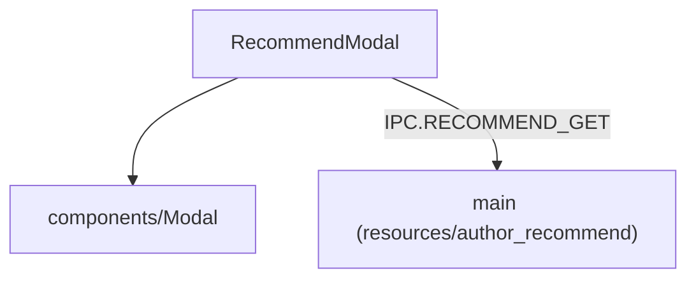

---
paths:
  - "claude-driver/src/renderer/src/features/author-recommend/**/*"
---

<!-- parent: features -->

### 架构图

### 定位与职责

- **职责**：作者推荐 Modal。加载某分类精选推荐列表，三视图模式（list/detail/install-commands）。映射 PRD「Agent 工具和经验·添加按钮·下载精选·作者推荐」。
- **边界**：展示推荐；当前仅显示命令供复制（不实际安装 `[部分实现]`）。

### 内部组成

- **RecommendModal.tsx**：props（category/onClose）；state（items/loading/view/selected/copiedIdx）；CATEGORY_I18N 映射 agents/skills/mcps/workflows/clis。

### 依赖与联动

- **内部依赖**：components/Modal。
- **通信方式**：IPC.RECOMMEND_GET（读打包资源 resources/author_recommend/）。
- **关键交互场景**：选分类 -> 加载列表 -> 查看详情 -> 复制安装命令。

### 技术选型

React FC + 三视图模式切换。

### 非功能约束

- **当前限制**：仅显示命令供复制，不实际执行安装 `[部分实现]`。

> 详情请阅读对应 TDD 块文件：`docs/TDD.md` § renderer § features § author-recommend（`.claude/rules/tdd/src/renderer/features/author-recommend.md`）
