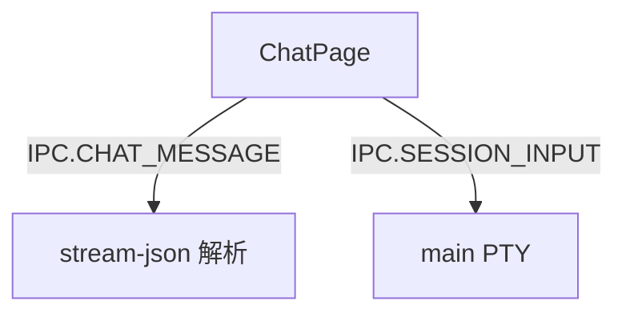

---
paths:
  - "claude-driver/src/renderer/src/features/chat/**/*"
---

<!-- parent: features -->

### 架构图

### 定位与职责

- **职责**：独立闲聊气泡 pop-out 窗口（`#/chat?sessionId=`）。监听 IPC.CHAT_MESSAGE（stream-json）追加 user/assistant 气泡；Enter 发送。映射 PRD「闲聊入口」（闲聊 token 归全局未分类）。
- **边界**：闲聊 UI；不负责 PTY 启动（main CHAT_START）、不负责项目绑定。

### 内部组成

- **ChatPage.tsx**：props（sessionId）；state（bubbles[]/input/ended/sending）；streamingIdRef 跟踪 in-flight assistant 气泡。纯 DOM（无外部 children）。

### 依赖与联动

- **内部依赖**：无。
- **通信方式**：IPC.CHAT_MESSAGE（推送解析消息）；IPC.SESSION_INPUT（发送）。
- **关键交互场景**：Enter 发送 -> SESSION_INPUT；流式回复 -> 追加气泡。

### 技术选型

纯 React state + stream-json 解析；独立 JotaiProvider（pop-out）。

### 非功能约束

- **交互**：Enter 发送 / Shift+Enter 换行。

> 详情请阅读对应 TDD 块文件：`docs/TDD.md` § renderer § features § chat（`.claude/rules/tdd/src/renderer/features/chat.md`）
