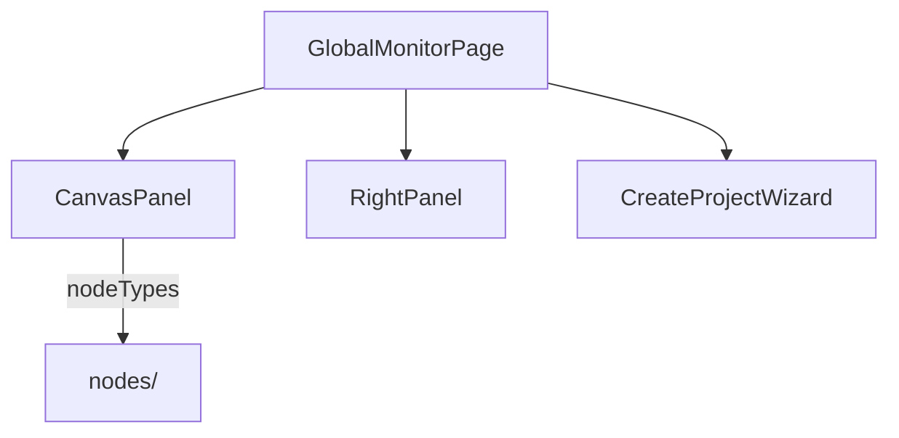
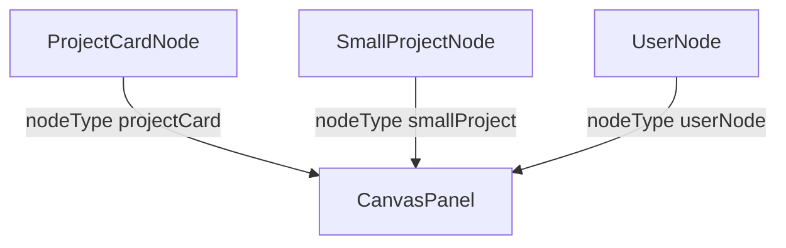

---
paths:
  - "claude-driver/src/renderer/src/features/global-monitor/**/*"
---

<!-- parent: features -->

### 架构图

### 定位与职责

- **职责**：全局监控页根。左半项目画板（无限画布）+ 右半（RightPanel/CreateProjectWizard 切换）。映射 PRD「全局监控界面」（项目画板/全局统计/Agent 工具和经验/功能入口）。
- **边界**：全局监控 UI；项目详情在 project-monitor。

### 内部组成

- **GlobalMonitorPage.tsx**：页根（prop onNavigateToProject；local wizardOpen）。
- **CanvasPanel.tsx**：左半 @xyflow/react 画布（UserNode 顶 + ProjectCardNode 进行中 + SmallProjectNode 待认领 badge + FABs）。布局 buildCardPositions（2 列网格）。
- **RightPanel.tsx**：右半 4 区（全局统计 + Agent 面板 + 经验/工具 + 功能入口）；内部 SoulModal。
- **CreateProjectWizard.tsx**：3 步向导（项目设置/放入资产/制定计划）。
- **InitSopModal.tsx**：初始化 SOP（首次扫描 + 待认领项目）。
- **LanguageSwitcher.tsx**：语言切换 select。

### 依赖与联动

- **内部依赖**：atoms（projects/sessions/stats/scheduler/insight/notification）；nodes/；features/{scheduler,remote,author-recommend}；components/{Modal,TruncatedList}。
- **通信方式**：IPC.PROJECT_CREATE/SCAN/UPDATE/LIST；CHAT_START+CHAT_WINDOW_OPEN；SHELL_OPEN_PATH；DIALOG_OPEN_DIR；SESSION_START+SESSION_INPUT。
- **关键交互场景**：双击项目卡 -> onNavigateToProject（切 project tab）；新建项目向导 -> SESSION_START。

### 技术选型

@xyflow/react（项目画板）+ Modal 向导。

### 非功能约束

- **状态**：倒三角执行指示器三态（active/possibly-paused/completed）在 ProjectCardNode 实现。
- **CSS bug [待修]**：ProjectCardNode.css line 107 `padding: 3.var(--space-sm)` 非法。

## nodes
<!-- parent: global-monitor -->
### 架构图

### 定位与职责

- **职责**：全局画布 ReactFlow 自定义节点（3 个）。映射 PRD「全局监控界面·项目画板」节点。
- **边界**：节点渲染；画布容器在 CanvasPanel。

### 内部组成

- **ProjectCardNode.tsx**：248px 进行中项目卡（状态点 + 名 + 当前模型 + M 级 Plan max 4 + 倒三角指示器 + 双击提示）。倒三角三态生命周期（全 DONE -> completed -> 3min 后清空 COMPLETED_DESTROY_MS）。
- **SmallProjectNode.tsx**：155px 紧凑卡（状态点 + 名 + `›`；isPending 橙警告样式）。
- **UserNode.tsx**：顶部用户 pill（橙色渐变头像 + 用户名 + `▾`）。

### 依赖与联动

- **内部依赖**：atoms/projects（planIndicatorsByProjectAtom）；i18n。
- **通信方式**：ReactFlow NodeProps；经 CanvasPanel onNodeDoubleClick 导航。
- **关键交互场景**：双击 projectCard -> 切 project tab；倒三角指示器 active/possibly-paused/completed。

### 技术选型
### 非功能约束
