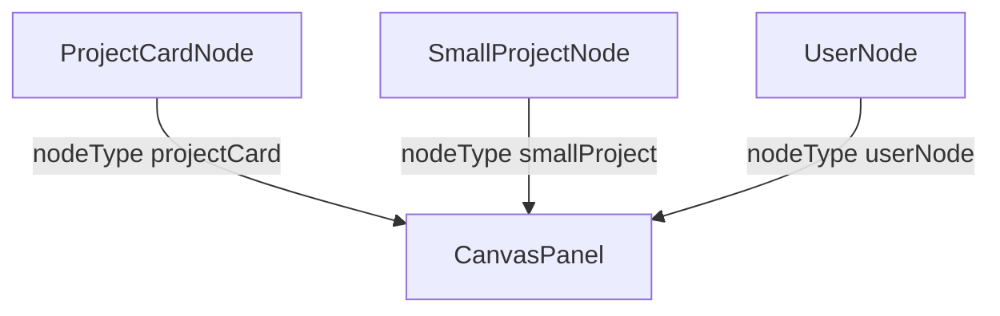

---
paths:
  - "claude-driver/src/renderer/src/features/global-monitor/nodes/**/*"
---

<!-- parent: global-monitor -->

### 架构图

### 定位与职责

- **职责**：全局画布 ReactFlow 自定义节点（3 个）。映射 PRD「全局监控界面·项目画板」节点。
- **边界**：节点渲染；画布容器在 CanvasPanel。

### 内部组成

- **ProjectCardNode.tsx**：248px 进行中项目卡（状态点 + 名 + 当前模型 + M 级 Plan max 4 + 倒三角指示器 + 双击提示）。倒三角三态生命周期（全 DONE -> completed -> 3min 后清空 COMPLETED_DESTROY_MS）。
- **SmallProjectNode.tsx**：155px 紧凑卡（状态点 + 名 + `›`；isPending 橙警告样式）。
- **UserNode.tsx**：顶部用户 pill（橙色渐变头像 + 用户名 + `▾`）。

### 依赖与联动

- **内部依赖**：atoms/projects（planIndicatorsByProjectAtom）；i18n。
- **通信方式**：ReactFlow NodeProps；经 CanvasPanel onNodeDoubleClick 导航。
- **关键交互场景**：双击 projectCard -> 切 project tab；倒三角指示器 active/possibly-paused/completed。

### 技术选型

@xyflow/react 自定义 Node；module-level nodeTypes 注册。

### 非功能约束

- **健壮性**：空 plan 占位；pending 合成 id 双击短路。
- **CSS bug [待修]**：ProjectCardNode.css `padding: 3.var(--space-sm)` 非法。

> 详情请阅读对应 TDD 块文件：`docs/TDD.md` § renderer § features § global-monitor § nodes（`.claude/rules/tdd/src/renderer/features/global-monitor/nodes.md`）
