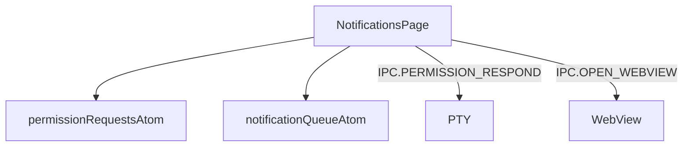

---
paths:
  - "claude-driver/src/renderer/src/features/notifications/**/*"
---

<!-- parent: features -->

### 架构图

### 定位与职责

- **职责**：消息通知页。左侧权限请求列表（按 Agent 分组 + info 消息）+ 右侧详情（同意/同意带消息/不同意 + info 打开报告）。映射 PRD「消息通知界面」。
- **边界**：通知 UI；不负责桌面通知（main notification）。

### 内部组成

- **NotificationsPage.tsx**：读 permissionRequestsAtom/notificationQueueAtom；local selectedId；内部 NotificationList/NotificationDetail/InfoItem/InfoDetail。调 dequeueRequest capability。

### 依赖与联动

- **内部依赖**：atoms/notification + atoms/permission；capabilities/permissionQueue。
- **通信方式**：IPC.PERMISSION_RESPOND（y/n + 附加 -> PTY stdin）；IPC.OPEN_WEBVIEW（insight 报告）。
- **关键交互场景**：权限请求 FIFO -> 审批 -> 注入；info 消息打开报告。

### 技术选型

React + 内部子组件（无外部 children）。

### 非功能约束

- **健壮性**：权限请求无超时（Agent 一直等待）；多请求 FIFO 堆叠。

> 详情请阅读对应 TDD 块文件：`docs/TDD.md` § renderer § features § notifications（`.claude/rules/tdd/src/renderer/features/notifications.md`）
