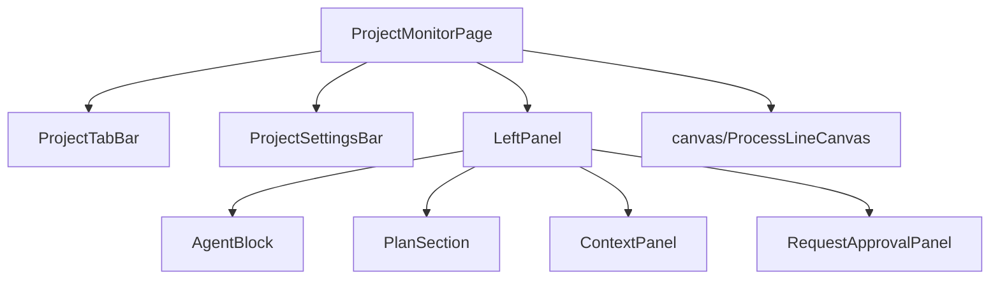
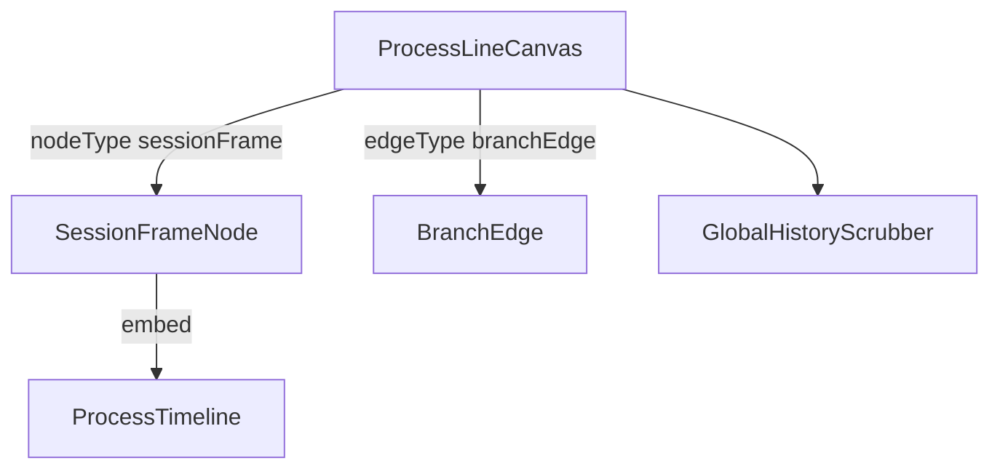

---
paths:
  - "claude-driver/src/renderer/src/features/project-monitor/**/*"
---

<!-- parent: features -->

### 架构图

### 定位与职责

- **职责**：项目监控页根。顶部 tab + 设置栏 + 左半实时工作区（LeftPanel）+ 右半历史画布（ProcessLineCanvas）。映射 PRD「项目监控界面」（项目顶栏/实时工作区/历史工作区/Plan区/Git功能）。
- **边界**：单项目深度管理 UI；全局视图在 global-monitor。

### 内部组成

- **ProjectMonitorPage.tsx**：页根（读 activeProjectIdAtom）。
- **LeftPanel.tsx**：左半编排（PlanSection + AgentBlock 列表 + RequestApprovalPanel + ContextPanel + StatusBar + 启动按钮）。
- **AgentBlock.tsx**：单会话实时工作卡（状态 + 工具/经验并排 + Subagent + Insight + MessageInputBar）。
- **ProcessTimeline.tsx**：垂直时间线（user_input 气泡 + assistant 卡 + 插入线 + Subagent mini + git 操作）。
- **PlanSection.tsx**：折叠 Plan 树（M/S/T）。
- **ContextPanel.tsx**：上下文组件列表（持久 4 + 动态）。
- **ProjectTabBar.tsx** / **ProjectSettingsBar.tsx** / **SettingsDropdown.tsx**：顶栏 + 设置。
- **MessageInputBar.tsx** / **RequestApprovalPanel.tsx** / **StatusBar.tsx** / **SubagentBlock.tsx** / **HistoryScrubber.tsx** / **LineInsertionItem.tsx** / **AssignAgentPanel.tsx** / **ToolsPanel.tsx** / **ExperiencesPanel.tsx**。

### 依赖与联动

- **内部依赖**：atoms（projects/sessions/agent-block/timeline/context-panel/permission/viewport）；canvas/；capabilities（gitCapability/branchRegistry）；hooks。
- **通信方式**：IPC.SESSION_START/INPUT/STOP/RESUME/JSONL_WATCH/GIT_*/PERMISSION_RESPOND/PROJECT_SETTINGS_*/MCP_SET_ENABLED/SKILL_SET_ENABLED/AGENT_LIST_PROJECT。
- **关键交互场景**：实时工作区 Agent Block；历史时间线节点 Git 操作；Plan 折叠区。

### 技术选型

@xyflow/react（canvas）+ 大量 React 组件；CSS flex 四层布局。

### 非功能约束

- **性能**：SessionFrameNode ResizeObserver 框高；ProcessLineCanvas `[DIAG]` 计数器。
- **复用**：Branch 完全复用主线工作框（AgentBlock + SessionFrameNode）。

## canvas
<!-- parent: project-monitor -->
### 架构图

### 定位与职责

- **职责**：右半历史进程线画布。@xyflow/react 容器，发现项目 session、布局 SessionFrameNode + BranchEdge、4 态视口机 + 全局键盘导航。映射 PRD「项目监控界面·历史工作区·历史进程线画布」。
- **边界**：画布与框；时间线内部在 ProcessTimeline（project-monitor 顶层）。

### 内部组成

- **ProcessLineCanvas.tsx**：ReactFlow 容器（panOnScroll/Ctrl 缩放/minZoom 0.3/maxZoom 3/nodesDraggable false）；4 态视口 + 全局键盘导航 + 外部 focus 请求。
- **SessionFrameNode.tsx**：自定义节点（虚线框 + 头部状态/agent/token/时长 + 内嵌 ProcessTimeline + 底部 interrupt/resume/open-terminal/merge + 里程碑 badge + ResizeObserver 框高）。
- **BranchEdge.tsx**：自定义边（虚线 bezier + 紫色 + 两端圆点，/branch 继承记忆连接）。
- **GlobalHistoryScrubber.tsx**：右侧竖向拉动条（按 session 分段 + user_input 刻度 + 拖拽跳转）。

### 依赖与联动

- **内部依赖**：atoms（sessions/agentLabels/allFrameHeights/viewport/focus）；hooks（useProcessLineViewport/useSessionFrameLayout/useHistoryLoader/useGlobalKeyNav）；ProcessTimeline。
- **通信方式**：IPC.SESSION_STOP/RESUME/TERM_WINDOW_OPEN。
- **关键交互场景**：3 布局情形（单框/branch 继承记忆/多 session 并排）；视口 4 态切换；键盘 ←->/↑↓ 跳转。

### 技术选型
### 非功能约束
