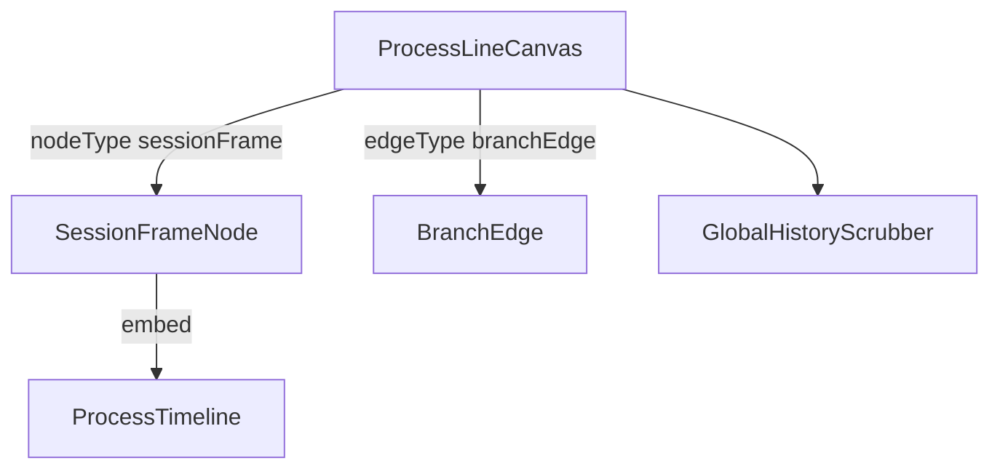

---
paths:
  - "claude-driver/src/renderer/src/features/project-monitor/canvas/**/*"
---

<!-- parent: project-monitor -->

### 架构图

### 定位与职责

- **职责**：右半历史进程线画布。@xyflow/react 容器，发现项目 session、布局 SessionFrameNode + BranchEdge、4 态视口机 + 全局键盘导航。映射 PRD「项目监控界面·历史工作区·历史进程线画布」。
- **边界**：画布与框；时间线内部在 ProcessTimeline（project-monitor 顶层）。

### 内部组成

- **ProcessLineCanvas.tsx**：ReactFlow 容器（panOnScroll/Ctrl 缩放/minZoom 0.3/maxZoom 3/nodesDraggable false）；4 态视口 + 全局键盘导航 + 外部 focus 请求。
- **SessionFrameNode.tsx**：自定义节点（虚线框 + 头部状态/agent/token/时长 + 内嵌 ProcessTimeline + 底部 interrupt/resume/open-terminal/merge + 里程碑 badge + ResizeObserver 框高）。
- **BranchEdge.tsx**：自定义边（虚线 bezier + 紫色 + 两端圆点，/branch 继承记忆连接）。
- **GlobalHistoryScrubber.tsx**：右侧竖向拉动条（按 session 分段 + user_input 刻度 + 拖拽跳转）。

### 依赖与联动

- **内部依赖**：atoms（sessions/agentLabels/allFrameHeights/viewport/focus）；hooks（useProcessLineViewport/useSessionFrameLayout/useHistoryLoader/useGlobalKeyNav）；ProcessTimeline。
- **通信方式**：IPC.SESSION_STOP/RESUME/TERM_WINDOW_OPEN。
- **关键交互场景**：3 布局情形（单框/branch 继承记忆/多 session 并排）；视口 4 态切换；键盘 ←->/↑↓ 跳转。

### 技术选型

@xyflow/react 自定义 Node/Edge + 程序化 setViewport/fitView。

### 非功能约束

- **性能**：fitView 节流 500ms；框高 ResizeObserver；`[DIAG]` 计数器。
- **占位**：SessionFrameNode 合并到 Main 按钮 stub（M4 S4 T4，console.info）。

> 详情请阅读对应 TDD 块文件：`docs/TDD.md` § renderer § features § project-monitor § canvas（`.claude/rules/tdd/src/renderer/features/project-monitor/canvas.md`）
