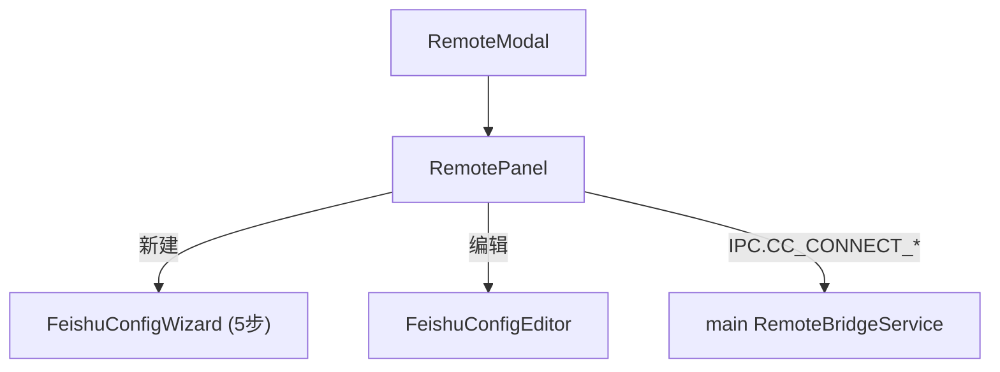

---
paths:
  - "claude-driver/src/renderer/src/features/remote/**/*"
---

<!-- parent: features -->

### 架构图

### 定位与职责

- **职责**：cc-connect 远程/飞书配置 UI。映射 PRD「功能入口·远程交互·cc-connect·飞书」+「全局设置·飞书机器人」。基于外部 cc-connect 工具（github.com/chenhg5/cc-connect），非进程内实现。
- **边界**：UI + 配置管理；不实现飞书协议（cc-connect 外部进程）。

### 内部组成

- **RemoteModal.tsx**：Modal 外壳（📡 标题）。
- **RemotePanel.tsx**：安装检测（8s 轮询）+ 服务状态栏（start/stop 5s 轮询）+ 实时日志（capped 50 行）+ 项目列表（每行配置向导/编辑）。
- **FeishuConfigWizard.tsx**：5 步向导（创建应用/权限/长连接订阅/凭证/发布）。
- **FeishuConfigEditor.tsx**：已配置项目的精细编辑表单。

### 依赖与联动

- **内部依赖**：atoms/projects（claimedProjectsAtom）；components/Modal。
- **通信方式**：IPC.CC_CONNECT_CHECK/START/STOP/STATUS/CONFIG_SAVE/CONFIG_READ/INSTALL/LOG。
- **关键交互场景**：检测安装 -> 未装引导（CHAT_START+CHAT_WINDOW_OPEN 预填安装命令）；保存 bot -> 重生成 toml；start/stop 服务。

### 技术选型

React + 轮询；配置选择视图（CLI 一键命令 / 手动向导）。

### 非功能约束

- **外部依赖**：cc-connect 外部进程；未装时提供 npm install -g cc-connect 引导。
- **健壮性**：config.toml 字段级合并（保留其他项目）。

> 详情请阅读对应 TDD 块文件：`docs/TDD.md` § renderer § features § remote（`.claude/rules/tdd/src/renderer/features/remote.md`）
