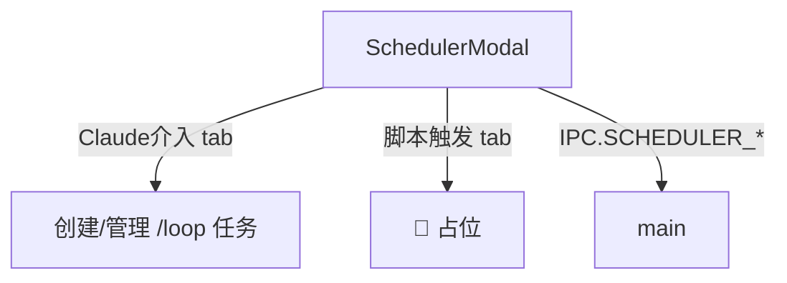

---
paths:
  - "claude-driver/src/renderer/src/features/scheduler/**/*"
---

<!-- parent: features -->

### 架构图

### 定位与职责

- **职责**：定时任务 Modal。两 tab：「Claude 介入」（创建/管理 loop 任务）+「脚本触发」（占位）。映射 PRD「功能入口·定时触发」。
- **边界**：调度 UI；不负责 PTY 注入（main）。

### 内部组成

- **SchedulerModal.tsx**：props（onClose）；读 claimedProjectsAtom/schedulerTasksAtom；state（activeTab/selectedPath/interval/prompt/creating）；内部 TaskCard。IPC SCHEDULER_LIST（3s 轮询）/CREATE/TOGGLE/DELETE。

### 依赖与联动

- **内部依赖**：atoms/projects（claimedProjectsAtom）；atoms/scheduler；components/Modal。
- **通信方式**：IPC.SCHEDULER_LIST/CREATE/TOGGLE/DELETE。
- **关键交互场景**：选项目 + 间隔 + prompt -> 创建；toggle 暂停/恢复；删除；重建过期任务。

### 技术选型

React + 3s 轮询刷新任务列表。

### 非功能约束

- **健壮性**：7 天过期强制（formatExpiry）；每会话最多 50 任务；toggle 需 claudeId 初始化。
- **占位**：脚本触发 tab 为 🚧 coming soon `[占位]`。

> 详情请阅读对应 TDD 块文件：`docs/TDD.md` § renderer § features § scheduler（`.claude/rules/tdd/src/renderer/features/scheduler.md`）
