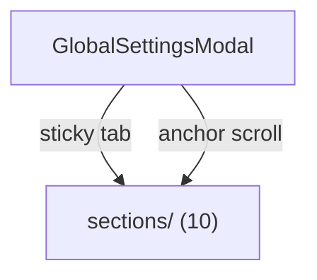
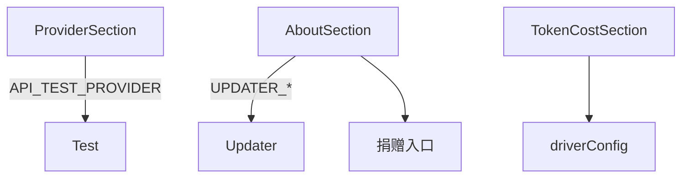

---
paths:
  - "claude-driver/src/renderer/src/features/settings/**/*"
---

<!-- parent: features -->

### 架构图

### 定位与职责

- **职责**：全局设置 Modal 容器（width 640）。sticky 顶 tab 栏 + 滚动内容（10 section 全挂载）+ 底部保存/取消。映射 PRD「全局设置」。
- **边界**：设置容器；section 在 sections/。

### 内部组成

- **GlobalSettingsModal.tsx**：state（activeSection/claude/driver/appVersion/updaterState）；SECTIONS 顺序（provider/language/permissions/token-cost/notification/preferences/memory/storage/about）；统一 handleChange + 单次保存写 driver config + claude settings.json + provider env block。

### 依赖与联动

- **内部依赖**：components/Modal；sections/*；capabilities/tokenCapability（setDriverConfig）。
- **通信方式**：IPC.DRIVER_CONFIG_READ/PROVIDER_CONFIG_READ/CLAUDE_SETTINGS_READ/CONFIG_WRITE/PROVIDER_CONFIG_WRITE/CONFIG_EXPORT/CONFIG_IMPORT/DIALOG_*/UPDATER_*。
- **关键交互场景**：开 Modal 加载配置；anchor scroll 切 section；保存统一写三处。

### 技术选型

anchor-scroll（所有 section 常驻，state 持久）；sticky tab 栏。

### 非功能约束

- **死代码 [待清理]**：ApiSection.tsx 未被渲染（API key 实际在 ProviderSection 经 API_TEST_PROVIDER）；section nav 无 api tab。
- **健壮性**：单次保存写多文件；export/import 配置。

## sections
<!-- parent: settings -->
### 架构图

### 定位与职责

- **职责**：全局设置各 section 面板（10 个）。映射 PRD「全局设置」各锚点。
- **边界**：单 section UI；容器在 GlobalSettingsModal。

### 内部组成

- **ProviderSection**：provider 预设下拉 + API key（show/hide + API_TEST_PROVIDER）+ baseUrl + 模型四元组（light/balanced/powerful）+ reasoning + timeout + disable-nonessential。
- **PermissionsSection**：6 权限模式 radio + additionalDirectories/allow/ignorePatterns textarea。
- **TokenCostSection**：input/output 单价 + 月预算 USD（driver scope）。
- **NotificationSection**：桌面通知开关（driver scope，注：当前死开关见机制五）。
- **PreferencesSection**：主题（即时 dataset.theme）+ outputStyle + 语法高亮 + thinking 摘要 + spinner tips + disabled「Claude Code in Chrome」。
- **LanguageSection**：Claude 回复语言 + UI 语言（即时 setLanguage）。
- **MemorySection**：autoMemory 开关 + memoryDir。
- **StorageSection**：cleanupPeriodDays + 检查更新按钮 + export/import。
- **AboutSection**：版本 + auto-updater 全状态机 UI + GitHub + 捐赠（Buy Me a Coffee + 支付宝）。

### 依赖与联动

- **内部依赖**：@shared/constants/providers（PROVIDER_PRESETS）；@shared/types；i18n。
- **通信方式**：API_TEST_PROVIDER/UPDATER_*/SHELL_OPEN_PATH；经父统一 CONFIG_WRITE/PROVIDER_CONFIG_WRITE。
- **关键交互场景**：provider 切换自动填 baseUrl + 模型；主题即时切换；捐赠打开链接。

### 技术选型
### 非功能约束
