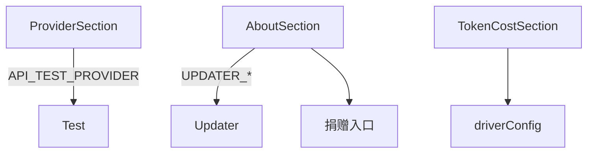

---
paths:
  - "claude-driver/src/renderer/src/features/settings/sections/**/*"
---

<!-- parent: settings -->

### 架构图

### 定位与职责

- **职责**：全局设置各 section 面板（10 个）。映射 PRD「全局设置」各锚点。
- **边界**：单 section UI；容器在 GlobalSettingsModal。

### 内部组成

- **ProviderSection**：provider 预设下拉 + API key（show/hide + API_TEST_PROVIDER）+ baseUrl + 模型四元组（light/balanced/powerful）+ reasoning + timeout + disable-nonessential。
- **PermissionsSection**：6 权限模式 radio + additionalDirectories/allow/ignorePatterns textarea。
- **TokenCostSection**：input/output 单价 + 月预算 USD（driver scope）。
- **NotificationSection**：桌面通知开关（driver scope，注：当前死开关见机制五）。
- **PreferencesSection**：主题（即时 dataset.theme）+ outputStyle + 语法高亮 + thinking 摘要 + spinner tips + disabled「Claude Code in Chrome」。
- **LanguageSection**：Claude 回复语言 + UI 语言（即时 setLanguage）。
- **MemorySection**：autoMemory 开关 + memoryDir。
- **StorageSection**：cleanupPeriodDays + 检查更新按钮 + export/import。
- **AboutSection**：版本 + auto-updater 全状态机 UI + GitHub + 捐赠（Buy Me a Coffee + 支付宝）。

### 依赖与联动

- **内部依赖**：@shared/constants/providers（PROVIDER_PRESETS）；@shared/types；i18n。
- **通信方式**：API_TEST_PROVIDER/UPDATER_*/SHELL_OPEN_PATH；经父统一 CONFIG_WRITE/PROVIDER_CONFIG_WRITE。
- **关键交互场景**：provider 切换自动填 baseUrl + 模型；主题即时切换；捐赠打开链接。

### 技术选型

受控表单（props + 父 handleChange）；无独立状态。

### 非功能约束

- **占位**：PreferencesSection「Claude Code in Chrome」toggle disabled。

> 详情请阅读对应 TDD 块文件：`docs/TDD.md` § renderer § features § settings § sections（`.claude/rules/tdd/src/renderer/features/settings/sections.md`）
