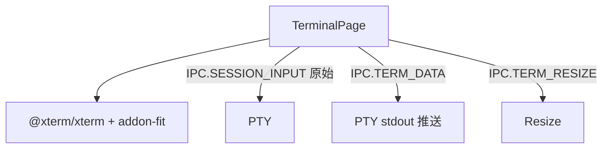

---
paths:
  - "claude-driver/src/renderer/src/features/terminal/**/*"
---

<!-- parent: features -->

### 架构图

### 定位与职责

- **职责**：独立终端 pop-out 窗口（`#/terminal?sessionId=`）。xterm.js 渲染 PTY 原始输出；转发按键。映射 PRD「独立终端窗口」（打开绑定 PTY 的子窗口）。
- **边界**：终端 UI；不持有 PTY（main）。

### 内部组成

- **TerminalPage.tsx**：props（sessionId）；refs（termRef/fitAddonRef/containerRef）。

### 依赖与联动

- **内部依赖**：@xterm/xterm + @xterm/addon-fit。
- **通信方式**：IPC.SESSION_INPUT（原始按键）；IPC.TERM_DATA（输出推送）；IPC.TERM_RESIZE（同步大小）。
- **关键交互场景**：SessionFrameNode「打开终端」-> TERM_WINDOW_OPEN -> 此页渲染；用户键入 -> SESSION_INPUT。

### 技术选型

xterm.js（终端渲染）+ FitAddon（自适应）。

### 非功能约束

- **独立**：pop-out 各自 JotaiProvider；原始 PTY 流渲染。

> 详情请阅读对应 TDD 块文件：`docs/TDD.md` § renderer § features § terminal（`.claude/rules/tdd/src/renderer/features/terminal.md`）
