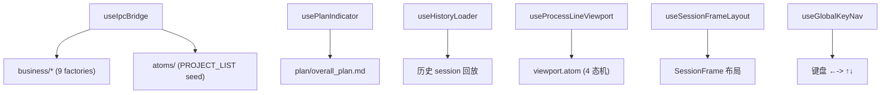

---
paths:
  - "claude-driver/src/renderer/src/hooks/**/*"
---

<!-- parent: renderer -->

### 架构图

### 定位与职责

- **职责**：React 胶水（6 文件）。挂载/卸载 IPC 编排（useIpcBridge）、生命周期状态机（usePlanIndicator/useHistoryLoader）、画布 UI 控制器（useGlobalKeyNav/useProcessLineViewport/useSessionFrameLayout）。
- **边界**：将 business 接到 live Jotai store；不持有业务状态、不定义 atom。

### 内部组成

- **useIpcBridge**：IPC 编排入口。组装 9 business handlers（注册顺序 branch 优先），PROJECT_LIST seed，后台扫描 token（PROJECT_HISTORY_SCAN）。
- **usePlanIndicator**：Plan 数据管理 + 倒三角指示器状态机（active/possibly-paused/completed）。导出 `parsePlanNodes`（M/S/T markdown 解析）。
- **useHistoryLoader**：历史 session 加载（GIT_ENSURE_REPO/PROJECT_HISTORY_SCAN max 20/replay insertions/milestones/git-marks/branch relations/token-scan）。
- **useProcessLineViewport**：4 态视口机（overview/focus/follow/locked）+ 节流 fitView 500ms。
- **useSessionFrameLayout**：SessionFrame 位置计算（cluster-aware X + 时间堆叠 Y）。导出 FRAME_WIDTH/GAP 等常量。
- **useGlobalKeyNav**：←-> 框间跳转 + ↑↓ 框内节点跳转（buildJumpableNodes）。

### 依赖与联动

- **内部依赖**：business/* + capabilities/* + atoms/* + @xyflow/react。
- **通信方式**：useEffect -> createXxxHandler(store) + window.api.on；handlers 变更 atom -> 组件 re-render。
- **关键交互场景**：useIpcBridge 是 IPC->Atom 桥接根；usePlanIndicator 检测 PostToolUse plan 写入生成里程碑。

### 技术选型

Jotai `useStore()` 获取 live store；requestAnimationFrame 微平移；ResizeObserver 框高监听。

### 非功能约束

- **可测试性**：useIpcBridge 是不可测的组合根（设计如此）；其余 hook 偏 UI 控制器。
- **性能**：fitView 节流 500ms 防 Hook 高频抖动。

> 详情请阅读对应 TDD 块文件：`docs/TDD.md` § renderer § hooks（`.claude/rules/tdd/src/renderer/hooks.md`）
