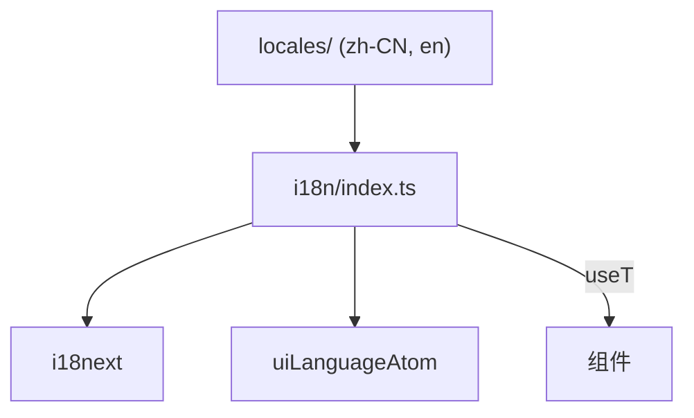
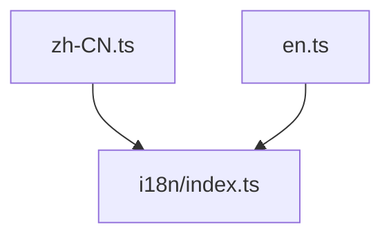

---
paths:
  - "claude-driver/src/renderer/src/i18n/**/*"
---

<!-- parent: renderer -->

### 架构图

### 定位与职责

- **职责**：i18next 翻译引擎 + Jotai atom 集成。atom 为单一真相源，i18next 为引擎。
- **边界**：翻译；不持有业务状态。

### 内部组成

- **index.ts**：i18next init（zh-CN 默认 + en）、`uiLanguageAtom`、`useT()` hook（订阅 atom + setLanguage 持久化经 CONFIG_WRITE + 同步 i18next.language）、`tStatic`（非组件上下文）。
- **types.ts**：`UILanguage` 联合 + `SUPPORTED_LANGUAGES` + `FALLBACK_LANGUAGE`。

### 依赖与联动

- **内部依赖**：locales/{zh-CN,en}。
- **通信方式**：setLanguage 写 atom + 持久化 IPC.CONFIG_WRITE(scope:driver,key:uiLanguage)。
- **关键交互场景**：atom 变更 -> 订阅组件 re-render；语言即时切换。

### 技术选型

i18next（成熟生态）+ Jotai atom（响应式驱动）。

### 非功能约束

- **解耦性**：atom 单一真相源，i18next 仅翻译引擎，可替换。

## locales
<!-- parent: i18n -->
### 架构图

### 定位与职责

- **职责**：翻译字典（扁平 key -> 翻译，支持 `{{count}}` 插值）。
- **边界**：纯数据；无逻辑。

### 内部组成

- **zh-CN.ts** / **en.ts**：`Record<string, string>`（key 如 `titlebar.today`、`bottombar.pendingRequests`）；命名空间：titlebar/bottombar/canvasPanel/projectCard/globalMonitor 等。

### 依赖与联动

- **内部依赖**：被 i18n/index.ts import。
- **通信方式**：i18next 按 key 查找 + 插值。
- **关键交互场景**：useT().t(key) -> 查字典 -> 渲染。

### 技术选型
### 非功能约束
