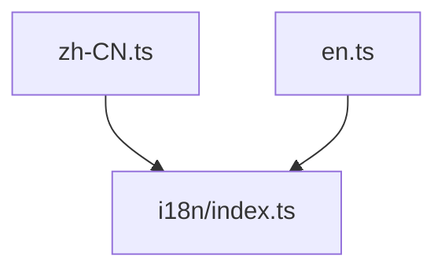

---
paths:
  - "claude-driver/src/renderer/src/i18n/locales/**/*"
---

<!-- parent: i18n -->

### 架构图

### 定位与职责

- **职责**：翻译字典（扁平 key -> 翻译，支持 `{{count}}` 插值）。
- **边界**：纯数据；无逻辑。

### 内部组成

- **zh-CN.ts** / **en.ts**：`Record<string, string>`（key 如 `titlebar.today`、`bottombar.pendingRequests`）；命名空间：titlebar/bottombar/canvasPanel/projectCard/globalMonitor 等。

### 依赖与联动

- **内部依赖**：被 i18n/index.ts import。
- **通信方式**：i18next 按 key 查找 + 插值。
- **关键交互场景**：useT().t(key) -> 查字典 -> 渲染。

### 技术选型

扁平 key 字典（简单，无嵌套解析开销）。

### 非功能约束

- **可维护性**：扁平 key 易检索；新增文案需同步两语言文件。

> 详情请阅读对应 TDD 块文件：`docs/TDD.md` § renderer § i18n § locales（`.claude/rules/tdd/src/renderer/i18n/locales.md`）
