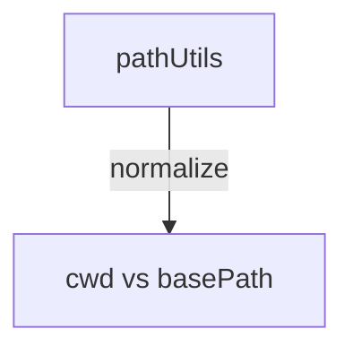

---
paths:
  - "claude-driver/src/renderer/src/utils/**/*"
---

<!-- parent: renderer -->

### 架构图

### 定位与职责

- **职责**：渲染层通用工具。当前仅跨平台路径前缀匹配。
- **边界**：纯函数；无 IPC、无状态。

### 内部组成

- **pathUtils.ts**：`pathMatches(cwd, basePath)` - 规范化 `\`->`/`、大小写不敏感、`cwd===base || cwd.startsWith(base+'/')`。

### 依赖与联动

- **内部依赖**：无。
- **通信方式**：被 business/capabilities/hooks 调用做 session cwd 归属判定。
- **关键交互场景**：session 按项目路径归属（LeftPanel 过滤、statusLine claudeId 解析回退）。

### 技术选型

纯函数，无依赖。

### 非功能约束

- **跨平台**：路径分隔符规范化 + 大小写不敏感（Windows 不区分大小写）。

> 详情请阅读对应 TDD 块文件：`docs/TDD.md` § renderer § utils（`.claude/rules/tdd/src/renderer/utils.md`）
