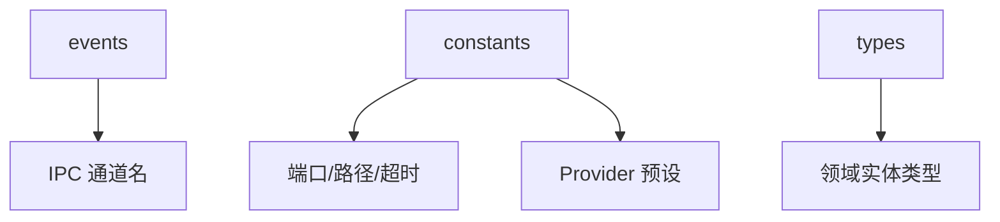
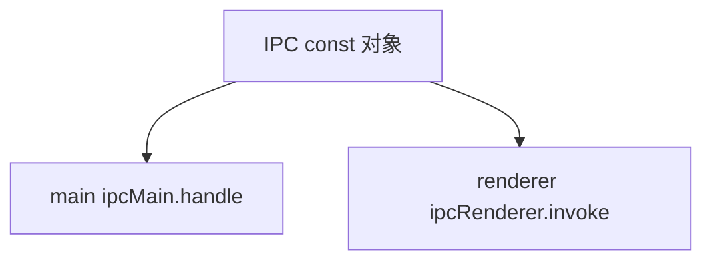
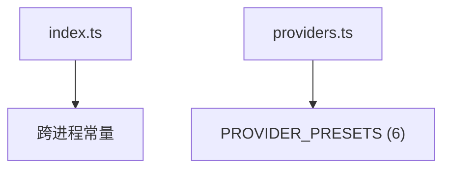
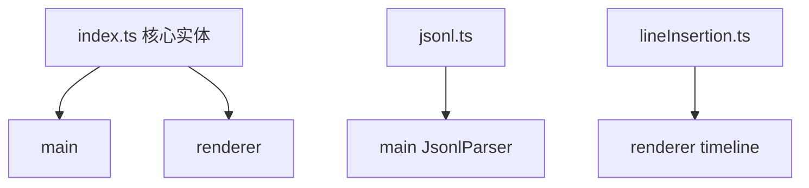

---
paths:
  - "claude-driver/src/shared/**/*"
---

<!-- parent: src -->

### 架构图

### 定位与职责

- **职责**：跨进程契约层。类型（types）+ 常量（constants）+ IPC 通道名（events）。被 main 与 renderer 共同引用（renderer 经 `@shared` 别名）。
- **边界**：纯契约；无运行时副作用、无 Electron/Node 依赖（renderer-safe）。

### 内部组成

- **events**：`ipc-channels.ts`（~90 IPC 通道常量 + IpcChannel 联合类型，单一真相源防漂移）。
- **constants**：`index.ts`（HOOK_PORT=39521/DRIVER_CONFIG_DIRNAME/超时/端点）+ `providers.ts`（6 provider 预设）。
- **types**：`index.ts`（核心领域实体）+ `jsonl.ts`（JSONL 解析类型 + extractToolDisplay）+ `lineInsertion.ts`（十类插入线统一模型）。

### 依赖与联动

- **内部依赖**：types 被 events/constants 引用（type-only）；无外部依赖。
- **通信方式**：被 main（相对路径）与 renderer（@shared 别名）import。
- **关键交互场景**：IPC 类型安全；跨进程实体共享；常量统一。

### 技术选型

纯 TypeScript 类型 + `as const` 常量；renderer-safe（无 Node 内置 import）。

### 非功能约束

- **解耦性**：main 与 renderer 唯一耦合点，契约化。
- **配置路径 [待统一]**：DRIVER_CONFIG_DIRNAME='.claude-driver'，PRD 要求统一 '.claude-steer'。

## events
<!-- parent: shared -->
### 架构图

### 定位与职责

- **职责**：IPC 通道名单一真相源（~90 通道）。防字符串硬编码漂移。`IPC` const 对象 + `IpcChannel` 联合类型供类型安全 ipcMain.handle/ipcRenderer.invoke。
- **边界**：通道名常量；不含逻辑。

### 内部组成

- **ipc-channels.ts**：`IPC` as const（~90 常量）+ `IpcChannel` 联合类型。分组：Main->Renderer 推送（HOOK_EVENT/STATUS_LINE/JSONL_*/PTY_BIND/...）/ Renderer->Main invoke（PROJECT_*/SESSION_*/GIT_*/CONFIG_*/...）/ 终端子窗口（TERM_DATA/TERM_RESIZE）。

### 依赖与联动

- **内部依赖**：无（纯数据 + 类型）。
- **通信方式**：被 main（ipcMain.handle/on）与 renderer（window.api invoke/on）共用。
- **关键交互场景**：所有跨进程通信经此常量；类型安全防漂移。

### 技术选型
### 非功能约束

## constants
<!-- parent: shared -->
### 架构图

### 定位与职责

- **职责**：跨进程共享常量（端口/路径 dirname/超时/HTTP 端点）+ 多 provider 预设。renderer 安全（无 Node 内置）；main 自行拼接 os.homedir()。
- **边界**：常量数据；不含逻辑。

### 内部组成

- **index.ts**：HOOK_PORT=39521、DRIVER_CONFIG_DIRNAME='.claude-driver'、CLAUDE_CONFIG_DIRNAME='.claude'、STATUS_LINE_SCRIPT_NAME、PTY_TIMEOUT_MS=30min、HEARTBEAT_INTERVAL_MS=10s、PLAN_INDICATOR_TTL_MS=5min、HOOK_ENDPOINT='/hooks'、STATUS_LINE_ENDPOINT='/statusline'。
- **providers.ts**：PROVIDER_PRESETS（6：anthropic/deepseek/openrouter/siliconflow/minimax/custom）+ PROVIDER_PRESET_LIST（下拉用）。

### 依赖与联动

- **内部依赖**：types/index（type-only ProviderId/ProviderPreset）。
- **通信方式**：被 main 与 renderer 直接 import。
- **关键交互场景**：HookServer 用 HOOK_PORT；PtyManager 用 HEARTBEAT/PTY_TIMEOUT；ProviderSection 用 PROVIDER_PRESETS。

### 技术选型
### 非功能约束

## types
<!-- parent: shared -->
### 架构图

### 定位与职责

- **职责**：核心领域实体类型（跨 main/renderer）。Project/Session/PlanNode/AgentNode/Hook 事件/statusLine/通知/history meta/GitMark/Milestone/DriverConfig/Provider 等。
- **边界**：类型定义；无逻辑（jsonl.ts 含一个纯函数 extractToolDisplay）。

### 内部组成

- **index.ts**：ClaimStatus(1/0/-1)、PermissionMode(6)、Project、Session、SessionStatus、TokenUsage、PlanStatus/Level/Node、AgentType/Node、HookEventName(12 变体)、HookPayload(判别联合)、HookEvent、StatusLineData、Notification、SessionHistoryMeta、GitMark、PlanIndicator、Milestone、DriverConfig、ProviderId/Preset/EnvBlock、FeishuBotConfig。
- **jsonl.ts**：JsonlMessageType/ToolUse/ToolResult/Usage/Record + extractToolDisplay 纯函数（Bash->desc/cmd, Read/Write->file_path 等）。
- **lineInsertion.ts**：LineInsertionType(10)/Direction/Length/Status + LineInsertion 接口（十类插入线统一模型）。

### 依赖与联动

- **内部依赖**：无（纯类型，jsonl.ts 例外含纯函数）。
- **通信方式**：被 main 与 renderer 共用（renderer 经 @shared 别名）。
- **关键交互场景**：IPC payload 类型；atom 状态类型；JSONL 解析类型。

### 技术选型
### 非功能约束
