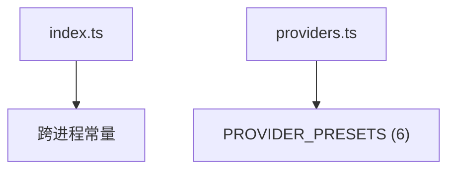

---
paths:
  - "claude-driver/src/shared/constants/**/*"
---

<!-- parent: shared -->

### 架构图

### 定位与职责

- **职责**：跨进程共享常量（端口/路径 dirname/超时/HTTP 端点）+ 多 provider 预设。renderer 安全（无 Node 内置）；main 自行拼接 os.homedir()。
- **边界**：常量数据；不含逻辑。

### 内部组成

- **index.ts**：HOOK_PORT=39521、DRIVER_CONFIG_DIRNAME='.claude-driver'、CLAUDE_CONFIG_DIRNAME='.claude'、STATUS_LINE_SCRIPT_NAME、PTY_TIMEOUT_MS=30min、HEARTBEAT_INTERVAL_MS=10s、PLAN_INDICATOR_TTL_MS=5min、HOOK_ENDPOINT='/hooks'、STATUS_LINE_ENDPOINT='/statusline'。
- **providers.ts**：PROVIDER_PRESETS（6：anthropic/deepseek/openrouter/siliconflow/minimax/custom）+ PROVIDER_PRESET_LIST（下拉用）。

### 依赖与联动

- **内部依赖**：types/index（type-only ProviderId/ProviderPreset）。
- **通信方式**：被 main 与 renderer 直接 import。
- **关键交互场景**：HookServer 用 HOOK_PORT；PtyManager 用 HEARTBEAT/PTY_TIMEOUT；ProviderSection 用 PROVIDER_PRESETS。

### 技术选型

纯数据 const；renderer-safe（无 Node 内置 import）。

### 非功能约束

- **跨平台**：main 层拼接 homedir；renderer 不接触路径。
- **配置路径 [待统一]**：DRIVER_CONFIG_DIRNAME='.claude-driver'，PRD §8.5 要求统一 '.claude-steer'（代码层待改）。

> 详情请阅读对应 TDD 块文件：`docs/TDD.md` § shared § constants（`.claude/rules/tdd/src/shared/constants.md`）
