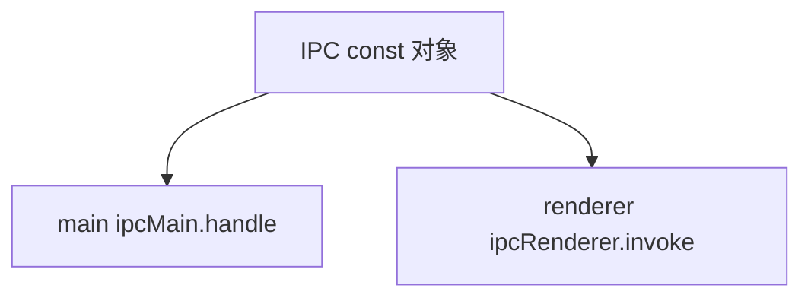

---
paths:
  - "claude-driver/src/shared/events/**/*"
---

<!-- parent: shared -->

### 架构图

### 定位与职责

- **职责**：IPC 通道名单一真相源（~90 通道）。防字符串硬编码漂移。`IPC` const 对象 + `IpcChannel` 联合类型供类型安全 ipcMain.handle/ipcRenderer.invoke。
- **边界**：通道名常量；不含逻辑。

### 内部组成

- **ipc-channels.ts**：`IPC` as const（~90 常量）+ `IpcChannel` 联合类型。分组：Main->Renderer 推送（HOOK_EVENT/STATUS_LINE/JSONL_*/PTY_BIND/...）/ Renderer->Main invoke（PROJECT_*/SESSION_*/GIT_*/CONFIG_*/...）/ 终端子窗口（TERM_DATA/TERM_RESIZE）。

### 依赖与联动

- **内部依赖**：无（纯数据 + 类型）。
- **通信方式**：被 main（ipcMain.handle/on）与 renderer（window.api invoke/on）共用。
- **关键交互场景**：所有跨进程通信经此常量；类型安全防漂移。

### 技术选型

`as const` 对象 + 联合类型（编译期类型安全，零运行时开销）。

### 非功能约束

- **解耦性**：单一真相源，新增/改名通道改一处。
- **类型安全**：IpcChannel 联合约束 invoke/on 参数。

> 详情请阅读对应 TDD 块文件：`docs/TDD.md` § shared § events（`.claude/rules/tdd/src/shared/events.md`）
