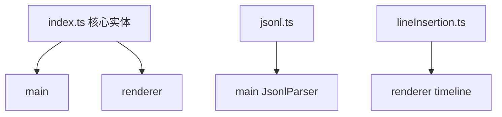

---
paths:
  - "claude-driver/src/shared/types/**/*"
---

<!-- parent: shared -->

### 架构图

### 定位与职责

- **职责**：核心领域实体类型（跨 main/renderer）。Project/Session/PlanNode/AgentNode/Hook 事件/statusLine/通知/history meta/GitMark/Milestone/DriverConfig/Provider 等。
- **边界**：类型定义；无逻辑（jsonl.ts 含一个纯函数 extractToolDisplay）。

### 内部组成

- **index.ts**：ClaimStatus(1/0/-1)、PermissionMode(6)、Project、Session、SessionStatus、TokenUsage、PlanStatus/Level/Node、AgentType/Node、HookEventName(12 变体)、HookPayload(判别联合)、HookEvent、StatusLineData、Notification、SessionHistoryMeta、GitMark、PlanIndicator、Milestone、DriverConfig、ProviderId/Preset/EnvBlock、FeishuBotConfig。
- **jsonl.ts**：JsonlMessageType/ToolUse/ToolResult/Usage/Record + extractToolDisplay 纯函数（Bash->desc/cmd, Read/Write->file_path 等）。
- **lineInsertion.ts**：LineInsertionType(10)/Direction/Length/Status + LineInsertion 接口（十类插入线统一模型）。

### 依赖与联动

- **内部依赖**：无（纯类型，jsonl.ts 例外含纯函数）。
- **通信方式**：被 main 与 renderer 共用（renderer 经 @shared 别名）。
- **关键交互场景**：IPC payload 类型；atom 状态类型；JSONL 解析类型。

### 技术选型

纯 TypeScript interface/type；判别联合（HookPayload）支持类型安全分发。

### 非功能约束

- **解耦性**：跨进程契约单一来源；renderer 不 import main 代码仅类型。
- **一致性**：jsonl.ts 的 extractToolDisplay 与 main JsonlParser 重复实现（保持同步）。

> 详情请阅读对应 TDD 块文件：`docs/TDD.md` § shared § types（`.claude/rules/tdd/src/shared/types.md`）
